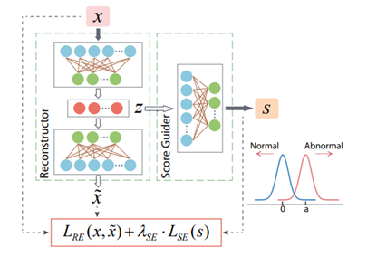

# SG-AE 模型描述

SG-AE模型由一个Encoder一个Decoder以及一个Scoring  
Guider构成，Scoring Guider 对于输入明显正常的样本的特征z，生成一个较小的分值；对于明显异常的样本特征z,生成一个较大的分值。在特征空间上将这两种样本的中间变量区分开，有利于Encoder和Decoder的学习。

详见论文:

Huang Z, Zhang B, Hu G, et al. Enhancing  
Unsupervised Anomaly Detection with Score-Guided Network[J]. arXiv preprint  
arXiv:2109.04684, 2021.

论文链接：[https://arxiv.org/abs/2104.11952v1](https://arxiv.org/abs/2104.11952v1)。

# 数据集

|Dataset (数据集名称)|Number of Instances (实例个数)|Feature Dimension (特征维度)|Anomaly Ratio (异常比例)|
| ----------------------| --------------------------------| ------------------------------| --------------------------|
|Attack|75965|191|25.24%|
|Bcsc|382122|14|2.62%|
|Creditcard|285441|30|0.17%|
|Diabetic|98575|115|12.10%|
|Donor|587383|79|6.28%|
|Intrusion|216420|119|37.23%|
|Market|45451|51|11.70%|
|20news|7200|10000|25%|
|reuters|1800|26147|25%|
|mnist|5124|784|5.2%|

本项目选取了异常检测任务中10个常见的数据集进行了实验，这些数据集涵盖了多种不同的应用场景并且在大小、特征维度、异常比例等特性上多样性都较高，能够较为全面地对模型的性能进行评估。其中前7个数据集为表格类型数据，训练时按照 6：2：2的 比例随机划分了训练集、验证集和测试集。20news 和 reuters为文档类型数据集,其中news 有20个不同的文档类别，reuters有5个不同的文档类别，每个类别被切分为360个文档。训练时随机取一个类别的文档作为正常样本，随机选择部分其它类别的文档作为异常样本，异常样本的比例可以人为设定，默认为25%。mnist数据集为图像数据集，正常样本是数字为"4"的样本，其它数字的样本为异常。按照8:2的比例随机划分了训练集和测试集。

# 环境要求

* 硬件

  使用Ascend、GPU或者CPU来搭建硬件环境
* 框架

  [MindSpore](https://www.mindspore.cn/install/en)
* 如需查看详情，请参见如下资源：

  [MindSpore教程](https://www.mindspore.cn/tutorials/zh-CN/r1.3/index.html)

  [MindSpore Python API](https://www.mindspore.cn/docs/api/zh-CN/r1.3/index.html)

# 项目结构说明

## 数据文件

下载连接见下；将下载好的数据放在SGAE/data 下

> attack: [https://research.unsw.edu.au/projects/unsw-nb15-dataset](https://research.unsw.edu.au/projects/unsw-nb15-dataset)
>
> bcsc:<https://www.bcsc-research.org/data/rfdatasetCreditcard:>
>
> creditcard:<https://www.kaggle.com/mlg-ulb/creditcardfraud>
>
> diabetic:<https://archive.ics.uci.edu/ml/datasets/Diabetes+130+US+hospitals+for+years+1999-2008>
>
> Donor:<https://www.kaggle.com/c/kdd-cup-2014-predicting-excitement-at-donors-choose>
>
> intrusion:<https://archive.ics.uci.edu/ml/datasets/KDD+Cup+1999+Data>
>
> market: [https://archive.ics.uci.edu/ml/datasets/bank+marketing](https://archive.ics.uci.edu/ml/datasets/bank+marketing)
>
> reuters/20news: <https://github.com/dmzou/RSRAE>
>
> mnist: <https://github.com/zc8340311/RobustAutoencoder>
>

下载好后的文件结构如下

> data
> │   20news.data  
> │    attack.csv  
> │    bcsc.csv  
> │    creditcard.csv  
> │    diabetic.csv  
> │    donor.csv  
> │    intrusion.csv  
> │    market.csv  
> │    mnist_data.txt
> │   mnist_y.txt  
> │    reuters.data
> │    thyroid.csv

## 脚本及样例代码

脚本及样例代码结构如下:

> SG-AE
> │  dataloader.py                                      #数据集加载
> │  dataset.py                                            # 生成mindspore dataset  
> │  README.md  
> │  SGAE_train.py                                      #训练代码
> │  SGAE_eval.py                                       #验证代码  
> │  
> ├─assets                                                  #README使用的资源文件
> │
> ├─model_utils
> │   config.py                                            #参数读取
> │
> ├─config
> │   config.yaml                                         #模型参数
> │
> │  
> ├─results                                                  #结果记录  
> │  
> ├─scripts
> │      SGAE_eval.sh                              #验证脚本  
> │      SGAE_train.sh                             #训练脚本
> │  
> └─src                                                        #模型文件  
> SGAE.py

## 脚本参数

在SGAE/config/config.yaml中可以同时配置训练参数和评估参数

配置EAL-GAN和数据集

> #data  
> data_name: attack                         #数据集名称  
> data_path: ./data/                         # 数据集路径  
> inject_noise: True                          # 对表格数据是否加噪  
> cont_rate: 0.01                              # 加噪率  
> anomal_rate: default                     # 异常比例
>
> #trian  
> out_dir: ./results/                           # 结果输出路径  
> epochs: 50                                     # 训练代数  
> lr: 0.0001                                        # 学习率  
> early_stop: False                            # 是否使用提前终止策略  
> batch_size: 1024                            # batch_size  
> run_num: 3                                    # 重复训练次数  
> device: Ascend                              # 使用设备  
> seed: 42                                         # 划分训练集的随机种子  
> np_seed: 22                                   # 数据集加噪的随机种子  
> stop_train: 0.5                                # 提前终止训练的异常分值与a的比值  
> verbose: True                                 # 训练过程中是否打印信息  
> print_step: 5                                   # 打印信息的step代数
>
> #eval  
> run_idx: 0                                       # 模型验证时使用第几次训练得到的结果
>
> #model  
> lam_out: 5                                      # scoring network 中的正异常样本loss权重参数  
> lam_dist: 0.005                               # scoring network loss 和 重构误差权重参数  
> a: 5                                                 # 异常样本分值预计大于等于a  
> epsilon: 93                                     # 样本重构误差分位点  
> model_name: SG-AE  
> hidden_dim: auto                           # 隐藏层维度  
> ms_mode: GRAPH                          # mindspore 使用的模式
>

通过官方网站安装MindSpore后，您可以按照 如下的步骤进行训练和评估。

# 训练和测试

CPU/Ascend/GPU处理器环境运行

> #使用python启动训练
> nohup python -u ./SGAE_train.py --data_path=[DATASE_FOLDER] --data_name=[DATASET_NAME]> log/log_train_[DATASET_NAME].txt 2>&1 &
>
> #使用脚本启动训练
>
> bash scripts/SGAE_train.sh [DATASE_FOLDER] [DATASET_NAME]
>
> #使用python 启动评估
>
> nohup python -u ./SGAE_eval.py  
> --run_idx=[index] --data_path=[DATASE_FOLDER] --data_name=[DATASET_NAME] --inject_noise=False > log/log_val_[DATASET_NAME].txt 2>&1 &
>
> #使用脚本启动评估
>
> bash scripts/SGAE_eval.sh [DATASE_FOLDER] [DATASET_NAME] [RUN_IDX]
>
>

# 模型描述

## 性能

### 评估性能

Creditcard数据集上SG-AE

|参数|Ascend|
| ------------------------| --------|
|模型|SG-AE|
|资源|Ascend 910|
|上传日期|2022-12-5|
|Mindspore版本|1.7.0|
|数据集|Creditcard，285441个样本|
|训练参数|epoch=100,batch_size=1024|
|优化器|Adam |
|损失函数|详见论文|
|损失|0.20|
|输出|异常分值|
|分类AUC-ROC/AUC-PR指标|0.968/0.330|
|速度|单卡 300ms/step|
|训练耗时|30min （run on ModelArts） |
|||

# ModelZoo主页

请浏览官网[主页](https://gitee.com/mindspore/models)
