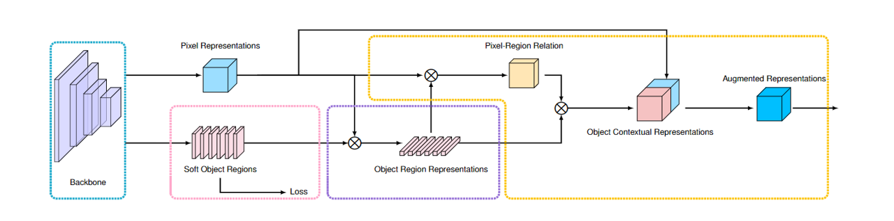

# 目录

<!-- TOC -->

- [目录](#目录)
- [OCRNet描述](#ocrnet描述)
    - [概述](#概述)
    - [论文](#论文)
- [模型架构](#模型架构)
- [数据集](#数据集)
- [环境要求](#环境要求)
- [快速入门](#快速入门)
- [脚本说明](#脚本说明)
    - [脚本及样例代码](#脚本及样例代码)
    - [脚本参数](#脚本参数)
    - [训练过程](#训练过程)
        - [用法](#用法)
            - [Ascend处理器环境运行](#ascend处理器环境运行)
            - [训练时推理](#训练时推理)
        - [结果](#结果)
    - [评估过程](#评估过程)
        - [用法](#用法-1)
            - [Ascend处理器环境运行](#ascend处理器环境运行-1)
        - [结果](#结果-1)
    - [推理过程](#推理过程)
        - [导出MindIR](#导出mindir)
        - [执行推理](#执行推理)
        - [结果](#结果-2)
- [模型描述](#模型描述)
    - [性能](#性能)
        - [评估性能](#评估性能)
            - [Cityscapes上OCRNet的性能](#cityscapes上ocrnet的性能)
- [随机情况说明](#随机情况说明)
- [ModelZoo主页](#modelzoo主页)

<!-- /TOC -->

# OCRNet描述

## 概述

OCRNet是由微软亚研院和中科院计算所提出的语义分割网络。OCRNet使用了一种新的物体上下文信息——在构建上下文信息时显式地增强了来自于同一类物体的像素的贡献，并在2019年7月和2020年1月的 Cityscapes leaderboard提交结果中都取得了语义分割任务第一名的成绩。相关工作“Object-Contextual Representations for Semantic Segmentation”已经被 ECCV 2020 收录。

## 论文

[Object-Contextual Representations for Semantic Segmentation](https://arxiv.org/pdf/1909.11065)

# 模型架构

OCRNet的总体架构如下:



# 数据集

1. 数据集[Cityscapes](https://www.cityscapes-dataset.com/)

Cityscapes数据集包含5000幅高质量像素级别精细注释的街城市道场景图像。图像按2975/500/1525的分割方式分为三组，分别用于训练、验证和测试。数据集中共包含30类实体，其中19类用于验证。

2. 数据集下载后的结构模式

```bash
$SEG_ROOT/data
├─ cityscapes
│  ├─ leftImg8bit
│  │  ├─ train
│  │  │  └─ [city_folders]
│  │  └─ val
│  │     └─ [city_folders]
│  ├─ gtFine
│  │  ├─ train
│  │  │  └─ [city_folders]
│  │  └─ val
│  │     └─ [city_folders]
│  ├─ train.lst
│  └─ val.lst

```

# 环境要求

- 硬件（Ascend）
    - 准备Ascend处理器搭建硬件环境
- 框架
    - [Mindspore](https://www.mindspore.cn/install/en)
- 如需查看详情，请参见如下资源：
    - [MindSpore教程](https://www.mindspore.cn/tutorials/zh-CN/master/index.html)
    - [MindSpore Python API](https://www.mindspore.cn/docs/zh-CN/master/index.html)

# 快速入门

通过运行`convert_from_torch.py`将[torch HRNet-W48-C](https://github.com/HRNet/HRNet-Image-Classification)转换成训练所需的[hrnet_w48](https://download.mindspore.cn/model_zoo/official/cv/ocrnet/ImageNet-torch-pretrained-hrnet48.ckpt)。

```bash
python convert_from_torch.py --torch_path [INPUT_TORCH_MODEL] --mindspore_path [OUT_MINDSPORE_MODEL]
```

通过官方网站安装MindSpore后，您可以按照如下步骤进行训练和评估：

- Ascend处理器环境运行

```bash
# 分布式训练
bash scripts/run_distribute_train.sh [RANK_TABLE_FILE] [DATASET_PATH] [TRAIN_OUTPUT_PATH] [CHECKPOINT_PATH] [EVAL_CALLBACK]

# 分布式训练，从指定周期开始恢复训练
bash scripts/run_distribute_train.sh [RANK_TABLE_FILE] [DATASET_PATH] [TRAIN_OUTPUT_PATH] [CHECKPOINT_PATH] [BEGIN_EPOCH] [EVAL_CALLBACK]

# 单机训练
bash scripts/run_standalone_train.sh [DEVICE_ID] [DATASET_PATH] [TRAIN_OUTPUT_PATH] [CHECKPOINT_PATH] [EVAL_CALLBACK]

# 单机训练，从指定周期开始恢复训练
bash scripts/run_standalone_train.sh [DEVICE_ID] [DATASET_PATH] [TRAIN_OUTPUT_PATH] [CHECKPOINT_PATH] [BEGIN_EPOCH] [EVAL_CALLBACK]

# 运行评估
bash scripts/run_eval.sh [DEVICE_ID] [DATASET_PATH] [CHECKPOINT_PATH]
```

如果要在ModelArts上进行模型的训练，可以参考ModelArts的[官方指导文档](https://support.huaweicloud.com/modelarts/)开始进行模型的训练和推理，具体操作如下：

```text
# 训练模型
1. 创建作业
2. 选择数据集存储位置
3. 选择输出存储位置
2. 在模型参数列表位置按如下形式添加参数：
    data_url            [自动填充]
    train_url           [自动填充]
    checkpoint_url      [CHECKPOINT_PATH_OBS]
    modelarts           True
    device_target       Ascend
    run_distribute      [True/False]
    eval_callback       [True/False]
    # 其他可选参数具体详情请参考train.py脚本
3. 选择相应数量的处理器
4. 开始运行

# 评估模型
1. 创建作业
2. 选择数据集存储位置
3. 选择输出存储位置
2. 在模型参数列表位置按如下形式添加参数：
    data_url            [自动填充]
    train_url           [自动填充]
    checkpoint_url      [CHECKPOINT_PATH_OBS]
    modelarts           True
    device_target       Ascend
3. 选择单个处理器
4. 开始运行
```

# 脚本说明

## 脚本及样例代码

```bash
├─ OCRNet
│  ├─ ascend310_infer                       # 310推理相关脚本
│  │  ├─ inc
│  │  │  └─ utils.py
│  │  └─ src
│  │  │  ├─ build.sh
│  │  │  ├─ CMakeLists.txt
│  │  │  ├─ main.cc
│  │  │  └─ utils.cc
│  ├─ scripts
│  │  ├─ ascend310_inference.sh             # 启动Ascend310推理（单卡）
│  │  ├─ run_standalone_train.sh            # 启动Ascend单机训练（单卡）
│  │  ├─ run_distribute_train.sh            # 启动Ascend分布式训练（8卡）
│  │  └─ run_eval.sh                        # 启动Asend单机评估（单卡）
│  ├─ data
│  │  ├─ cityscapes
│  │  │  ├─ leftImg8bit
│  │  │  │  └─ [original_images]            # 数据集图像文件
│  │  │  ├─ gtFine
│  │  │  │  └─ [label_images]               # 数据集标签文件
│  │  │  ├─ train.lst                       # 训练集存储路径列表
│  │  │  └─ val.lst                         # 验证集存储路径列表
│  ├─ src
│  │  ├─ model_utils
│  │  │  └─ moxing_adapter.py               # ModelArts设备配置
│  │  ├─ config.py                          # 参数配置
│  │  ├─ basedataset.py                     # 数据集生成器基类
│  │  ├─ cityscapes.py                      # Cityscapes数据集生成器
│  │  ├─ loss.py                            # 损失函数
│  │  ├─ callback.py                        # 训练时推理回调函数
│  │  ├─ seg_hrnet_ocr.py                   # OCRNet网络结构
│  │  └─ utils.py                           # 参数初始化函数
│  ├─ train_out
│  ├─ export.py                             # 310推理，导出mindir
│  ├─ preprocess.py                         # 310推理，数据预处理
│  ├─ postprocess.py                        # 310推理，计算mIoU
│  ├─ train.py                              # 训练模型
│  └─ eval.py                               # 评估模型
```

## 脚本参数

在配置文件中可以同时配置训练参数和评估参数。

```python
hrnetv2_w48_configuratiom = {
    "data_url": None,                           # 数据集OBS存储路径
    "data_path": None,                          # 数据集本地机器存储路径
    "train_url": None,                          # 训练输出OBS存储路径
    "train_path": None,                         # 训练输出本地机器存储路径
    "checkpoint_url": None,                     # checkpoint文件OBS存储路径
    "checkpoint_path": None,                    # checkpoint文件本地机器存储路径
    "run_distribute": False,                    # 是否为分布式运行
    "device_target": "Ascend",                  # 运行平台
    "workers": 8,
    "modelarts": False,                         # 是否在ModelArts上运行
    "lr": 0.0013,                               # 基础学习率
    "lr_power": 4e-10,                          # 学习率调整因子
    "save_checkpoint_epochs": 20,               # 存储checkpoint的频率
    "keep_checkpoint_max": 20,                  # 保存checkpoint的个数
    "total_epoch": 1000,                        # 总训练周期
    "begin_epoch": 0,                           # 开始周期
    "end_epoch": 1000,                          # 结束周期
    "batchsize": 4,                             # 输入张量批次大小
    "eval_callback": False,                     # 是否使用训练时推理
    "eval_interval": 50,                        # 训练时推理的频率
    "train": {
        "train_list": "/train.lst",             # 训练集文件存储路径列表
        "image_size": [512, 1024],              # 训练输入图像大小
        "base_size": 2048,                      # 训练图像的基础大小
        "multi_scale": True,                    # 是否随机放缩图像
        "flip": True,                           # 是否翻转图像
        "downsample_rate": 1,                   # 下采样率
        "scale_factor": 16,                     # 方法因子
        "shuffle": True,                        # 是否混洗
        "param_initializer": "TruncatedNormal", # 参数初始化方法
        "opt_momentum": 0.9,                    # 动量优化器
        "wd": 0.0005,                           # 权重衰减
        "num_samples": 0                        # 采样数
    },
    "dataset": {
        "name": "Cityscapes",                   # 数据集名称
        "num_classes": 19,                      # 类别数量
        "ignore_label": 255,                    # 不被考虑的类别标签值
        "mean": [0.485, 0.456, 0.406],          # 均值
        "std": [0.229, 0.224, 0.225],           # 方差

    },
    "eval": {
        "eval_list": "/val.lst",                # 验证集文件存储路径列表
        "image_size": [1024, 2048],             # 评估输入图像大小
        "base_size": 2048,                      # 评估图像基础大小
        "batch_size": 1,                        # 评估输入批次大小
        "num_samples": 0,                       # 采样数
        "flip": False,                          # 是否翻转图像
        "multi_scale": False,                   # 是否使用多尺寸特征图
        "scale_list": [1]                       # 放大尺寸列表
    },
    "model": {                                  # 模型相关参数
        "name": "seg_hrnet_w48",                # 模型名称
        "extra": {
            "FINAL_CONV_KERNEL": 1,
            "STAGE1": {                         # stage1参数
                "NUM_MODULES": 1,               # High-resolution module数量
                "NUM_BRANCHES": 1,              # 分支数量
                "BLOCK": "BOTTLENECK",          # 残差块类型
                "NUM_BLOCKS": [4],              # 各分支残差块数量
                "NUM_CHANNELS": [64],           # 各分支特征图通道数
                "FUSE_METHOD": "SUM"            # 分支融合方式
            },
            "STAGE2": {                         # stage2参数
                "NUM_MODULES": 1,
                "NUM_BRANCHES": 2,
                "BLOCK": "BASIC",
                "NUM_BLOCKS": [4, 4],
                "NUM_CHANNELS": [48, 96],
                "FUSE_METHOD": "SUM"
            },
            "STAGE3": {                         # stage3参数
                "NUM_MODULES": 4,
                "NUM_BRANCHES": 3,
                "BLOCK": "BASIC",
                "NUM_BLOCKS": [4, 4, 4],
                "NUM_CHANNELS": [48, 96, 192],
                "FUSE_METHOD": "SUM"
            },
            "STAGE4": {                         # stage4参数
                "NUM_MODULES": 3,
                "NUM_BRANCHES": 4,
                "BLOCK": "BASIC",
                "NUM_BLOCKS": [4, 4, 4, 4],
                "NUM_CHANNELS": [48, 96, 192, 384],
                "FUSE_METHOD": "SUM"
            }
        },
        "ocr": {                                # ocr module参数
            "mid_channels": 512,
            "key_channels": 256,
            "key_channels": 256,
            "dropout": 0.05,
            "scale": 1
        }
    },
    "loss": {
        "loss_scale": 10,                       # 损失等级
        "use_weights": True,
        "balance_weights": [0.4, 1]
    },
}
```

## 训练过程

### 用法

#### Ascend处理器环境运行

```bash
# 分布式训练
bash scripts/run_distribute_train.sh [RANK_TABLE_FILE] [DATASET_PATH] [TRAIN_OUTPUT_PATH] [CHECKPOINT_PATH] [EVAL_CALLBACK](optional)

# 分布式训练，从指定周期开始恢复训练
bash scripts/run_distribute_train.sh [RANK_TABLE_FILE] [DATASET_PATH] [TRAIN_OUTPUT_PATH] [CHECKPOINT_PATH] [BEGIN_EPOCH] [EVAL_CALLBACK](optional)

# 单机训练
bash scripts/run_standalone_train.sh [DEVICE_ID] [DATASET_PATH] [TRAIN_OUTPUT_PATH] [CHECKPOINT_PATH] [EVAL_CALLBACK](optional)

# 单机训练，从指定周期开始恢复训练
bash scripts/run_standalone_train.sh [DEVICE_ID] [DATASET_PATH] [TRAIN_OUTPUT_PATH] [CHECKPOINT_PATH] [BEGIN_EPOCH] [EVAL_CALLBACK](optional)
```

分布式训练需要提前创建JSON格式的HCCL配置文件。

具体操作，参见[hccn_tools](https://gitee.com/mindspore/models/tree/master/utils/hccl_tools)中的说明。

训练结果保存在示例路径中，文件夹名称以“train”或“train_parallel”开头。您可在此路径下的日志中找到检查点文件以及结果，如下所示。

运行单卡用例时如果想更换运行卡号，可以通过设置环境变量 `export DEVICE_ID=x`。

#### 训练时推理

如果需要训练时推理，在执行shell脚本时为`EVAL_CALLBACK`参数传入`True`即可，其默认值为`False`。

### 结果

使用Cityscapes数据集训练OCRNet

```text
# 分布式训练结果（4p）
epoch: 1 step: 248, loss is 1.1374861
epoch time: 339815.397 ms, per step time: 1370.223 ms
epoch: 2 step: 248, loss is 0.40133527
epoch time: 69468.934 ms, per step time: 280.117 ms
epoch: 3 step: 248, loss is 0.20046248
epoch time: 69358.028 ms, per step time: 279.669 ms
epoch: 4 step: 248, loss is 0.37442797
epoch time: 69333.672 ms, per step time: 279.571 ms
epoch: 5 step: 248, loss is 0.34999597
epoch time: 69352.299 ms, per step time: 279.646 ms
...
```

## 评估过程

### 用法

#### Ascend处理器环境运行

```bash
# 运行评估
bash scripts/run_eval.sh [DEVICE_ID] [DATASET_PATH] [CHECKPOINT_PATH]
```

### 结果

评估结果保存在示例路径中，文件夹名为“eval”。你可在此路径下的日志文件中找到如下结果：

```text
Total number of images:  500
=========== Validation Result ===========
===> mIoU: 0.7961077635109521
===> IoU array:
 [0.98296033 0.85900498 0.92949463 0.61348649 0.65449864 0.62388795
 0.70787673 0.79361175 0.92397478 0.64360418 0.94558114 0.81655936
 0.63244356 0.95029043 0.83258733 0.90902162 0.85732374 0.67388184
 0.77595802]
=========================================
```

## 推理过程

**推理前需参照 [MindSpore C++推理部署指南](https://gitee.com/mindspore/models/blob/master/utils/cpp_infer/README_CN.md) 进行环境变量设置。**

### 导出MindIR

```bash
python export.py --device_id [DEVICE_ID] --checkpoint_file [CKPT_PATH] --file_name [FILE_NAME] --file_format MINDIR --device_target Ascend
```

### 执行推理

在执行推理之前，必须先通过`export.py`脚本到本mindir文件。以下展示了使用mindir模型执行推理的示例。目前只支持Cityscapes数据集batchsize为1的推理。

```bash
bash scripts/run_cpp_infer.sh [MINDIR_PATH] [DATA_PATH] [DEVICE_TYPE] [DEVICE_ID]
```

- `MINDIR_PATH` mindir文件的存储路径
- `DATA_PATH` Cityscapes原始数据集的存储路径
- `DEVICE_TYPE` 可以为Ascend, GPU, 或CPU。
- `DEVICE_ID` 卡号

脚本内部分为三步：

1. `preprocess.py`对原始数据集进行预处理，并将处理后的数据集以二进制的形式存储在`./preprocess_Result/`路径下；
2. `ascend310_infer/src/main.cc`执行推理过程，并将预测结果以二进制的形式存储在`./result_Files/`路径下，推理日志可在`infer.log`中查看；
3. `postprocess.py`利用预测结果与相应标签计算mIoU，计算结果可在`acc.log`中查看。

### 结果

```text
Total number of images:  500
=========== 310 Inference Result ===========
miou: 0.7880364289865892
iou array:
 [0.98327649 0.86189605 0.92990512 0.53712174 0.63041064 0.68390911
 0.71874631 0.80141863 0.92871439 0.63142162 0.94527287 0.83139662
 0.6455081  0.95468034 0.81087329 0.87612221 0.74120989 0.67898836
 0.78182036]
============================================
```

# 模型描述

## 性能

### 评估性能

#### Cityscapes上OCRNet的性能

|参数|Ascend 910|
|------------------------------|------------------------------|
|模型版本|OCRNet|
|资源|Ascend 910；CPU 2.60GHz，192核；内存 755G；系统 Euler2.8|
|上传日期|2021-12-12|
|MindSpore版本|1.2|
|数据集|Cityscapes|
|训练参数|epoch=1000, steps per epoch=248, batch_size = 3|
|优化器|SGD|
|损失函数|Softmax交叉熵|
|输出|mIoU|
|损失|0.06756218|
|速度|279毫秒/步（4卡）|
|总时长|19.4小时|

# 随机情况说明

`train.py`中使用了随机种子。

# 免责说明

models仅提供转换模型的脚本。我们不拥有这些模型，也不对它们的质量负责和维护。对这些模型进行转换仅用于非商业研究和教学目的。

致模型拥有者：如果您不希望将模型包含在MindSpore models中，或者希望以任何方式对其进行转换，我们将根据要求删除或更新所有公共内容。请通过Gitee与我们联系。非常感谢您对这个社区的理解和贡献。

# ModelZoo主页

 请浏览官网[主页](https://gitee.com/mindspore/models)。
