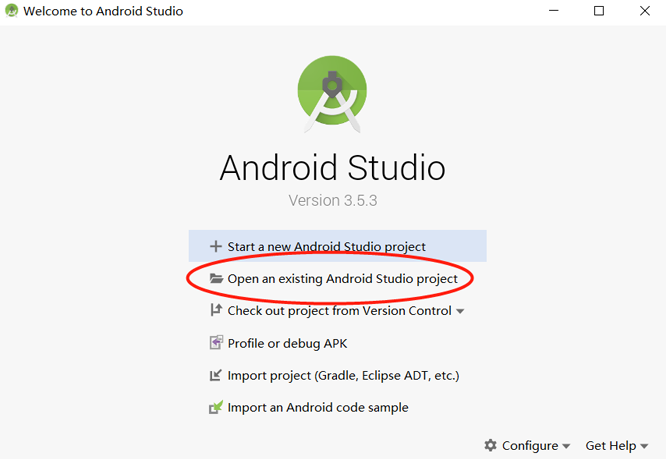
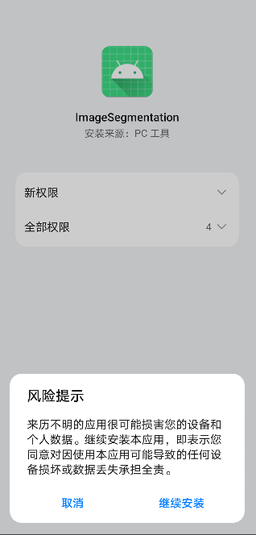
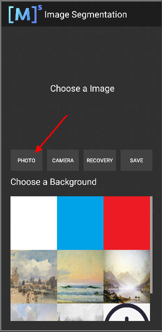
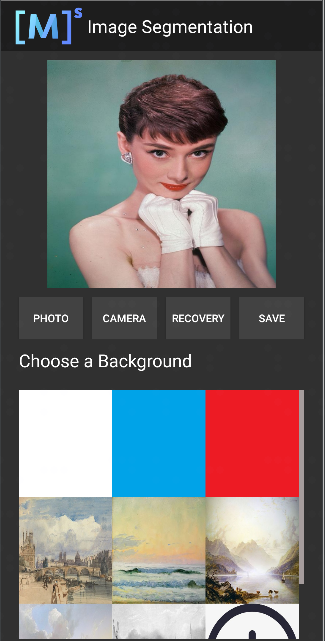

# MindSpore Lite 端侧图像分割demo（Android）

本示例程序演示了如何在端侧利用MindSpore Lite Java API 以及MindSpore Lite 图像分割模型完成端侧推理，实现对设备摄像头捕获的内容进行分割，并在App图像预览界面中显示出最可能的分割结果。
> 本示例程序目的是演示如何使用MindSpore Lite API完成推理，图像分割效果取决于模型以及模型训练使用的数据集，不是本示例程序的重点。

## 运行依赖

- Android Studio >= 3.2 (推荐4.0以上版本)
- Android SDK >= 26 （Android Studio默认安装）
- JDK >= 1.8 （Android Studio默认安装）

## 构建与运行

1. 在Android Studio中加载本[示例源码](https://gitee.com/mindspore/models/tree/master/official/lite/image_segmentation)，并安装相应的SDK（指定SDK版本后，由Android Studio自动安装）。

    

2. 连接Android设备，运行图像分割应用程序。

    通过USB连接Android设备调试，点击`Run 'app'`即可在你的设备上运行本示例项目。

    

    Android Studio连接设备调试操作，可参考<https://developer.android.com/studio/run/device?hl=zh-cn>。

    手机需开启“USB调试模式”，Android Studio才能识别到手机。 华

3. 在Android设备上，点击“继续安装”，安装完即可查看到本地相册以及设备摄像头拍照的头像图片进行分割推理的结果。

    

    运行结果如下图所示（以选取相册某张头像图片为例）。

    

    选取相册带有头像图片。

    

    选择九宫格中不同的背景图片，即可对人像的背景进行替换分割。

    <table>
      <tr>
        <td><center><br>图1  白色背景</br> </center></td>
        <td><center><br>图2  蓝色背景</br> </center></td>
        <td><center><br>图3  油画背景</br> </center></td>
      </tr>
    </table>

## 示例程序详细说明  

本端侧图像分割Android示例程序使用Java层，需读者具备一定的Android开发基础知识。

### 示例程序结构

```text
app
├── src/main
│   ├── assets # 资源文件
|   |   └── segment_model.ms # 存放的模型文件
│   |
│   ├── java # java层应用代码
│   │   └── com.mindspore.imagesegmentation
│   │       ├── help # 图像处理
│   │       │   └── ...
│   │       └── ... Android页面展示以及逻辑处理
│   │
│   ├── res # 存放Android相关的资源文件
│   └── AndroidManifest.xml # Android配置文件
│
├── libs # Android库项目的二进制归档文件
|     └── mindspore-lite-version.aar #  MindSpore Lite针对Android版本的归档文件
|
├── build.gradle # 其他Android配置文件
├── download.gradle # 工程依赖文件下载
└── ...
```

### 配置MindSpore Lite依赖项

Android调用MindSpore Android AAR时，需要相关库文件支持。可通过MindSpore Lite[源码编译](https://www.mindspore.cn/lite/docs/zh-CN/master/use/build.html)生成`mindspore-lite-maven-{version}.zip`库文件包并解压缩（包含`mindspore-lite-{version}.aar`库文件）。

> version：输出件版本号，与所编译的分支代码对应的版本一致。
>
> device：当前分为cpu（内置CPU算子）和gpu（内置CPU和GPU算子）。
>
> os：输出件应部署的操作系统。

本示例中，build过程由`app/download.gradle`文件自动下载MindSpore Lite版本文件，并放置在`app/libs`目录下。

> 注： 若自动下载失败，请手动下载相关库文件[mindspore-lite-{version}-android-{arch}.tar.gz](https://www.mindspore.cn/lite/docs/zh-CN/master/use/downloads.html)，解压后将其放在对应位置。

### 下载及部署模型文件

从MindSpore Model Hub中下载模型文件，本示例程序中使用的终端图像分割模型文件为`segment_model.ms`，同样通过`app/download.gradle`脚本在APP构建时自动下载，并放置在`app/src/main/assets`工程目录下。

注：若下载失败请手工下载模型文件[segment_model.ms](https://download.mindspore.cn/model_zoo/official/lite/mobile_segment_lite/segment_model.ms)。

### 编写端侧推理代码

推理代码流程如下，完整代码请参见 [src/java/com/mindspore/imagesegmentation/TrackingMobile](https://gitee.com/mindspore/models/blob/master/official/lite/image_segmentation/app/src/main/java/com/mindspore/imagesegmentation/help/TrackingMobile.java)。

1. 加载MindSpore Lite模型，构建上下文、会话以及用于推理的计算图。  

    - 创建会话。

      ```java
      // Create and init config.
      MSContext context = new MSContext();
      if (!context.init(2, CpuBindMode.MID_CPU, false)) {
          Log.e(TAG, "Init context failed");
          return;
      }
      if (!context.addDeviceInfo(DeviceType.DT_CPU, false, 0)) {
          Log.e(TAG, "Add device info failed");
          return;
      }
      ```

    - 加载模型并构建用于推理的计算图。

      ```java
      MappedByteBuffer modelBuffer = loadModel(mContext, IMAGESEGMENTATIONMODEL);
      if(modelBuffer == null) {
          Log.e(TAG, "Load model failed");
          return;
      }
      // build model.
      boolean ret = model.build(modelBuffer, ModelType.MT_MINDIR,context);
      if(!ret) {
          Log.e(TAG, "Build model failed");
      }
      ```

2. 将输入图片转换为传入MindSpore模型的Tensor格式。

      将待检测图片数据转换为输入MindSpore模型的Tensor。

      ```java
      List<MSTensor> inputs = model.getInputs();
      if (inputs.size() != 1) {
        Log.e(TAG, "inputs.size() != 1");
        return null;
      }

      float resource_height = bitmap.getHeight();
      float resource_weight = bitmap.getWidth();

      ByteBuffer contentArray = BitmapUtils.bitmapToByteBuffer(bitmap, imageSize, imageSize, IMAGE_MEAN, IMAGE_STD);

      MSTensor inTensor = inputs.get(0);
      inTensor.setData(contentArray);
      ```

3. 运行会话，执行计算图。

    ```java
    // Run graph to infer results.
    if (!model.predict()) {
        Log.e(TAG, "Run graph failed");
        return null;
    }
    ```

4. 对输出数据进行处理。

    - 通过Tensor获取的输出数据得到其维度，批处理数，通道数等信息。

      ```java
      // Get output tensor values.
      List<MSTensor> outTensors = model.getOutputs();
      for (MSTensor output : outTensors) {
        if (output == null) {
            Log.e(TAG, "Can not find output " + tensorName);
            return null;
        }
      float[] results = output.getFloatData();
      float[] result = new float[output.elementsNum()];

      int batch = output.getShape()[0];
      int channel = output.getShape()[1];
      int weight = output.getShape()[2];
      int height = output.getShape()[3];
      int plane = weight * height;
      ```

    - 将NCHW格式转为NHWC格式，放入到`float[] result`。

      ```java
      for (int n = 0; n < batch; n++) {
        for (int c = 0; c < channel; c++) {
          for (int hw = 0; hw < plane; hw++) {
                 result[n * channel * plane + hw * channel + c] = results[n * channel * plane + c * plane + hw];
              }
           }
        }
      ```

5. 对输入Tensor按照模型进行推理，进行后处理。

    - 将`float[] result`数据转换成ByteBuffer数据格式。

      ```java
      ByteBuffer buffer = ByteBuffer.allocate(4 * result.length);
      FloatBuffer floatBuffer = buffer.asFloatBuffer();
      floatBuffer.put(result);
      return buffer;
      ```

    - 将ByteBuffer数据格式转成Bitmap。

        通过推理出来的数据在Bitmap每个像素坐标进行比对。如果坐标数据等于PERSON，坐标点颜色不变。反之，则改成透明色（如下图所示）。

        ```java
        Bitmap.Config conf = Bitmap.Config.ARGB_8888;
        Bitmap maskBitmap = Bitmap.createBitmap(imageWidth, imageHeight, conf);
        Bitmap scaledBackgroundImage =
                BitmapUtils.scaleBitmapAndKeepRatio(backgroundImage, imageWidth, imageHeight);
        int[][] mSegmentBits = new int[imageWidth][imageHeight];
        inputBuffer.rewind();
        for (int y = 0; y < imageHeight; y++) {
            for (int x = 0; x < imageWidth; x++) {
                float maxVal = 0f;
                mSegmentBits[x][y] = 0;
                    for (int i = 0; i < NUM_CLASSES; i++) {
                        float value = inputBuffer.getFloat((y * imageWidth * NUM_CLASSES + x * NUM_CLASSES + i) * 4);
                        if (i == 0 || value > maxVal) {
                            maxVal = value;
                        if (i == PERSON) {
                            mSegmentBits[x][y] = i;
                        } else {
                            mSegmentBits[x][y] = 0;
                        }
                    }
                }
                maskBitmap.setPixel(x, y, mSegmentBits[x][y] == 0 ? colors[0] : scaledBackgroundImage.getPixel(x, y));
            }
        }
        ```

        <table>
           <tr>
            <td><center><br>图1  推理前</br></center></td>
            <td><center><br>图2  推理后</br></center></td>
          </tr>
        </table>

6. 将推理后的图片与选择的背景图片相结合。

    ```java
    MainActivity.this.imgPreview.setDrawingCacheEnabled(true);
    MainActivity.this.imgPreview.setBackground(isDemo ? getDrawable(IMAGES[selectedPosition]) : customBack);
    MainActivity.this.imgPreview.setImageBitmap(foreground);
    MainActivity.this.imgPreview.setDrawingCacheEnabled(false);
    ```
