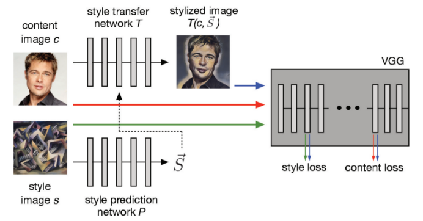
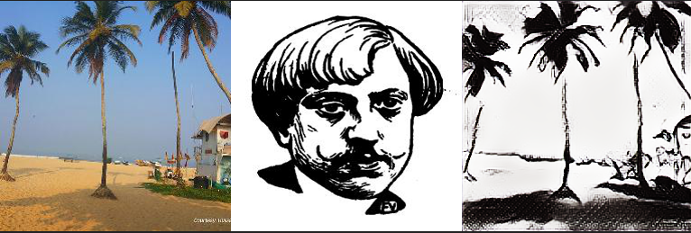
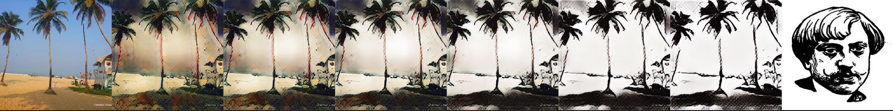

# Contents

- [Style Transfer Description](#style-transfer-description)
- [Model Architecture](#model-architecture)
- [Dataset](#dataset)
- [Pretrained model](#pretrained-model)
- [Environment Requirements](#environment-requirements)
- [Script Description](#script-description)
    - [Script and Sample Code](#script-and-sample-code)
    - [Script Parameters](#script-parameters)
    - [Training Process](#training-process)
- [Model Description](#model-description)
        - [Performance](#performance)
        - [Training Performance](#training-performance)  
        - [Evaluation Performance](#evaluation-performance)
- [Description of Random Situation](#description-of-random-situation)
- [Example](#example)
- [ModelZoo Homepage](#modelzoo-homepage)

# [Style Transfer Description](#contents)

This is the Implementation of the Mindspore code of paper [**Exploring the structure of a real-time, arbitrary neural artistic stylization network.** ](https://arxiv.org/abs/1705.06830)

Authors: [Golnaz Ghiasi](https://arxiv.org/search/cs?searchtype=author&query=Ghiasi%2C+G), [Honglak Lee](https://arxiv.org/search/cs?searchtype=author&query=Lee%2C+H), [Manjunath Kudlur](https://arxiv.org/search/cs?searchtype=author&query=Kudlur%2C+M), [Vincent Dumoulin](https://arxiv.org/search/cs?searchtype=author&query=Dumoulin%2C+V), [Jonathon Shlens](https://arxiv.org/search/cs?searchtype=author&query=Shlens%2C+J)

In this paper, we present a method which combines the flexibility of the neural algorithm of artistic style with the speed of fast style transfer networks to allow real-time stylization using any content/style image pair. We build upon recent work leveraging conditional instance normalization for multi-style
transfer networks by learning to predict the conditional instance normalization parameters directly from a style image. The model is successfully trained on a corpus of roughly 80,000 paintings and is able to generalize to paintings previously unobserved. We demonstrate that the learned embedding space is smooth and contains a rich structure and organizes semantic information associated with paintings in an entirely unsupervised manner.

# [Model Architecture](#contents)



The style prediction network P predicts an embedding vector S from an input style image, which supplies a set of normalization constants for the style transfer network. The style transfer network transforms the photograph into a stylized representation. The content and style losses  are derived from the distance in representational space of the VGG image classification network. The style transfer network largely follows  and the style prediction network largely follows the Inception-v3 architecture.

# [Dataset](#contents)

To train Style Transfer Networks, Two datasets are used:

- content dataset: [MS COCO](http://images.cocodataset.org/zips/train2014.zip)
- style dataset:  [Painter by Number dataset (PBN)](https://www.kaggle.com/c/painter-by-numbers) and [Describable Textures Dataset (DTD)](https://www.robots.ox.ac.uk/~vgg/data/dtd/)
  [PBN training](https://github.com/zo7/painter-by-numbers/releases/download/data-v1.0/train.tgz)
  [PBN testing](https://github.com/zo7/painter-by-numbers/releases/download/data-v1.0/test.tgz)
  [DTD dataset](https://www.robots.ox.ac.uk/~vgg/data/dtd/download/dtd-r1.0.1.tar.gz)

Train dataset：

- content dataset: [MS COCO](http://images.cocodataset.org/zips/train2014.zip)
- style dataset [PBN training](https://github.com/zo7/painter-by-numbers/releases/download/data-v1.0/train.tgz) [DTD dataset](https://www.robots.ox.ac.uk/~vgg/data/dtd/download/dtd-r1.0.1.tar.gz), place the images in both datasets in the same folder

Test dataset:

- content dataset: arbitrarily collect images by yourself or Select some images from MS COCO as the data set.
- style dataset: arbitrarily collect style images or [PBN testing](https://github.com/zo7/painter-by-numbers/releases/download/data-v1.0/test.tgz)

# [Pretrained model](#contents)

The process of training Style Transfer Networks needs a pretrained VGG16 and  Inception-v3.
[VGG16 pretrained model](https://download.mindspore.cn/model_zoo/r1.2/vgg16_ascend_v120_imagenet2012_official_cv_bs32_acc73/) and [Inception-v3 pretrained model](https://download.mindspore.cn/model_zoo/r1.2/inceptionv3_ascend_v120_imagenet2012_official_cv_bs128_acc78/)

Modify the name of ckpt to inceptionv3.ckpt and vgg16.ckpt

After downloading the pre-training model, please place it in folder './pretrained_model'.

# [Environment Requirements](#contents)

- Hardware Ascend
    - Prepare hardware environment with Ascend processor.
- Framework
    - [MindSpore](https://www.mindspore.cn/install/en)
- For more information, please check the resources below：
    - [MindSpore Tutorials](https://www.mindspore.cn/tutorials/en/master/index.html)
    - [MindSpore Python API](https://www.mindspore.cn/docs/api/en/master/index.html)

# [Script Description](#contents)

## [Script and Sample Code](#contents)

```shell
style transfer

├─ README.md # descriptions about style transfer
├── scripts  
 ├─ run_distribute_train.sh # launch Acsend training (8 Acsend)
 ├─ run_eval.sh # launch ascend eval
 └─ run_stranalone_train.sh # launch Acsend training(1 Acsend)
├─── dataset # dataset
 ├── train # train content data and train style data
  ├─ content
  └─ style
 └── test # test content data and test style data
  ├─ content
  └─ style
├── pretrained_model  
 ├─ vgg16.ckpt # VGG16 pretrained model
 └─ inceptionv3.ckpt # Inception-v3 pretrained model
├── src
 ├─ ckpt # save ckpt  
 ├─ testdataset.py # dataset for evaling  
 ├─ traindataset.py # dataset for training
 ├─ loss.py #style transfer losses function define
 ├─ model.py # style transfer model define  and training process
 ├─ networks.py # sub-networks define  
 ├─ vgg16.py # vgg16 network define  
 └─ inceptionv3py # inception-v3 network define  
├─ output #result
├─ test.py # generate style transfer images
└─ train.py # train script
```

## [Script Parameters](#contents)

### [Training Script Parameters](#contents)

```shell
# distributed Ascend training
bash ./scripts/run_distribute_train_ascend.sh [RANK_TABLE_FILE] [PLATFORM] [CONTENT_PATH] [STYLE_PATH] [CKPT_PATH]
# distributed GPU training
bash ./scripts/run_distribute_train_gpu.sh [CONTENT_PATH] [STYLE_PATH] [CKPT_PATH]

# standalone Ascend\GPU training
bash ./scripts/run_standalone_train.sh [PLATFORM] [DEVICE_ID] [CONTENT_PATH] [STYLE_PATH] [CKPT_PATH]
```

### [Training Result](#content)

Training result will be stored in './src/ckpt'. You can find checkpoint file.

### [Evaluation Script Parameters](#content)

- Run `run_eval.sh` for evaluation.

```bash
# evaling
bash ./scripts/run_eval.sh [PLATFORM] [DEVICE_ID] [CONTENT_PATH] [STYLE_PATH] [INCEPTION_CKPT] [CKPT_PATH]
```

### [Evaluation result](#content)

Evaluation result will be stored in the output. Under this, you can find style transfer pictures.

# [Model Description](#contents)

## [Performance](#contents)

### Training Performance

| Parameters                 |                                                              |
| -------------------------- | ------------------------------------------------------------ |
| Model Version              | v1                                                           |
| Resource                   | Ascend / GPU(Tesla V100-PCIE 32G)；CPU：2.60GHz 52cores ；RAM：754G |
| MindSpore Version          | 1.3.0                                                        |
| Dataset                    | content: MS COCO. style: PBN training and DTD dataset        |
| Training Parameters        | epoch=100,  batch_size = 16                                  |
| Optimizer                  | Adam                                                         |
| Loss Function              | content loss and  style loss                                 |
| outputs                    | style transfer pictures                                      |
| Speed                      | 1 Ascend: 392ms/step; 8 Ascend: 303ms/step; 1 GPU: 560ms/step; 8 GPU：582ms/step |
| Total time                 | 1 Ascend: 56h20m21s; 8 Ascend: 6h15m40s; 8 GPU:11h30m        |
| Checkpoint for Fine tuning | 71.27M (.ckpt file)                                          |

### Evaluation Performance

| Parameters        | single Ascend / GPU                  |
| ----------------- | ------------------------------------ |
| Model Version     | v1                                   |
| Resource          | Ascend;                              |
| MindSpore Version | 1.3.0                                |
| Dataset           | content: MS COCO. style: PBN testing |
| batch_size        | 1                                    |
| Speed             | GPU: 342ms/step;                     |
| outputs           | style transfer pictures              |

# [Example](#contents)

## Results



## Results_interpolation



# [ModelZoo Homepage](#contents)

Please check the official [homepage](https://gitee.com/mindspore/models).