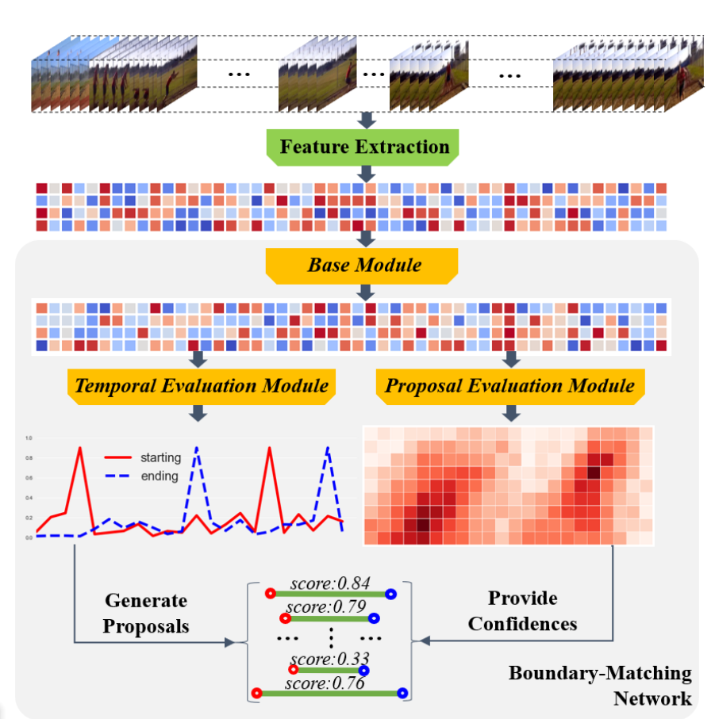

# BMN

<!-- TOC -->

- [BMN](#bmn)
- [BMN description](#bmn-description)
- [Model Architecture](#model-architecture)
- [Dataset](#dataset)
    - [Dataset prepararion](#dataset-prepararion)
- [Requirements](#requirements)
- [Quick Start](#quick-start)
- [Script Description](#script-description)
    - [Scripts and sample code](#scripts-and-sample-code)
    - [Script parameters](#script-parameters)
    - [Training process](#training-process)
        - [Training](#training)
        - [Experiment names](#experiment-names)
        - [Monitoring](#monitoring)
    - [Evaluation process](#evaluation-process)
        - [Evaluation](#evaluation)
- [Model description](#model-description)
    - [Performance](#performance)
        - [Training performance](#training-performance)
            - [Training BSN on ActivityNet1.3](#training-bsn-on-activitynet13)
        - [Evaluation performance](#evaluation-performance)
            - [Evaluating BMN on ActivityNet1.3](#evaluating-bmn-on-activitynet13)
- [Random description](#random-description)
- [ModelZoo Homepage](#modelzoo-homepage)

<!-- /TOC -->

# BMN description

Boundary-Matching Network (BMN) - effective, efficient and end-to-end proposal generation method based on Boundary-Matching (BM) mechanism, which denote a proposal as a matching pair of starting and ending boundaries and combines all densely distributed BM pairs into the BM confidence map.
This method generates proposals with precise temporal boundaries as well as reliable confidence scores simultaneously. The two-branches of BMN are jointly trained in an unified framework. BMN can achieve state-of-the-art temporal action detection performance on two challenging datasets: ActivityNet-1.3 and THUMOS14.

[Lin, Tianwei, et al. "Bmn: Boundary-matching network for temporal action proposal generation." Proceedings of the IEEE/CVF International Conference on Computer Vision.](https://arxiv.org/pdf/1907.09702v1.pdf)

# Model Architecture



# Dataset

Dataset used：[ActivityNet1.3](http://activity-net.org/download.html)

- Dataset consists of:

    - 200 activity classes

    - 10,024 training videos (15,410 instances)

    - 4,926 validation videos (7,654 instances)

    - 5,044 testing videos (labels withheld)

**Note:** In this repository, the BMN Network is implemented directly, and not the entire pipeline. So, we did not use the Activity Net dataset itself, but the sets of functions extracted from it and proposed by the authors of the bmn method.

In addition, during the extraction of feature sets, some videos were skipped for technical reasons. This leads to some discrepancy between the extracted feature sets and the shortcuts offered on the official website. This can be fixed by writing your own script for matching video IDs and tags, but we assume to use the already corrected (reduced) annotation file proposed in the official repository.

## Dataset prepararion

To train BSN we need three parts of data:

- Feature sets extacted from videos may be downloaded and [here (Paddle-Paddle storage)](<https://paddlemodels.bj.bcebos.com/video_detection/bmn_feat.tar.gz>)

After downloading you need just extract it to some directory were dataset will be placed (/data/ActivityNet1.3 for example)

- Video annotations 1st form - [link](<https://paddlemodels.bj.bcebos.com/video_detection/activitynet_1.3_annotations.json>) - download and extract to the same folder

- Vidaeo annotations 2nd form - [link](<https://github.com/wzmsltw/BSN-boundary-sensitive-network.pytorch/blob/master/Evaluation/data/activity_net_1_3_new.json>) - download and place to the same folder

- Vidaeo annotations 3nd form - [link](<https://github.com/JJBOY/BMN-Boundary-Matching-Network/tree/master/data/activitynet_annotations>) - download and place to the same folder

- Finally directory structure should be as follows:

  ```text
  <datasets dir>
  ├── ActivityNet1.3
  │   ├── annotations
  │   │   ├── activitynet_1.3_annotations.json
  │   │   ├── activity_net_1_3_new.json
  │   │   ├── anet_anno_action.json
  │   │   ├── video_info_new.csv
  │   ├── fix_feat_100
  │   │   ├── v_---9CpRcKoU.npy
  │   │   ├── v_---9CpRcKoU.npy
  │   │   ├── v_---9CpRcKoU.npy
  │   │   ├── v_---9CpRcKoU.npy
  │   │    ...
  ......
  ```

# Requirements

- Hardware
    - Use NVIDIA GPU to build the hardware environment.
    - **At least 24 GB device memory required**
- Framework
    - [MindSpore](https://www.mindspore.cn/install/en)
- For more information, see the following resources:
    - [MindSpore Tutorials](https://www.mindspore.cn/tutorials/en/master/index.html)
    - [MindSpore Python API](https://www.mindspore.cn/docs/api/en/master/index.html)
- 3d-part requirements specified in the `requirements.txt` file

# Quick Start

After installing MindSpore through the official website and cloning this repository, you can follow the steps below for training and evaluation:

- GPU environment running

  ```bash
  # Run training
  bash run_train.sh CONFIG_PATH

  # Run evaluation
   bash run_eval.sh CONFIG_PATH CKPT_PATH
  ```

# Script Description

## Scripts and sample code

```text
└─ BMN
    ├─ scripts
        └─ bmn_scheme.png
    ├─ scripts
        ├─ run_eval.sh
        └─ run_train.sh
    ├─ src
        ├─ bmn.py
        ├─ callbacks.py
        ├─ config.py
        ├─ dataset.py
        ├─ eval_proposal.py
        ├─ loss.py
        ├─ metrics.py
        ├─ postprocessing.py
        └─ utils.py
    ├─ requirements.txt
    ├─ README.md
    ├─ train.py
    └─ eval.py
```

## Script parameters

The main environmental parameters are listed here, other parameters can be found/configured in config/default_gpu.yaml

```yaml
platform: 'GPU' # Now only GPU environment available
stage: 'TEM' # Which part of model will be trained/evaluated
keep_checkpoint_max: 5 # How much checkpoints will be saved
device_id: 0 # Which device will be used for training
experiment_name: "default" # Experiment label to distinguish different experiments. Different experiment names means:
# - different execution directories
# - different ckpt dirs
# - different results dirs
# Just for convenience ~
output_dir: "/path/to/some/dir/" # Directory, where network outputs, checkpoints and eval results will be stored
data_root: "/path/to/data/dir/ActivityNet1.3" # Path to the ActivityNet folder, which we prepared above
```

## Training process

### Training

**Before start you should set up `output_dir` and `data_root` in config.py.**

- GPU

```bash
bash run_train.sh CONFIG_PATH

#For example:
bash run_train.sh ../config/default_gpu.yaml
```

### Monitoring

Each script has own log file, that placed in script's folder:

```text
└─ default_train
    ├─ log
    ├─ summary
    ....
```

To monitor the log in real time use `tail`:

```bash
tail -f -n 30 default_tem_train/log
```

To exit watch just use `Ctrl+C`.

Also you may use mindinsight tool to see loss/metrics plots in realtime.
Mindinsight logs is stored in 'summary' dir (see scheme above). For more details please visit official [website](https://mindspore.cn/mindinsight/docs/en/r1.6/summary_record.html).

## Evaluation process

### Evaluation

- GPU

```bash
bash run_eval.sh CONFIG_PATH <output_path/default/ckpt/bmn_auto....>

# For example:
bash run_eval.sh ../config/default_gpu.yaml /data/bmn_output/default/ckpt/bmn_auto_-9_603.ckpt
```

# Model description

## Performance

### Training performance

#### Training BSN on ActivityNet1.3

| Parameter          | GPU                            |
| ------------- | ---------------------------------------------|
| Model      | BMN    |
| Environment   | NVIDIA RTX3090；CPU 2.90GHz，64 cores；RAM 251G；OS Ubuntu 18.04.6       |
| Upload date  |2022-04-15           |
| MindSpore version |1.6.1                    |
| Dataset        |ActivityNet1.3   |
| Training params|epoch=9, batch_size = 16, Adam|
| Speed          | 990 ms/step |
| Total duration |90 min |

### Evaluation performance

#### Evaluating BMN on ActivityNet1.3

| Parameter           |GPU                           |
| ------------------- |--------------------------- |
| Model       |BMN                        |
| Environment           |NVIDIA RTX3090；OS Ubuntu 18.04        |
| Upload date       |2022-04-12                       |
| MindSpore version  |1.6.1                            |
| Dataset          |ActivityNet1.3                         |
| batch_size      |16                     |
| AR@100     | 75.01 |
| AUC       | 67.25 |

# Random description

In dataset.py, "shuffle=True" is set. In train.py, SparseRandomProjection is used.

# ModelZoo Homepage  

Please visit the official website [homepage](https://gitee.com/mindspore/models) .
