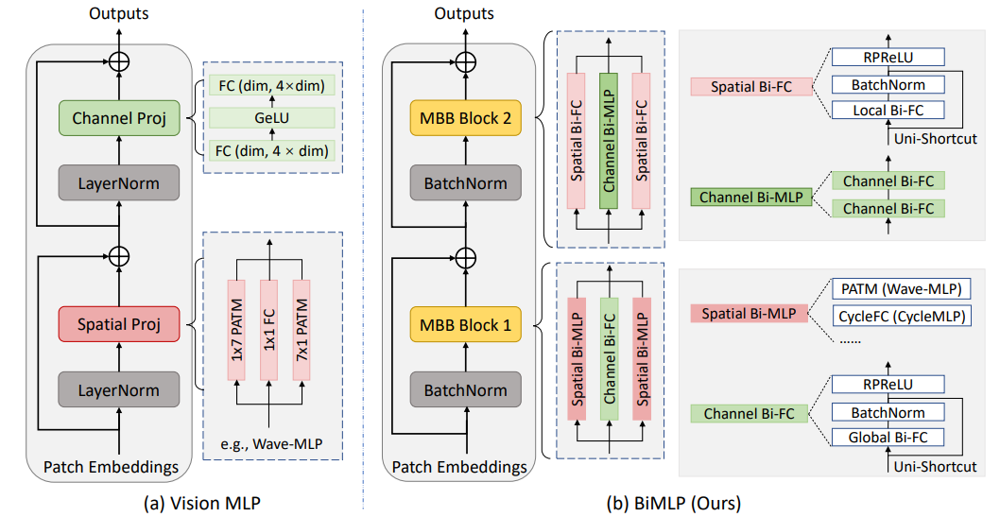

# Contents

- [Contents](#contents)
    - [BiMLP Description](#bimlp-description)
    - [BiMLP architecture](#bimlp-architecture)
    - [Dataset](#dataset)
    - [Environment Requirements](#environment-requirements)
    - [Script description](#script-description)
        - [Script and sample code](#script-and-sample-code)
    - [Eval process](#eval-process)
        - [Usage](#usage)
        - [Launch](#launch)
        - [Result](#result)
    - [Model Description](#model-description)
        - [Performance](#performance)  
            - [Training Performance](#evaluation-performance)
            - [Inference Performance](#evaluation-performance)
    - [Description of Random Situation](#description-of-random-situation)
    - [ModelZoo Homepage](#modelzoo-homepage)

# [BiMLP Description](#contents)

This paper studies the problem of designing compact binary architectures for vision multi-layer perceptrons (MLPs). We provide extensive analysis on the difficulty of binarizing vision MLPs and find that previous binarization methods perform poorly due to limited capacity of binary MLPs. In contrast with the traditional CNNs that utilizing convolutional operations with large kernel size, fully-connected (FC) layers in MLPs can be treated as convolutional layers with kernel size 1×1. Thus, the representation ability of the FC layers will be limited when being binarized, and places restrictions on the capability of spatial mixing and channel mixing on the intermediate features. To this end, we propose to improve the performance of binary MLP (BiMLP) model by enriching the representation ability of binary FC layers. We design a novel binary block that contains multiple branches to merge a series of outputs from the same stage, and also a universal shortcut connection that encourages the information flow from the previous stage. The downsampling layers are also carefully designed to reduce the computational complexity while maintaining the classification performance. Experimental results on benchmark dataset ImageNet-1k demonstrate the effectiveness of the proposed BiMLP models, which achieve state-of-the-art accuracy compared to prior binary CNNs.

[Paper](https://openreview.net/pdf?id=2ge7_pORL_n): Yixing Xu, Xinghao Chen, Yunhe Wang. BiMLP: Compact Binary Architectures for Vision Multi-Layer Perceptrons. Neurips 2022.

## [RNA architecture](#contents)

An illustration of Random Normalization Aggregation and Black-box Adversarial Training:



## [Dataset](#contents)

Dataset used: [ImageNet2012]

- Dataset size 224*224 colorful images in 1000 classes
    - Train：1,281,167 images  
    - Test： 50,000 images
- Data format：jpeg
    - Note：Data will be processed in dataset.py

## [Environment Requirements](#contents)

- Hardware(Ascend/GPU)
    - Prepare hardware environment with Ascend or GPU.
- Framework
    - [MindSpore](https://www.mindspore.cn/install/en)
- For more information, please check the resources below£º
    - [MindSpore Tutorials](https://www.mindspore.cn/tutorials/en/master/index.html)
    - [MindSpore Python API](https://www.mindspore.cn/docs/api/en/master/index.html)

## [Script description](#contents)

### [Script and sample code](#contents)

```python
├── BiMLP
  ├── Readme.md     # descriptions about BiMLP   # shell script for evaluation with GPU
  ├── src
  │   ├──quan_conv.py      # parameter configuration
  │   ├──dataset.py     # creating dataset
  │   ├──wavemlp_20_3.py      # Pruned ResNet architecture
  ├── eval.py       # evaluation script
```

## [Eval process](#contents)

### Usage

After installing MindSpore via the official website, you can start evaluation as follows:

### Launch

```bash
# infer example
  # python
  GPU: python eval.py --dataset_path dataset --platform GPU --checkpoint_path [CHECKPOINT_PATH] --checkpoint_nm BiMLP_M
```

> checkpoint can be produced in training process.

### Result

```bash
result: {'acc': 0.7155689820742638} ckpt= ./BiMLP_M.ckpt
```

## [Model Description](#contents)

### [Performance](#contents)

#### Evaluation Performance

| Parameters          | Ascend                      |
| ------------------- | --------------------------- |
| Model Version       | BiMLP_M              |
| Resource            | GPU     |
| Uploaded Date       | 26/11/2022 (month/day/year) |
| MindSpore Version   | 1.8.1                      |
| Dataset             | ImageNet2012                |
| batch_size          | 64                        |
| outputs             | probability                 |
| Accuracy            | 1pc: 71.56%             |

## [Description of Random Situation](#contents)

In dataset.py, we set the seed inside “create_dataset" function. We also use random seed in train.py.

## [ModelZoo Homepage](#contents)

Please check the official [homepage](https://gitee.com/mindspore/models).
