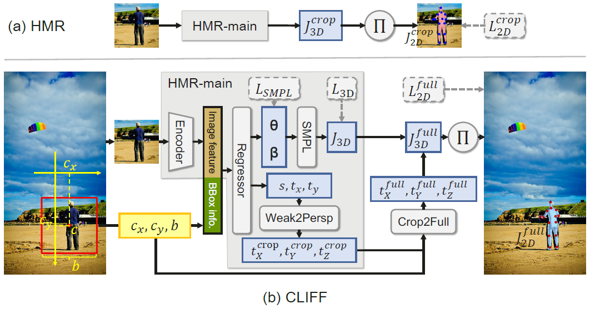

# 目录

- [模型简介](#模型简介)
- [数据集](#数据集)
- [环境要求](#环境要求)
- [快速入门](#推理)
- [ModelZoo主页](#modelzoo-主页)

## 模型简介


*(该测试视频来自3DPW的测试集，处理时是一帧一帧地处理的，并没有加上时域平滑.)*

CLIFF（ECCV 2022 Oral）是一种基于单目图像的人体动作捕捉算法，在多个公开数据集上取得了优异的效果。

> CLIFF: Carrying Location Information in Full Frames into Human Pose and Shape Estimation. \
> Zhihao Li, Jianzhuang Liu, Zhensong Zhang, Songcen Xu, and Youliang Yan ⋆ \
> ECCV 2022 Oral



## 数据集

不涉及

## 环境要求

```bash
conda create -n cliff python=3.9
pip install -r requirements.txt
```

下载预训练模型和测试样例，以运行推理代码。
[[百度网盘](https://pan.baidu.com/s/15v0jnoyEpKIXWhh2AjAZeQ?pwd=7777)]
[[Google Drive](https://drive.google.com/drive/folders/1_d12Q8Yj13TEvB_4vopAbMdwJ1-KVR0R?usp=sharing)]

请把预训练模型放在`ckpt`目录下，测试样例放在`data`目录下，形成如下的目录结构：

```text
${ROOT}
|-- ckpt
    |-- cliff-hr48-PA43.0_MJE69.0_MVE81.2_3dpw.ckpt
    |-- cliff-res50-PA45.7_MJE72.0_MVE85.3_3dpw.ckpt
|-- data
    |-- data/im07937.png
    |-- data/smpl_mean_params.npz
```

## 快速入门

运行脚本`demo.py`即可推理。

```bash
python demo.py --input_path PATH --ckpt CKPT
```

<p float="left">
    
    
    
    
</p>

<p float="left">
    
    
    
    
</p>

demo的相关参数可以修改，关于这些参数的说明请看`demo.py`文件的下方。

## ModelZoo 主页

请浏览官方[主页](https://gitee.com/mindspore/models)。