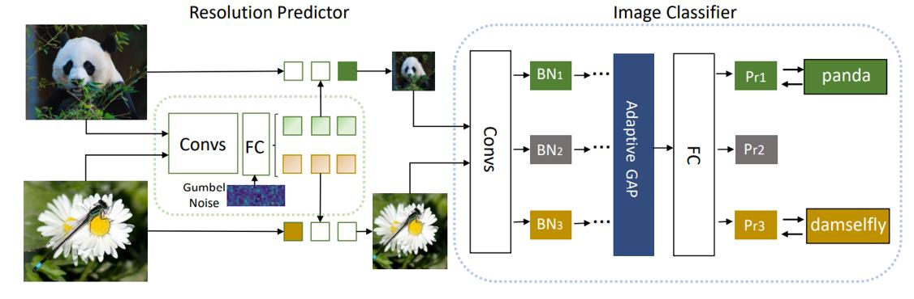

# Contents

- [Contents](#contents)
    - [DRNet Description](#DRNet-description)
    - [Model Architecture](#model-architecture)
    - [Dataset](#dataset)
    - [Environment Requirements](#environment-requirements)
    - [Script Description](#script-description)
        - [Script and Sample Code](#script-and-sample-code)
        - [Evaluation Process](#evaluation-process)
    - [Model Description](#model-description)
        - [Performance](#performance)
            - [Evaluation Performance](#evaluation-performance)
    - [ModelZoo Homepage](#modelzoo-homepage)

## [DRNet Description](#contents)

DRNet dynamically adjusts the input resolution of each sample for efficient inference. To accurately find the required minimum
resolution of each image, we introduce a resolution predictor which is embedded in front of the entire network. In practice, we set several different resolutions as candidates and feed the image into the resolution predictor to produce a probability distribution over candidate resolutions as the output. The network architecture of the resolution predictor is carefully designed with negligible computational complexity and trained jointly with classifier for recognition in an end-to-end fashion.

[Paper](https://arxiv.org/pdf/2106.02898.pdf): Mingjian Zhu, Kai Han,  Enhua Wu, Qiulin Zhang, Ying Nie, Zhenzhong Lan, Yunhe Wang. Dynamic Resolution Network. NeurIPS 2021.

## [Model Architecture](#contents)

The framework of DRNet is shown below:



## [Dataset](#contents)

Dataset used: [ImageNet](https://image-net.org/download)

- Dataset size: This dataset spans 1000 object classes and contains 1,281,167 training images, 50,000 validation images and 100,000 test images.

- Data format: RGB images.

## [Environment Requirements](#contents)

- Hardware(Ascend/GPU)
    - Prepare hardware environment with Ascend or GPU.
- Framework
    - [MindSpore](https://www.mindspore.cn/install/en)
- For more information, please check the resources below.
    - [MindSpore Tutorials](https://www.mindspore.cn/tutorials/en/master/index.html)
    - [MindSpore Python API](https://www.mindspore.cn/docs/en/master/index.html)

## [Script description](#contents)

### [Script and sample code](#contents)

```bash
DRNet
├── eval.py
├── readme.md
└── checkpoint
├── fig
│   └── DRNet.JPG
└── config
    └── resnet50_imagenet2012_config.yaml
└── src
    ├── predictor.py
    ├── classifier.py
    ├── dataset.py
    ├── gumbelmodule.py
    └── model_utils
        └── config.py
```

## [Evaluation Process](#contents)

### Usage

After installing MindSpore via the official website, you can start evaluation as follows:

### Launch

```bash
# infer example
  GPU: python eval.py
```

> checkpoint can be downloaded at https://mindspore.cn/resources/hub.

### Result

```bash
result: {'acc': 77.4} ckpt= ./checkpoint/classifier_net.ckpt ./checkpoint/predictor_net.ckpt
```

## [Model Description](#contents)

### [Performance](#contents)

#### Evaluation Performance

| 参数          | GPU                     |
| ------------------- | --------------------------- |
| Model Version                | DRNet_Resnet50 |
| uploaded Date                | 03/2022 |
| Dataset                 | ImageNet-1k Val，50,000 images |
| Resource                  | NV SMX2 V100-32G  |
| MindSpore Version          | 1.5.0      |
| Accuracy              | top1:77.4%                  |
| Inference Speed                   | 4.73 ms per frame|
| Inference Time | 236s|

## [ModelZoo Homepage](#contents)

Please check the official [homepage](https://gitee.com/mindspore/models).