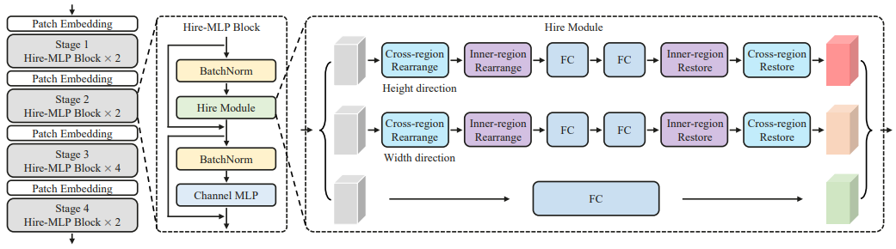

# Contents

- [Contents](#contents)
    - [HireMLP Description](#hiremlp-description)
    - [Model architecture](#model-architecture)
    - [Dataset](#dataset)
    - [Environment Requirements](#environment-requirements)
    - [Script description](#script-description)
        - [Script and sample code](#script-and-sample-code)
    - [Eval process](#eval-process)
        - [Usage](#usage)
        - [Launch](#launch)
        - [Result](#result)
    - [Description of Random Situation](#description-of-random-situation)
    - [ModelZoo Homepage](#modelzoo-homepage)

## [HireMLP Description](#contents)

  This paper presents Hire-MLP, a simple yet competitive vision MLP architecture via Hierarchical rearrangement, which contains two levels of rearrangements. Specifically, the innerregion rearrangement is proposed to capture local information inside a spatial region, and the cross-region rearrangement is proposed to enable information communication between different regions and capture global context by circular shifting all tokens along spatial directions.

[Paper](https://arxiv.org/pdf/2108.13341.pdf): Jianyuan Guo, Yehui Tang, Kai Han, Xinghao Chen, Han Wu, Chao Xu, Chang Xu, Yunhe Wang. Hire-MLP: Vision MLP via Hierarchical Rearrangement. Accepted in CVPR 2022.

## [Model architecture](#contents)

A block of HireMLP is shown below:



## [Dataset](#contents)

Dataset used: [ImageNet2012]

- Dataset size 224*224 colorful images in 1000 classes
    - Train：1,281,167 images  
    - Test： 50,000 images
- Data format：jpeg
    - Note：Data will be processed in dataset.py

## [Environment Requirements](#contents)

- Hardware(Ascend/GPU)
    - Prepare hardware environment with Ascend or GPU.
- Framework
    - [MindSpore](https://www.mindspore.cn/install/en)
- For more information, please check the resources below£º
    - [MindSpore Tutorials](https://www.mindspore.cn/tutorials/en/master/index.html)
    - [MindSpore Python API](https://www.mindspore.cn/docs/en/master/index.html)

## [Script description](#contents)

### [Script and sample code](#contents)

```bash
HireMLP
├── eval.py          # inference entry
├── fig
│   └── HireMLP.PNG  # the illustration of HireMLP network
├── readme.md        # Readme
└── src
    ├── dataset.py   # dataset loader
    └── hire_mlp.py  # HireMLP network
```

## [Eval process](#contents)

### Usage

After installing MindSpore via the official website, you can start evaluation as follows:

### Launch

```bash
# HireMLP infer example
  GPU: python eval.py --dataset_path dataset --platform GPU --checkpoint_path [CHECKPOINT_PATH]
```

> checkpoint can be downloaded at https://download.mindspore.cn/model_zoo/.

### Result

```bash
result: {'acc': 0.788} ckpt= ./hire_tiny_ms.ckpt
```

## [Description of Random Situation](#contents)

In dataset.py, we set the seed inside "create_dataset" function. We also use random seed in train.py.

## [ModelZoo Homepage](#contents)

Please check the official [homepage](https://gitee.com/mindspore/models).