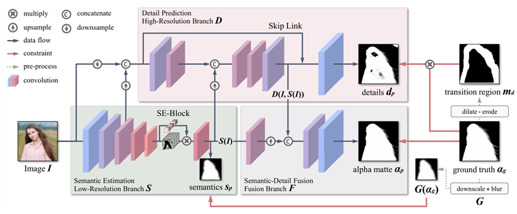

# 目录

- [目录](#目录)
- [MODNet描述](#MODNet描述)
- [数据集](#数据集)
- [环境要求](#环境要求)
- [脚本说明](#脚本说明)
    - [脚本及样例代码](#脚本及样例代码)
    - [脚本参数](#脚本参数)
        - [训练](#训练)
        - [评估](#评估)
    - [参数配置](#参数配置)
    - [训练过程](#训练过程)
        - [训练](#训练-1)
    - [评估过程](#评估过程)
        - [评估](#评估-1)
    - [模型导出](#模型导出)
- [模型描述](#模型描述)
    - [性能](#性能)
        - [训练性能](#训练性能)
        - [评估性能](#评估性能)
- [ModelZoo主页](#modelzoo主页)

# MODNet描述

 [MODNet](https://arxiv.org/abs/2011.11961v1) (matting objective decomposition network)是一种轻量级网络，由香港城市大学和商汤科技于2020年11月首次提出。它仅仅使用单一的图像作为输入，通过一个模型，就能实现实时性与准确性的兼顾。它将人像抠图任务分解成三个相关的子任务，分别是语义估计（Semantic Estimation）、细节预测（Detail Prediction）和语义细节融合（Semantic-Detail Fusion，并通过特定约束执行同步优化。最终，相比于不需要三元图的方法，MODNet 具有更快，更精确以及更好的泛化能力。相比于需要三元图的方法，MODNet 的结果没有超过那些基于三元图的方法，但实验表明MODNet在实际应用中更加稳定，原因就在于不使用三元图作为输入。

整体来看，MODNet分为三个结构：低分辨率分支（Low-Resolution Branch S）、高分辨率分支（High-Resolution Branch D）和融合分支（Fusion Branch F）, 分别实现语义估计、细节预测和语义和细节融合这三个子目标，网络结构如下图。

<center class="half">
    <br>
<div style="color:orange; border-bottom: 1px solid #d9d9d9;    display: inline-block;    color: #999;    padding: 2px;">MODNet网络结构</div> </center>

# 数据集

## 使用的数据集：[P3M-10k](https://github.com/JizhiziLi/P3M)

P3M-10k数据集（Privacy-Preserving Portrait Matting）是一个人像抠图数据集，为了保护隐私对人物面部进行了模糊。它包含10000张经过面部模糊处理的未命名高分辨率人像图片，以及高质量的真实alpha蒙版。这些图像都是免费使用的。训练集中有9421个图像，测试集中有500个图像（表示为P3M-500-P）。此外，还有另外500张没有面部模糊处理的公众名人图片，来评估在PPT设置下，抠图网络模型在正常人像图像（表示为P3M-500-NP）上的抠图效果。

更多信息请参考：[P3M-10k](https://github.com/JizhiziLi/P3M)。

- 数据集大小：约5.39GB，共9921张图像
 - 训练集：9421张图像
 - 测试集：500张图像
 - 注：dir_data中需要指定数据集所在位置的上一层目录。

```bash
P3M-10k
├── train
│   ├── blurred_image
│   ├── mask (alpha mattes)
├── validation
│   ├── P3M-500-P
│   │   ├── blurred_image
│   │   ├── mask
│   │   ├── trimap
│   ├── P3M-500-NP
│   │   ├── original_image
│   │   ├── mask
│   │   ├── trimap
```

# 环境要求

- 硬件（GPU）
    - 准备GPU处理器搭建硬件环境。
- 框架
    - [MindSpore](https://www.mindspore.cn/install)
- 如需查看详情，请参见如下资源：
    - [MindSpore教程](https://www.mindspore.cn/tutorials/zh-CN/master/index.html)
    - [MindSpore Python API](https://www.mindspore.cn/docs/zh-CN/master/index.html)

# 脚本说明

## 脚本及样例代码

```bash
├── MODNet
    ├── data
    │   ├── README.md   // 所有数据集相关说明
    ├── pretrained
    │   ├── README.md   // 预训练模型说明
    ├── script
    │   ├── run_distributed_train_gpu.sh           // GPU分布式训练shell脚本
    │   ├── run_standalone_eval_gpu.sh             // eval验证shell脚本
    │   ├── run_standalone_train_gpu.sh            // GPU训练shell脚本
    ├── src
    │   ├── models
    │   │   ├──backbones                      // 主干网络
    │   │   │   ├── __init__.py               // 模块声明
    │   │   │   ├── mobilenetv2.py            // mobilenetv2 网络
    │   │   │   ├── wrapper.py                // 网络封装
    │   │   ├── __init__.py                   // 模块声明
    │   │   ├── modnet.py                     // MODNet网络
    │   ├── dataset.py                    // loss函数
    │   ├── losses.py                     // loss函数
    │   ├── transformers.py               // 数据增强方法
    │   ├── utils.py                      // 训练工具
    ├── train.py                              // 训练脚本
    ├── eval.py                               // 评估脚本
    ├── get_init_weight.py                    // 模型转换
    ├── P3M.yml                               // P3M训练参数
    ├── README.md                             // 自述文件
```

## 脚本参数

### 训练

```bash
用法：python train.py [--config][--output_path][--device_id]
选项：
  --config         数据集训练参数
  --output_path    训练输出日志和ckpt的存储路径。
  --device_id      希望使用的设备号
```

### 评估

```bash
用法：python eval.py [--config][--ckpt_path][--output_path][--device_id]
选项：
  --config         数据集训练参数
  --ckpt_path      加载的模型文件
  --output_path    输出图片的存储路径。
  --device_id      希望使用的设备号
```

## 参数配置

在args.py中可以同时配置训练参数和评估参数。

```bash
"name": P3M-10k,                        # 数据集名称
"dataset_root": ./data/P3M-10k/,        # 数据集根目录
"img_subpath": train/blurred_image,     # 训练图片与dataset_root的相对路径
"alpha_subpath": train/mask,            # 训练标签与dataset_root的相对路径
"workers": 4,                           # 数据加载时使用的线程数
"batch_size": 16,                       # 输入数据的批次大小
"transforms": 略,                       # 数据增强的方法
"backbone_pretrained": True             # 是否使用预训练模型
```

## 训练过程

### 训练准备

- 根据./data和./pretrained中的说明准备训练数据集和预训练模型

- 将下载的预训练模型放在./pretrained，并运行模型转换代码，将模型转化为mindspore版本

  ```shell
  python get_init_weight.py
  ```

- 修改PPM.yml文件中数据集路径

### 训练

- 单卡训练

```bash
bash scripts/run_standalone_train_gpu.sh [CONFIG_PATH] [DEVICE_ID]
# for example: bash scripts/run_standalone_train_gpu.sh ./PPM.yml 0
```

- 多卡训练

```bash
bash scripts/run_distributed_train_gpu.sh [CONFIG_PATH] [DEVICE_NUM] [CUDA_VISIBLE_DEVICES]
# for example: bash scripts/run_distributed_train_gpu.sh /path/to/config.yml 8 0,1,2,3,4,5,6,7
```

## 评估过程

### 评估

- 评估过程如下

```bash
bash script/eval.sh [TEST_DATA_DIR] [CHECKPOINT_PATH] [DATASET_TYPE]
for example: bash scripts/run_standalone_eval_gpu.sh /path/to/config.yml /path/to/ckpt 0
```

- 上述python命令在后台运行，可通过`eval.log`文件查看结果。

# 模型描述

MODNet网络的输出为人像的抠图结果，如下图所示，识别结果与标签基本一致，人物的发丝和手中的道具都被识别出来了，这个效果是非常不错的。在论文中作者使用均方误差(MSE)和平均绝对误差（MAE）衡量网络的精度，最终我们所训练的网络精度也达到了论文中的标准。

<center class="half">
    
    
    <br>
<div style="color:orange; border-bottom: 1px solid #d9d9d9;display:inline-block; color: #999; padding: 2px;">网络输出结果<br> （从左往右依次为输入图片、真实标签、预测结果）</div> </center>

## 性能

### 训练性能

| 参数           | MODNet(GPU)                          |
| -------------------------- | ---------------------------------------------- |
| 模型版本                | MODNet                                    |
| 资源                   | GPU；                 |
| 上传日期              | 2022-09-29                         |
| MindSpore版本        | 1.8.0                                       |
| 数据集                |P3M-10k                                   |
| 训练参数  |epoch=40, batch_size = 16, lr=0.01  |
| 优化器                  | SGD                                                      |
| 输出              | 图片中人物的抠图结果                      |
| 速度 | 单卡：400毫秒/步 |
| 总时长 | 单卡：2.68小时 |
| 调优检查点 |    75MB（.ckpt 文件）            |

### 评估性能

| 参数  | MODNet(GPU)              |
| ------------------- | --------------------------- |
| 模型版本      | MODNet                  |
| 资源        | GPU              |
| 上传日期              | 2022-09-29                   |
| MindSpore版本   | 1.8.0                 |
| 数据集 | P3M-10k |
| batch_size          |   1                        |
| 输出 | 性能指标和抠图的结果 |
| 准确率 | 单卡：MSE: 0.0044, MAD: 0.0072 |

## Reference

- [ZHKKKe/MODNet](https://github.com/ZHKKKe/MODNet)

# ModelZoo主页

 请浏览官网[主页](https://gitee.com/mindspore/models)。
