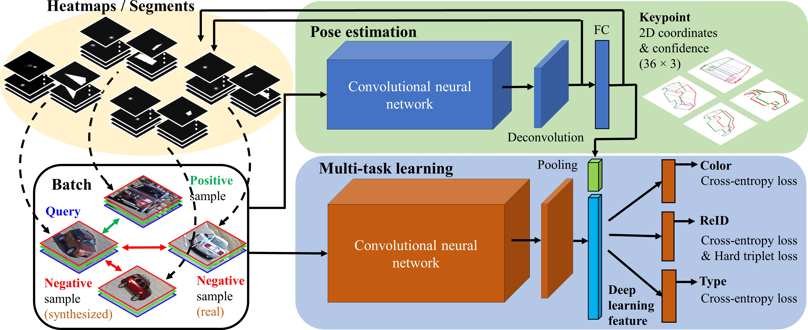

# 目录

- [目录](#目录)
- [PAMTRI概述](#PAMTRI概述)
- [模型架构](#模型架构)

<!-- /TOC -->

# PAMTRI概述

PAMTRI使用多任务学习和嵌入的姿态表示来解决车辆重新识别的问题。模型框架由两个卷积神经网络（CNN）组成，如下图所示。上部：姿势估计网络(PoseEstNet)是高分辨率网络（HRNet）的延伸，用于预测关键点坐标（有置信度/可见度）和生成热图/分段。底部。多任务网络(MultiTaskNet)使用来自HRNet的嵌入式姿态信息，用于车辆的联合重新识别和属性分类。

[论文](http://arxiv.org/abs/2005.00673) Tang Z ,  Naphade M ,  Birchfield S , et al. PAMTRI: Pose-Aware Multi-Task Learning for Vehicle Re-Identification Using Highly Randomized Synthetic Data[J]. IEEE, 2020.

# 模型架构

具体代码实现如下：

- [PoseEstNet](PoseEstNet):用于车辆姿势估计的HRNet的修改版。

- [MultiTaskNet](MultiTaskNet):使用嵌入式姿态表征的车辆联合重新识别和属性分类的多任务网络。