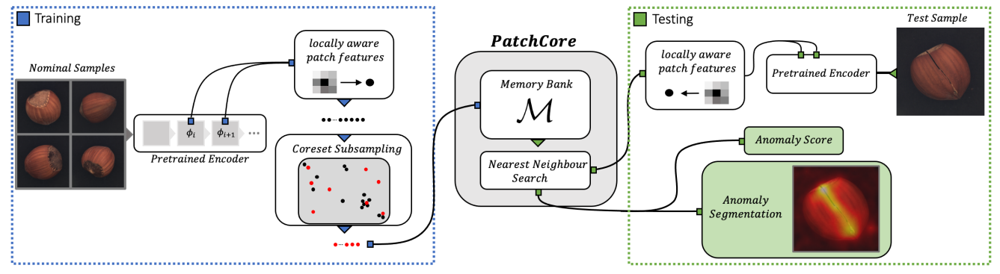

# PatchCore

<!-- TOC -->

- [PatchCore](#patchcore)
- [PatchCore description](#patchcore-description)
- [Model Architecture](#model-architecture)
- [Dataset](#dataset)
- [Characteristics](#characteristics)
    - [Mixed precision](#mixed-precision)
- [Requirements](#requirements)
- [Quick Start](#quick-start)
- [Script Description](#script-description)
    - [Scripts and sample code](#scripts-and-sample-code)
    - [Script parameters](#script-parameters)
    - [Training process](#training-process)
        - [Download pretrained weights](#download-pretrained-weights)
        - [Training](#training)
    - [Evaluation process](#evaluation-process)
        - [Evaluation](#evaluation)
    - [Export process](#export-process)
        - [Export](#export)
    - [Inference process](#inference-process)
        - [Inference](#inference)
- [Model description](#model-description)
    - [Performance](#performance)
        - [Training performance](#training-performance)
            - [Training PatchCore on MVTec-AD](#training-patchcore-on-mvtec-ad)
        - [Evaluation performance](#evaluation-performance)
            - [Evaluating PatchCore on MVTec-AD](#evaluating-patchcore-on-mvtec-ad)
        - [Inference performance](#inference-performance)
            - [Inference PatchCore on MVTec-AD](#inference-patchcore-on-mvtec-ad)
- [Random description](#random-description)
- [ModelZoo Homepage](#modelzoo-homepage)

<!-- /TOC -->

# PatchCore description

PatchCore is an industrial anomaly detection model based on a pre-trained neural network proposed in 2021, ranking first in accuracy on the MVTex-AD dataset by the end of 2021. Only normal samples are used in PatchCore training, the network parameters are not updated during the training process (no backpropagation), the network output of each image (feature representation of the corresponding area of ​​the image) is saved as part of the "Memory Bank", and finally sampling is performed The operation gets the final "Memory Bank". Load the "Memory Bank" during inference, and after obtaining the network output of a certain picture, obtain the picture score through the calculation defined in the paper to output the anomaly map.

[Towards Total Recall in Industrial Anomaly Detection](https://arxiv.org/abs/2106.08265)：Karsten Roth, Latha Pemula, Joaquin Zepeda, Bernhard Scholkopf, Thomas Brox, Peter Gehler.Towards Total Recall in Industrial Anomaly Detection.2021.

# Model Architecture


PatchCore uses the pre-trained WideResNet50 as the Encoder and removes the layers after layer3.

# Dataset

Dataset used：[MVTec AD](<https://www.mvtec.com/company/research/datasets/mvtec-ad/>)

- Data set size: 4.9G, a total of 15 classes, 5354 images (size between 700x700~1024x1024)

    - Training set: 3629 in total

    - Test set: 1725 in total

- Data format: binary file

- Note: Data will be processed in src/dataset.py.

- Directory Structure:

  ```text
  data
  ├── bottle
  │   ├── bottle_test.json
  │   ├── bottle_train.json
  │   ├── ground_truth
  │   │   ├── broken_large
  │   │   │   ├── 000_mask.png
  │   │   │   └── ......
  │   │   ├── broken_small
  │   │   │   ├── 000_mask.png
  │   │       └── ......
  │   ├── test
  │   │   ├── broken_large
  │   │   │   ├── 000.png
  │   │   │   └── ......
  │   │   └── good
  │   │       ├── 000.png
  │   │       └── ......
  │   └── train
  │       └── good
  │           ├── 000.png
  │           └── ......
  ├── cable
  │   ├── cable_test.json
  │   ├── cable_train.json
  │   ├── ground_truth
  │   │   ├── bent_wire
  │   │   │   ├── 000_mask.png
  ......
  ```

# Characteristics

## Mixed precision

Training methods with [mixed precision](https://www.mindspore.cn/docs/programming_guide/en/r1.6/enable_mixed_precision.html) use support for both single-precision and half-precision data to increase the training speed of deep learning neural networks, while maintaining the network accuracy that can be achieved with single-precision training. Mixed-precision training increases computational speed and reduces memory usage while enabling training of larger models on specific hardware or enabling larger batches of training. Taking the FP16 operator as an example, if the input data type is FP32, the MindSpore background will automatically reduce the precision to process the data. You can open the INFO log and search for "reduce precision" to view operators with reduced precision.

# Requirements

- Hardware
    - Use NVIDIA GPU or Ascend processor to build the hardware environment.
- Framework
    - [MindSpore](https://www.mindspore.cn/install/en)
- For more information, see the following resources:
    - [MindSpore Tutorials](https://www.mindspore.cn/tutorials/en/master/index.html)
    - [MindSpore Python API](https://www.mindspore.cn/docs/api/en/master/index.html)

# Quick Start

After installing MindSpore through the official website, you can follow the steps below for training and evaluation:

- Ascend processor environment running

  ```bash
  # Run training example
  python train.py --dataset_path ../data/ --device_id 0 --pre_ckpt_path ../pretrain/PatchCore_pretrain.ckpt --category screw > train.log 2>&1 &
  or
  bash run_train.sh [dataset_path] [device_id] [pre_ckpt_path] [category]

  # Run evaluation example
  python eval.py --dataset_path ../data/ --device_id 0 --pre_ckpt_path ../pretrain/PatchCore_pretrain.ckpt --category screw > eval.log 2>&1 &
  or
  bash run_eval.sh [dataset_path] [device_id] [pre_ckpt_path] [category]

  # Run the inference example
  bash run_310_infer.sh [MINDIR_PATH] [DATASET_PATH] [NEED_PREPROCESS] [DEVICE_ID] [CATEGORY]
  ```

- GPU environment running

  ```bash
  # Run training example
  bash run_standalone_train_gpu.sh [DATA_PATH] [PRETRAINED_PATH] [DEVICE_ID] [CATEGORY]

  # Run evaluation example
  bash run_eval_gpu.sh [DATA_PATH] [PRETRAINED_PATH] [DEVICE_ID] [CATEGORY]

  ```

# Script Description

## Scripts and sample code

```text

  ├── PatchCore
      ├── README.md                        // PatchCore related instructions
      ├── ascend310_infer                  // 310 inference source code
      ├── scripts
      │   ├── run_310_infer.sh             // inference script
      │   ├── run_eval.sh                  // evaluation script
      │   ├── run_eval_gpu.sh              // evaluation script GPU
      │   ├── run_standalone_train.sh      // training script
      │   ├── run_standalone_train_gpu.sh  // training script GPU
      |   ├── run_all_mvtec.sh             // full MVTec-AD dataset train&eval
      |   └── run_all_mvtec_gpu.sh         // full MVTec-AD dataset train&eval GPU
      ├── src
      │   ├── config.py
      │   ├── dataset.py
      │   ├── model.py
      │   ├── oneStep.py               // Model extending
      │   ├── operator.py              // Data manipulation
      │   ├── pthtockpt.py             // pth2ckpt conversion
      │   └── sampling_methods
      │       ├── kcenter_greedy.py    // classification + sampling
      │       └── sampling_def.py      // sampling base class
      ├── eval.py
      ├── export.py                    // inference model export script
      ├── preprocess.py                // 310 pre-processing script
      ├── postprocess.py               // 310 post-processing script
      └── train.py                     // training script
```

## Script parameters

  ```yaml
  --dataset_path: dataset path
  --category: data category
  --device_id: device id
  --pre_ckpt_path: pre-training path
  ```

## Training process

### Download pretrained weights

pytorch's WideResNet50 pre-training model, [click](https://download.pytorch.org/models/wide_resnet50_2-95faca4d.pth) to get

```bash
python src/pthtockpt.py --pth_path /path/wide_resnet50_2-95faca4d.pth
```

### Training

- Ascend

  ```bash
  python train.py --dataset_path ../data/ --pre_ckpt_path ../pretrain/PatchCore_pretrain.ckpt --category screw --device_id 0 > train.log 2>&1 &
  or
  cd scripts
  bash run_standalone_train.sh [dataset_path] [pre_ckpt_path] [category] [device_id]
  ```

  The above python commands will run in the background and you can view the results via the train.log file.

  For the MVTec-AD dataset, the training and inference of all categories of data in Mvtec can be performed by executing the following commands:

  ```bash
  cd scripts
  bash run_all_mvtec.sh [dataset_path] [pre_ckpt_path] [device_id]
  ```

- GPU

  ```bash
  cd scripts
  bash run_standalone_train_gpu.sh [dataset_path] [pre_ckpt_path] [category] [device_id]
  ```

  The above python commands will run in the background and you can view the results via the train.log file.

   For the MVTec-AD dataset, the training and inference of all categories of data in Mvtec can be performed by executing the following commands:

  ```bash
  cd scripts
  bash run_all_mvtec_gpu.sh [dataset_path] [pre_ckpt_path] [device_id]
  ```

  After training, you can find the faiss.index file in the generated corresponding category embeddings directory, which is used in the evaluation or inference phase and does not need to be moved. Anomaly graph files can be found in the sample directory of the corresponding category.

  Overall directory structure will be as follows:

  ```text
  ├── PatchCore
      ├── README.md                    // PatchCore related instructions
      ├── ascend310_infer              // 310 inference source code
      ├── scripts
      ....
      │   ├── train_<category 1 name>
      │   │   ├── env<device_id>.log
      │   │   └── train.log
      //if you already run eval.sh or process all_mvtec script there will be also eval dir(s)
      │   ├── eval_<category 1 name>
      │   │   ├── env<device_id>.log
      │   │   └── eval.log
      ...
      ├── src
      ├── checkpoint
      │   ├── <category 1 name>
      │   ├── <category 2 name>
      │   │   ├── embeddings
      │   │   │   └── index.faiss
      │   │   ├── sample
      │   │   │   ├── ... .jpg
      │   │   │   .... // sample files
      │   ├── <category 3 name>
      │   ...
      ├── eval.py
      ├── export.py                    // inference model export script
      ├── preprocess.py                // 310 pre-processing script
      ├── postprocess.py               // 310 post-processing script
      └── train.py                     // training script
  ```

## Evaluation process

### Evaluation

- Ascend

  ```text
  python eval.py --dataset_path ../data/ --device_id 0 --pre_ckpt_path ../pretrain/PatchCore_pretrain.ckpt --category screw > eval.log 2>&1 &
  or
  cd scripts
  bash run_eval.sh [dataset_path] [device_id] [pre_ckpt_path] [category]
  ```

  The above python command will run in the background and you can view the result through the eval.log file. The accuracy of the test dataset is as follows:

  ```text
  # Reference precision of screw class
  img_auc: 0.947732, pixel_auc: 0.97995
  ```

- GPU

  ```text
  cd scripts
  bash run_eval_gpu.sh [dataset_path] [device_id] [pre_ckpt_path] [category]
  ```

  The above python command will run in the background and you can view the result through the eval.log file. The accuracy of the test dataset is as follows:

  ```text
  # Reference precision of screw class
  img_auc: 0.910637, pixel_auc: 0.983426
  ```

## Export process

### Export

Export the checkpoint file to mindir format model:

```text
python export.py --device_id 0 --ckpt_file ../pretrain/PatchCore_pretrain.ckpt
```

## Inference process

**Before inference, please refer to [MindSpore Inference with C++ Deployment Guide](https://gitee.com/mindspore/models/blob/master/utils/cpp_infer/README.md) to set environment variables.**

### Inference

Before running inference we need to export the model. Air models can only be exported on the Ascend 910 environment, mindir can be exported on any environment.

- Inference on MVTec AD dataset

  The command to perform inference is as follows, where ``MINDIR_PATH`` is the mindir file path;

  ``DATASET_PATH``is the path of the inference dataset, which is the parent directory of the data class (such as toothbrush);

  ``NEED_PREPROCESS`` Indicates whether the data set needs to be preprocessed, generally select 'y';

  ``DEVICE_ID`` optional, default value is 0;

  ``CATEGORY`` Indicates the data type, desirable: bottle, cable, capsule, carpet, grid, hazelnut, leather, metal_nut, pill, screw, tile, toothbrush, transistor, wood, zipper.

  ```bash
  bash run_infer_cpp.sh [MINDIR_PATH] [DATASET_PATH] [NEED_PREPROCESS] [CATEGORY] [DEVICE_TYPE] [DEVICE_ID]
  ```

  The inference accuracy results are saved in the acc_[CATEGORY].log log file.

# Model description

## Performance

### Training performance

#### Training PatchCore on MVTec-AD

| Parameter          | Ascend                            | GPU                            |
| ------------- | ---------------------------------------------|---------------------------------------------|
| Model      | PatchCore    || PatchCore    |
| Environment   | Ascend 910；CPU 2.60GHz，192 cores；RAM 755G；OS Euler2.8       | NVIDIA RTX3090；CPU 2.90GHz，64 cores；RAM 251G；OS Ubuntu 18.04.6       |
| Upload date  | 2021-12-17           |2022-02-24           |
| MindSpore version | 1.5.0                    |1.5.0                    |
| Dataset        | MVTec AD   |MVTec AD   |
| Training params| epoch=1, steps depend on data type, batch_size = 32                  |epoch=1, steps depend on data type, batch_size = 32                  |
| Speed          | 95 ms/step                                                     | 45 ms/step (median)/ 225ms/step (mean)                                                     |
| Total duration | 5-15min according to data type (including downsampling time) |5-15min according to data type (including downsampling time) |

### Evaluation performance

#### Evaluating PatchCore on MVTec-AD

| Parameter           | Ascend                           |GPU                           |
| ------------------- | --------------------------- |--------------------------- |
| Model       | PatchCore                        |PatchCore                        |
| Environment           | Ascend 910；OS Euler2.8        |NVIDIA RTX3090；OS Ubuntu 18.04        |
| Upload date       | 2021-12-17                       |2022-02-24                       |
| MindSpore version | 1.5.0                            |1.5.0                            |
| Dataset         | MVTec AD                         |MVTec AD                         |
| batch_size     | 1                                |1                                |
| carpet_auc     | img_auc: 0.9896, pixel_auc: 0.9886| img_auc: 0.9884, pixel_auc: 0.9885|
| grid_auc       | img_auc: 0.9741, pixel_auc: 0.9698| img_auc: 0.9766, pixel_auc: 0.9700|
| leather_auc    | img_auc: 1.0, pixel_auc: 0.9904   | img_auc: 1.0, pixel_auc: 0.9904   |
| tile_auc       | img_auc: 0.9859, pixel_auc: 0.9491| img_auc: 0.9862, pixel_auc: 0.9477|
| wood_auc       | img_auc: 0.9930, pixel_auc: 0.9379| img_auc: 0.9930, pixel_auc: 0.9358|
| bottle_auc     | img_auc: 1.0, pixel_auc: 0.9812   | img_auc: 1.0, pixel_auc: 0.9810   |
| cable_auc      | img_auc: 0.9946, pixel_auc: 0.9833| img_auc: 0.9930, pixel_auc: 0.9816|
| capsule_auc    | img_auc: 0.9813, pixel_auc: 0.9887| img_auc: 0.9772, pixel_auc: 0.9886|
| hazelnut_auc   | img_auc: 1.0, pixel_auc: 0.9841   | img_auc: 1.0, pixel_auc: 0.9839   |
| metal_nut_auc  | img_auc: 0.9990, pixel_auc: 0.9850| img_auc: 0.9970, pixel_auc: 0.9845|
| pill_auc       | img_auc: 0.9539, pixel_auc: 0.9781| img_auc: 0.9563, pixel_auc: 0.9786|
| screw_auc      | img_auc: 0.9477, pixel_auc: 0.9799| img_auc: 0.9106, pixel_auc: 0.9834|
| toothbrush_auc | img_auc: 0.9917, pixel_auc: 0.9866| img_auc: 0.9889, pixel_auc: 0.9859|
| transistor_auc | img_auc: 1.0, pixel_auc: 0.9728   | img_auc: 0.9996, pixel_auc: 0.9748|
| zipper_auc     | img_auc: 0.9945, pixel_auc: 0.9836| img_auc: 0.9966, pixel_auc: 0.9834|
| **Average**    | **img_auc: 0.9870, pixel_auc: 0.9773**| **img_auc: 0.9842, pixel_auc: 0.9772**|

### Inference performance

#### Inference PatchCore on MVTec-AD

| Parameter           | Ascend                           |
| ------------------- | --------------------------- |
| Model       | PatchCore                        |
| Environment           | Ascend 310；OS Euler2.8        |
| Upload date       | 2021-12-17                       |
| MindSpore version | 1.5.0                            |
| Dataset         | MVTec AD                         |
| carpet_auc     | img_auc: 0.9928, pixel_auc: 0.9886|
| grid_auc       | img_auc: 0.9816, pixel_auc: 0.9670|
| leather_auc    | img_auc: 1.0, pixel_auc: 0.9904|
| tile_auc       | img_auc: 0.9917, pixel_auc: 0.9490|
| wood_auc       | img_auc: 0.9895, pixel_auc: 0.9376|
| bottle_auc     | img_auc: 1.0, pixel_auc: 0.9810|
| cable_auc      | img_auc: 0.9964, pixel_auc: 0.9827|
| capsule_auc    | img_auc: 0.9852, pixel_auc: 0.9886|
| hazelnut_auc   | img_auc: 1.0, pixel_auc: 0.9844|
| metal_nut_auc  | img_auc: 1.0, pixel_auc: 0.9812|
| pill_auc       | img_auc: 0.9414, pixel_auc: 0.9794|
| screw_auc      | img_auc: 0.9108, pixel_auc: 0.9826|
| toothbrush_auc | img_auc: 1.0, pixel_auc: 0.9860|
| transistor_auc | img_auc: 1.0, pixel_auc: 0.9718|
| zipper_auc     | img_auc: 0.9966, pixel_auc: 0.9842|

# Random description

In dataset.py, "shuffle=True" is set. In train.py, SparseRandomProjection is used.

# ModelZoo Homepage  

Please visit the official website [homepage](https://gitee.com/mindspore/models) .
