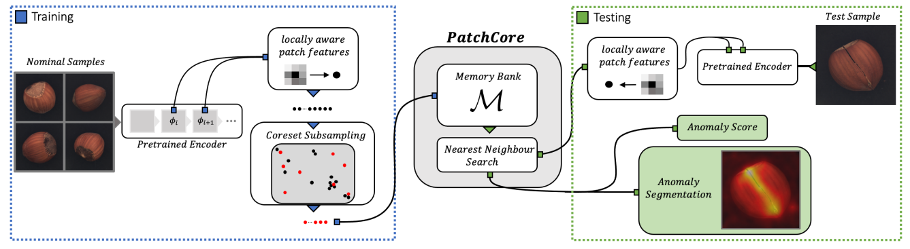

# 目录

<!-- TOC -->

- [目录](#目录)
- [PatchCore描述](#patchcore描述)
- [模型架构](#模型架构)
- [数据集](#数据集)
- [特性](#特性)
    - [混合精度](#混合精度)
- [环境要求](#环境要求)
- [快速入门](#快速入门)
- [脚本说明](#脚本说明)
    - [脚本及样例代码](#脚本及样例代码)
    - [脚本参数](#脚本参数)
    - [训练过程](#训练过程)
        - [加载预训练权重](#加载预训练权重)
        - [训练](#训练)
    - [评估过程](#评估过程)
        - [评估](#评估)
    - [导出过程](#导出过程)
        - [导出](#导出)
    - [推理过程](#推理过程)
        - [推理](#推理)
- [模型描述](#模型描述)
    - [性能](#性能)
        - [训练性能](#训练性能)
            - [MVTec-AD上训练PatchCore](#mvtec-ad上训练patchcore)
        - [评估性能](#评估性能)
            - [MVTec-AD上评估PatchCore](#mvtec-ad上评估patchcore)
        - [推理性能](#推理性能)
            - [MVTec-AD上推理PatchCore](#mvtec-ad上推理patchcore)
- [随机情况说明](#随机情况说明)
- [ModelZoo主页](#modelzoo主页)

<!-- /TOC -->

# PatchCore描述

PatchCore是2021年提出的基于预训练神经网络的工业异常检测模型，截至2021年末在MVTex-AD数据集上精度排名第一。PatchCore训练时仅使用正常样本，训练过程中不对网络参数进行更新(无反向传播)，将每张图片的网络输出(图片对应区域的特征表示)保存作为“Memory Bank”的一部分，最后进行采样操作得到最终“Memory Bank”。推理时加载“Memory Bank”，得到某张图片的网络输出后，通过论文定义的计算得到该图片score，以输出异常图。

[论文](https://arxiv.org/abs/2106.08265)：Karsten Roth, Latha Pemula, Joaquin Zepeda, Bernhard Scholkopf, Thomas Brox, Peter Gehler.Towards Total Recall in Industrial Anomaly Detection.2021.

# 模型架构


PatchCore使用预训练的WideResNet50作为Encoder, 并去除layer3之后的层。

# 数据集

使用的数据集：[MVTec AD](<https://www.mvtec.com/company/research/datasets/mvtec-ad/>)

- 数据集大小：4.9G，共15个类、5354张图片(尺寸在700x700~1024x1024之间)
    - 训练集：共3629张
    - 测试集：共1725张
- 数据格式：二进制文件
    - 注：数据将在src/dataset.py中处理。
- 目录结构:

  ```text
  data
  ├── bottle
  │   ├── bottle_test.json
  │   ├── bottle_train.json
  │   ├── ground_truth
  │   │   ├── broken_large
  │   │   │   ├── 000_mask.png
  │   │   │   └── ......
  │   │   ├── broken_small
  │   │   │   ├── 000_mask.png
  │   │       └── ......
  │   ├── test
  │   │   ├── broken_large
  │   │   │   ├── 000.png
  │   │   │   └── ......
  │   │   └── good
  │   │       ├── 000.png
  │   │       └── ......
  │   └── train
  │       └── good
  │           ├── 000.png
  │           └── ......
  ├── cable
  │   ├── cable_test.json
  │   ├── cable_train.json
  │   ├── ground_truth
  │   │   ├── bent_wire
  │   │   │   ├── 000_mask.png
  ......
  ```

# 特性

## 混合精度

采用[混合精度](https://www.mindspore.cn/tutorials/zh-CN/master/advanced/mixed_precision.html)的训练方法使用支持单精度和半精度数据来提高深度学习神经网络的训练速度，同时保持单精度训练所能达到的网络精度。混合精度训练提高计算速度、减少内存使用的同时，支持在特定硬件上训练更大的模型或实现更大批次的训练。
以FP16算子为例，如果输入数据类型为FP32，MindSpore后台会自动降低精度来处理数据。用户可打开INFO日志，搜索“reduce precision”查看精度降低的算子。

# 环境要求

- 硬件（Ascend）
    - 使用Ascend处理器来搭建硬件环境。
- 框架
    - [MindSpore](https://www.mindspore.cn/install/en)
- 如需查看详情，请参见如下资源：
    - [MindSpore教程](https://www.mindspore.cn/tutorials/zh-CN/master/index.html)
    - [MindSpore Python API](https://www.mindspore.cn/docs/zh-CN/master/index.html)

# 快速入门

通过官方网站安装MindSpore后，您可以按照如下步骤进行训练和评估：

- Ascend处理器环境运行

  ```bash
  # 运行训练示例
  python train.py --dataset_path ../data/ --device_id 0 --pre_ckpt_path ../pretrain/PatchCore_pretrain.ckpt --category screw > train.log 2>&1 &
  或
  bash run_train.sh [dataset_path] [device_id] [pre_ckpt_path] [category]

  # 运行评估示例
  python eval.py --dataset_path ../data/ --device_id 0 --pre_ckpt_path ../pretrain/PatchCore_pretrain.ckpt --category screw > eval.log 2>&1 &
  或
  bash run_eval.sh [dataset_path] [device_id] [pre_ckpt_path] [category]

  # 运行推理示例
  bash run_310_infer.sh [MINDIR_PATH] [DATASET_PATH] [NEED_PREPROCESS] [DEVICE_ID] [CATEGORY]
  ```

# 脚本说明

## 脚本及样例代码

```text

  ├── PatchCore
      ├── README.md                    // PatchCore相关说明
      ├── ascend310_infer              // 实现310推理源代码
      ├── scripts
      │   ├── run_310_infer.sh         // 推理脚本
      │   ├── run_eval.sh              // 评估脚本
      │   └── run_train.sh             // 训练脚本
      |   └── run_all_mvtec.sh         // 训练所有的Mvtec数据集
      ├── src
      │   ├── dataset.py               // 数据集加载
      │   ├── model.py                 // 模型加载
      │   ├── oneStep.py               // model增加填充与池化操作
      │   ├── operator.py              // 数据操作
      │   ├── pthtockpt.py             // pth转ckpt
      │   └── sampling_methods
      │       ├── kcenter_greedy.py    // 分类+采样
      │       └── sampling_def.py      // 采样基类
      ├── eval.py                      // 评估脚本
      ├── export.py                    // 推理模型导出脚本
      ├── preprocess.py                // 310前处理脚本
      ├── postprocess.py               // 310后处理脚本
      └── train.py                     // 训练脚本
```

## 脚本参数

  ```yaml
  --dataset_path:数据集路径
  --category:数据类别
  --device_id:设备序号
  --pre_ckpt_path:预训练路径
  ```

## 训练过程

### 加载预训练权重

pytorch的WideResNet50预训练模型，[点击获取](https://download.pytorch.org/models/wide_resnet50_2-95faca4d.pth)

```bash
python src/pthtockpt.py --pth_path /path/wide_resnet50_2-95faca4d.pth
```

### 训练

- Ascend处理器环境运行

  ```bash
  python train.py --dataset_path ../data/ --pre_ckpt_path ../pretrain/PatchCore_pretrain.ckpt --category screw --device_id 0 > train.log 2>&1 &
  或
  bash run_train.sh [dataset_path] [pre_ckpt_path] [category] [device_id]
  ```

  上述python命令将在后台运行，您可以通过train.log文件查看结果。

  训练结束后，您可在生成的相应类别embeddings目录下找到faiss.index文件，该文件在评估或推理阶段使用，不需要移动。在相应类别的sample目录下可找到异常图文件。

  对于Mvtec数据集，可以通过执行以下命令，进行Mvtec中全部类别数据的训练与推理。

  ```bash
  bash run_all_mvtec.sh [dataset_path] [pre_ckpt_path] [device_id]
  ```

## 评估过程

### 评估

- 在Ascend环境运行评估

  ```shell
  python eval.py --dataset_path ../data/ --device_id 0 --pre_ckpt_path ../pretrain/PatchCore_pretrain.ckpt --category screw > eval.log 2>&1 &
  或
  bash run_eval.sh [dataset_path] [device_id] [pre_ckpt_path] [category]
  ```

  上述python命令将在后台运行，您可以通过eval.log文件查看结果。测试数据集的准确性如下：

  ```shell
  # screw类参考精度
  img_auc: 0.947732, pixel_auc: 0.97995
  ```

## 导出过程

### 导出

将checkpoint文件导出成mindir格式模型。

```shell
python export.py --device_id 0 --ckpt_file ../pretrain/PatchCore_pretrain.ckpt
```

## 推理过程

**推理前需参照 [MindSpore C++推理部署指南](https://gitee.com/mindspore/models/blob/master/utils/cpp_infer/README_CN.md) 进行环境变量设置。**

### 推理

在运行推理之前我们需要先导出模型。Air模型只能在昇腾910环境上导出，mindir可以在任意环境上导出。

- 使用MVTec AD数据集进行推理

  执行推理的命令如下所示, 其中``MINDIR_PATH``是mindir文件路径；

  ``DATASET_PATH``是推理数据集路径, 为数据类(如toothbrush)的父级目录；

  ``NEED_PREPROCESS``表示数据集是否需要预处理，一般选择'y'；

  ``DEVICE_ID``可选，默认值为0；

  ``CATEGORY``表示数据类型，可取：bottle, cable, capsule, carpet, grid, hazelnut, leather, metal_nut, pill, screw, tile, toothbrush, transistor, wood, zipper.  

  ```shell
  bash run_infer_cpp.sh [MINDIR_PATH] [DATASET_PATH] [NEED_PREPROCESS] [CATEGORY] [DEVICE_TYPE] [DEVICE_ID]
  # 例：bash run_infer_cpp.sh ./PathCore.mindir ../data/ y toothbrush Ascend 0
  ```

  推理的精度结果保存在acc_[CATEGORY].log日志文件中。

# 模型描述

## 性能

### 训练性能

#### MVTec-AD上训练PatchCore

| 参数          | Ascend                                                         |
| ------------- | ---------------------------------------------------------------|
| 模型版本      | PatchCore                                                      |
| 资源          | Ascend 910；CPU 2.60GHz，192核；内存 755G；系统 Euler2.8       |
| 上传日期      | 2021-12-17                                                     |
| MindSpore版本 | 1.5.0                                                          |
| 数据集        | MVTec AD                                                       |
| 训练参数      | epoch=1, steps依数据类型而定, batch_size = 32                  |
| 速度          | 95毫秒/步                                                      |
| 总时长        | 依数据类型5-15min(包含下采样时间)                              |

### 评估性能

#### MVTec-AD上评估PatchCore

| 参数           | Ascend                           |
| ------------------- | --------------------------- |
| 模型版本       | PatchCore                        |
| 资源           | Ascend 910；系统 Euler2.8        |
| 上传日期       | 2021-12-17                       |
| MindSpore 版本 | 1.5.0                            |
| 数据集         | MVTec AD                         |
| batch_size     | 1                                |
| carpet_auc     | img_auc: 0.9896, pixel_auc: 0.9886|
| grid_auc       | img_auc: 0.9741, pixel_auc: 0.9698|
| leather_auc    | img_auc: 1.0, pixel_auc: 0.9904|
| tile_auc       | img_auc: 0.9859, pixel_auc: 0.9491|
| wood_auc       | img_auc: 0.9930, pixel_auc: 0.9379|
| bottle_auc     | img_auc: 1.0, pixel_auc: 0.9812|
| cable_auc      | img_auc: 0.9946, pixel_auc: 0.9833|
| capsule_auc    | img_auc: 0.9813, pixel_auc: 0.9887|
| hazelnut_auc   | img_auc: 1.0, pixel_auc: 0.9841|
| metal_nut_auc  | img_auc: 0.9990, pixel_auc: 0.9850|
| pill_auc       | img_auc: 0.9539, pixel_auc: 0.9781|
| screw_auc      | img_auc: 0.9477, pixel_auc: 0.9799|
| toothbrush_auc | img_auc: 0.9917, pixel_auc: 0.9866|
| transistor_auc | img_auc: 1.0, pixel_auc: 0.9728|
| zipper_auc     | img_auc: 0.9945, pixel_auc: 0.9836|

### 推理性能

#### MVTec-AD上推理PatchCore

| 参数           | Ascend                           |
| ------------------- | --------------------------- |
| 模型版本       | PatchCore                        |
| 资源           | Ascend 310；系统 Euler2.8        |
| 上传日期       | 2021-12-17                       |
| MindSpore 版本 | 1.5.0                            |
| 数据集         | MVTec AD                         |
| carpet_auc     | img_auc: 0.9928, pixel_auc: 0.9886|
| grid_auc       | img_auc: 0.9816, pixel_auc: 0.9670|
| leather_auc    | img_auc: 1.0, pixel_auc: 0.9904|
| tile_auc       | img_auc: 0.9917, pixel_auc: 0.9490|
| wood_auc       | img_auc: 0.9895, pixel_auc: 0.9376|
| bottle_auc     | img_auc: 1.0, pixel_auc: 0.9810|
| cable_auc      | img_auc: 0.9964, pixel_auc: 0.9827|
| capsule_auc    | img_auc: 0.9852, pixel_auc: 0.9886|
| hazelnut_auc   | img_auc: 1.0, pixel_auc: 0.9844|
| metal_nut_auc  | img_auc: 1.0, pixel_auc: 0.9812|
| pill_auc       | img_auc: 0.9414, pixel_auc: 0.9794|
| screw_auc      | img_auc: 0.9108, pixel_auc: 0.9826|
| toothbrush_auc | img_auc: 1.0, pixel_auc: 0.9860|
| transistor_auc | img_auc: 1.0, pixel_auc: 0.9718|
| zipper_auc     | img_auc: 0.9966, pixel_auc: 0.9842|

# 随机情况说明

在dataset.py中，设置了"shuffle=True"。
在train.py中，使用了SparseRandomProjection。

# ModelZoo主页  

请浏览官网[主页](https://gitee.com/mindspore/models)。
