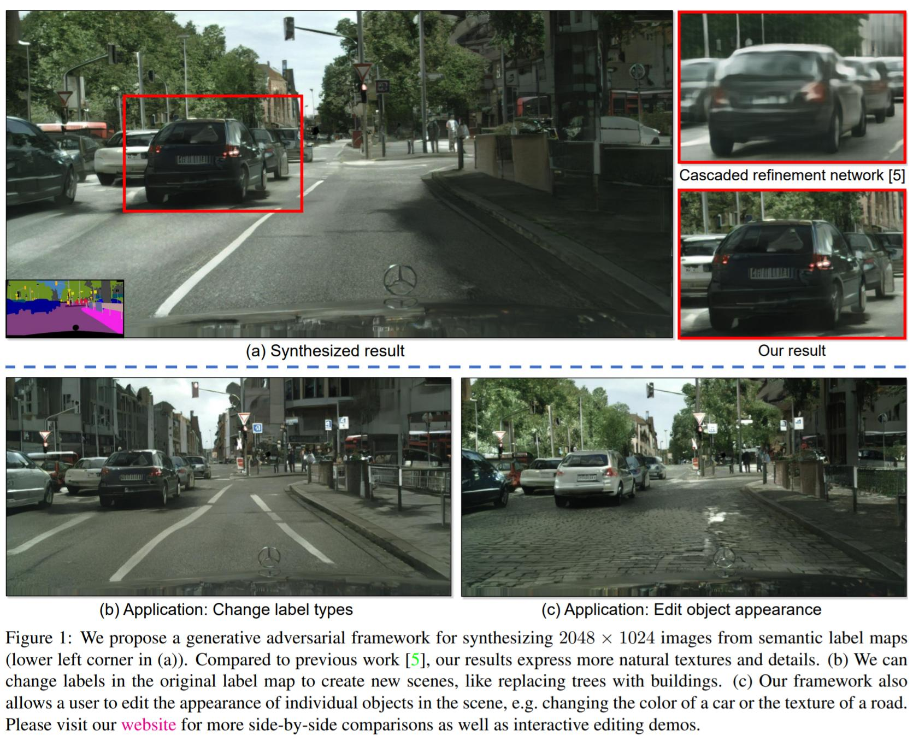
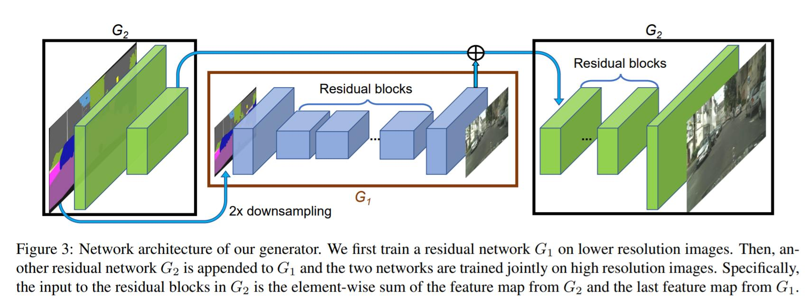
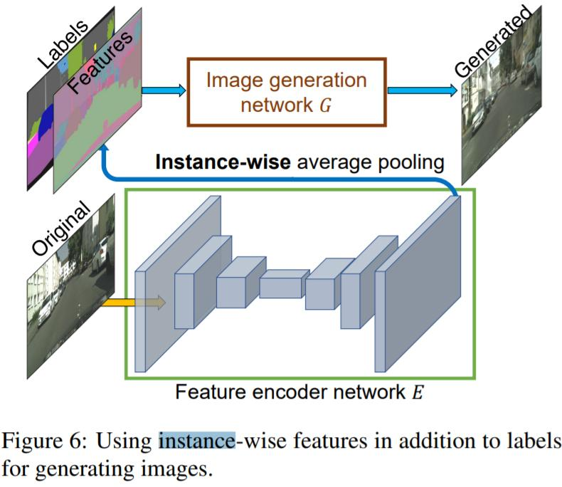

# 目录

- [Pix2PixHD描述](#Pix2PixHD描述)
- [模型架构](#模型架构)
- [数据集](#数据集)
- [环境要求](#环境要求)
- [脚本说明](#脚本说明)
    - [脚本及样例代码](#脚本及样例代码)
    - [脚本参数](#脚本参数)
    - [训练](#训练)
        - [仅使用标签进行训练](#仅使用标签训练)
            - [1024x512分辨率训练](#1024x512分辨率训练)
            - [2048x1024分辨率训练](#2048x1024分辨率训练)
        - [训练添加实例和编码特征](#训练添加实例和编码特征)
            - [1024x512分辨率训练](#1024x512分辨率训练)
            - [2048x1024分辨率训练](#2048x1024分辨率训练)
    - [评估](#评估)
- [模型说明](#模型说明)
    - [性能](#性能)
        - [训练性能](#训练性能)
        - [评估性能](#评估性能)
- [ModelZoo主页](#modelzoo主页)

# [Pix2PixHD描述](#目录)

Pix2PixHD是Pix2Pix的重要升级版本，可以实现高分辨率的图像生成和图像的语义编辑。Pix2PixHD采用多尺度的生成器和判别器，损失函数包括GAN损失、特征匹配损失和内容损失。

[论文](https://arxiv.org/abs/1711.11585): Ting-Chun Wang, Ming-Yu Liu, Jun-Yan Zhu, Andrew Tao, Jan Kautz, Bryan Catanzaro. "High-Resolution Image Synthesis and Semantic Manipulation with Conditional GANs", in CVPR 2017.



# [模型架构](#目录)

Pix2PixHD包含生成网络、判别器和编码器网络。
生成器包括G1和G2，结构相似。G1表示全局生成网络，输入和输出大小为1024×512, G2表示本地增强器网络，输入和输出大小为2048×1024。
判别器包括多个结构相同的判别器，但它们的输入和输出大小不同，增强了判别器在不同输入图像大小下的判别能力。
编码器主要是支持图像的语义编辑功能，这样网络能够根据同一语义地图生成真实多样的图像。

****生成器（粗到细）架构：****



****编码器架构：****



# [数据集](#目录)

使用的数据集：[Cityscapes](https://www.cityscapes-dataset.com/)

```markdown
    数据集大小：11.8G, 5000张2048x1024图像
                  2975张训练图像
                  500张验证图像
                  1525张测试图像
    数据格式：.png
```

**注：**我们提供了data/create_pix2ixhd_dataset.py，将Cityscapes数据集转换为网络所需的格式。

# [环境要求](#目录)

- 硬件（Ascend）
    - 使用Ascend处理器来搭建硬件环境。
- 框架
    - [MindSpore](https://www.mindspore.cn/install)
- 如需查看详情，请参见如下资源：
    - [MindSpore教程](https://www.mindspore.cn/tutorials/zh-CN/master/index.html)
    - [MindSpore Python API](https://www.mindspore.cn/docs/zh-CN/master/index.html)

## [依赖项](#目录)

- Python==3.7.1
- MindSpore>=1.8

# [脚本说明](#目录)

## [脚本及样例代码](#目录)

整个代码结构如下：

```markdown
.Pix2PixHD
├─ data
  └─create_pix2ixhd_dataset.py         # 转换Cityscapes数据集
├─ datasets
  ├─ cityscapes
    ├─ test_inst                       # 测试实例
    ├─ test_label                      # 测试标签
    ├─ train_img                       # 训练图像
    ├─ train_inst                      # 训练实例
    ├─ train_label                     # 训练标签
├─ imgs
  ├─ Pix2PixHD.jpg                     # Pix2PixHD图像
  ├─ Pix2PixHD-E.jpg                   # Pix2PixHD-E图像
  ├─ Pix2PixHD-G.jpg                   # Pix2PixHD-G图像
├─ scripts
  ├─ distribute_train_512p.sh          # Ascend上运行512x1024分辨率训练（8卡）
  ├─ distribute_train_512p_feat.sh     # Ascend上运行添加特征的512x1024分辨率训练（8卡）
  ├─ eval_512p.sh                      # 512x1024分辨率的Pix2PixHD模型评估
  ├─ eval_512p_feat.sh                 # 添加特征的512x1024分辨率的Pix2PixHD模型评估
  ├─ eval_1024p.sh                     # 1024x2048分辨率的Pix2PixHD模型评估
  ├─ eval_1024p_feat.sh                # 添加特征的1024x2048分辨率的Pix2PixHD模型评估
  ├─ train_512p.sh                     # Ascend上运行512x1024分辨率训练（单卡）
  ├─ train_512p_feat.sh                # Ascend上运行添加特征的512x1024分辨率训练（单卡）
  ├─ train_1024p.sh                    # Ascend上运行1024x2048分辨率训练（单卡）
  └─ train_1024p_feat.sh               # Ascend上运行添加特征的1024x2048分辨率训练（单卡）
├─ src
  ├─ dataset
    ├─ __init__.py                     # 初始化文件
    ├─ base_dataset.py                 # 基准数据集
    └─ pix2pixHD_dataset.py            # 创建Pix2PixHD数据集
  ├─ models
    ├─ __init__.py                     # 初始化文件
    ├─ discriminator_model.py          # 定义多尺度判别器模型
    ├─ generator_model.py              # 定义由粗到细生成器模型
    ├─ loss.py                         # 定义损失
    ├─ network.py                      # 定义与网络相关的函数
    └─ pix2pixHD.py                    # 定义Pix2PixHD模型
  └─ utils
    ├─ config.py                       # 解析参数
    ├─ local_adapter.py                # 获取本地ID
    └─ tools.py                        # Pix2PixHD模型工具
├─ default_config.yaml                 # 默认配置文件
├─ eval.py                             # 评估Pix2PixHD模型
├─ precompute_feature_maps.py          # 预计算特征图
├─ README.md                           # Pix2PixHD描述
└─ train.py                            # 训练脚本
```

## [脚本参数](#目录)

train.py和config.py中的主要涉及如下参数：

```python
device_target: "Ascend"
run_distribute: False
device_id: 0
norm: "instance"
batch_size: 1
load_size: 1024
fine_size: 512
label_nc: 35
input_nc: 3
output_nc: 3
resize_or_crop: "scale_width"
no_flip: False
netG: "global"
ngf: 64
n_downsample_global: 4
n_blocks_global: 9
n_blocks_local: 3
n_local_enhancers: 1
niter_fix_global: 0
no_instance: False
instance_feat: False
label_feat: False
feat_num: 3
load_features: False
n_downsample_E: 4
nef: 16
n_clusters: 10
data_root: './datasets/cityscapes'

# optimiter options
loss_scale: 1

# train options
vgg_pre_trained: "./vgg19.ckpt"
continue_train: False
load_pretrain: ''
which_epoch: 'latest'
save_ckpt_dir: './checkpoints'
name: "label2city"
init_type: 'normal'
init_gain: 0.02
pad_mode: 'CONSTANT'
beta1: 0.5
beta2: 0.999
lr: 0.0002
phase: 'train'
niter: 100
niter_decay: 100
num_D: 2
n_layers_D: 3
ndf: 64
lambda_feat: 10.0
no_ganFeat_loss: False
no_vgg_loss: False
no_lsgan: False
serial_batches: False
device_num: 1

# eval options
predict_dir: "results/predict/"
use_encoded_image: False
cluster_path: "features_clustered_010.npy"
load_ckpt: ''
```

注：当`no_vgg_loss`为`False`时，可以点击[此处](https://download.mindspore.cn/model_zoo/r1.3/vgg19_ascend_v130_imagenet2012_research_cv_bs64_top1acc74__top5acc91.97/vgg19_ascend_v130_imagenet2012_research_cv_bs64_top1acc74__top5acc91.97.ckpt)下载vgg19.ckpt模型文件。

## [训练](#目录)

### [仅使用标签进行训练](#目录)

#### [1024x512分辨率训练](#目录)

- 使用默认参数在Ascend上运行。

    ```python
    bash ./scripts/train_512p.sh
    ```

- 在Ascend上运行分布式训练。

    ```python
    bash ./scripts/distribute_train_512p.sh [DEVICE_NUM] [DISTRIBUTE] [DATASET_PATH]
    ```

#### [2048x1024分辨率训练](#目录)

- 使用默认参数在Ascend上运行。

    ```python
    bash ./scripts/train_1024p.sh
    ```

### [训练添加实例和编码特征](#目录)

#### [1024x512分辨率训练](#目录)

- 使用默认参数在Ascend上运行。

    ```python
    bash ./scripts/train_512p_feat.sh
    ```

- 在Ascend上运行分布式训练。

    ```python
    bash ./scripts/distribute_train_512p_feat.sh [DEVICE_NUM] [DISTRIBUTE] [DATASET_PATH]
    ```

#### [2048x1024分辨率训练](#目录)

- 使用默认参数在Ascend上运行。

    ```python
    bash ./scripts/train_1024p_feat.sh
    ```

### [使用自己的数据集进行训练](#目录)

- 如果您想使用自己的数据集进行训练，请生成单通道标签映射，其像素值对象标签一一对应（即，0,1,...,N-1，其中N是标签的数量）。这是因为我们需要从标签映射中生成单热向量。在训练和测试期间，还需要指定`--label_nc N`。
- 如果不输入标签映射，设置`--label_nc 0`，则直接使用RGB颜色作为输入。然后，将文件夹命名为`train_A`、`train_B`，不要命名为`train_label`、`train_img`，以便将图像从A转换到B。
- 如果没有或不想使用实例映射，需指定`--no_instance`。
- 预处理默认设置为`scale_width`，在不改变宽高比的同时，将所有训练图像的宽度缩放为`Opt.loadSize`(1024)。如果想要更改设置，指定`--resize_or_crop`选项。例如，`scale_width_and_crop`首先将图像的宽度调整为`opt.loadSize`，然后随机裁剪`(opt.fineSize, opt.fineSize)`。设置为`crop`则将跳过调整大小步骤，仅执行随机裁剪。如果您不需要预处理，设置为`none`，则仅将图像32等分。

## [评估](#目录)

### [仅使用标签进行评估](#目录)

```python
bash ./scripts/eval_1024p.sh
```

### [评估添加实例和编码特征](#目录)

```python
bash scripts/eval_1024p_feat.sh
```

# [模型说明](#目录)

## [性能](#目录)

### 训练性能

| 参数                | Ascend|
| -------------------------- | ---------------------------------------------------------|
| 模型版本             | Pix2PixHD                                              |
| 资源                  | Ascend 910                                              |
| 上传日期               | 2022-8-15                                                |
| MindSpore版本         | 1.8                                                      |
| 数据集                   | Cityscapes                                               |
| 训练模式             | 仅在1024x512分辨率下使用标签进行训练       |
| 训练参数       | epoch=200, steps=2975, batch_size=1, lr=0.0002           |
| 优化器                 | Adam                                                    |
| 输出                   | 图像                                                   |
| 速度                     | 单卡（Ascend）：260 ms/step；8卡（Ascend）：300 ms/step         |
| 总时长                | 单卡（Ascend）：42h；8卡（Ascend）：6h                    |
| 微调检查点| 697M（.ckpt文件）                                       |

| 参数                | Ascend|
| -------------------------- | ---------------------------------------------------------|
| 模型版本             | Pix2PixHD                                              |
| 资源                  | Ascend 910                                              |
| 上传日期               | 2022-8-15                                                |
| MindSpore版本         | 1.8                                                      |
| 数据集                   | Cityscapes                                               |
| 训练模式             | 仅在2048x1024分辨率下使用标签进行训练      |
| 训练参数       | epoch=100, steps=2975, batch_size=1, lr=0.0002           |
| 优化器                 | Adam                                                    |
| 输出                   | 图像                                                   |
| 速度                     | 单卡（Ascend）：820 ms/step                                 |
| 总时长                | 单卡（Ascend）：67.7h                                      |
| 微调检查点| 698M（.ckpt文件）                                       |

| 参数                | Ascend|
| -------------------------- | ---------------------------------------------------------|
| 模型版本             | Pix2PixHD                                              |
| 资源                  | Ascend 910                                              |
| 上传日期               | 2022-8-15                                                |
| MindSpore版本         | 1.8                                                      |
| 数据集                   | Cityscapes                                               |
| 训练模式             | 添加实例特征的1024x512分辨率训练|
| 训练参数       | epoch=200, steps=1750, batch_size=1, lr=0.0002           |
| 优化器                 | Adam                                                    |
| 输出                   | 图像                                                   |
| 速度                     | 单卡（Ascend）：700 ms/step；8卡（Ascend）：741 ms/step       |
| 总时长                | 单卡（Ascend）：115.7h；8卡（Ascend）：15.5h                    |
| 微调检查点| 697M（.ckpt文件）                                       |

| 参数                | Ascend|
| -------------------------- | ---------------------------------------------------------|
| 模型版本             | Pix2PixHD                                              |
| 资源                  | Ascend 910                                              |
| 上传日期               | 2022-8-15                                                |
| MindSpore版本         | 1.8                                                      |
| 数据集                   | Cityscapes                                               |
| 训练模式             | 添加实例特征的2048x1024分辨率训练|
| 训练参数       | epoch=100, steps=2975, batch_size=1, lr=0.0002          |
| 优化器                 | Adam                                                    |
| 输出                   | 图像                                                   |
| 速度                     | 单卡（Ascend）：850 ms/step                                |
| 总时长                | 单卡（Ascend）：70h                                        |
| 微调检查点| 698M（.ckpt文件）                                       |

### 评估性能

| 参数                | Ascend|
| -------------------------- | ---------------------------------------------------------|
| 模型版本             | Pix2PixHD                                              |
| 资源                  | Ascend 910                                              |
| 上传日期               | 2022-8-13                                                |
| MindSpore版本         | 1.8                                                      |
| 数据集                   | Cityscapes                                               |
| 输出                   | 图像                                                   |

# [ModelZoo主页](#目录)

请浏览官网[主页](https://gitee.com/mindspore/models)。
