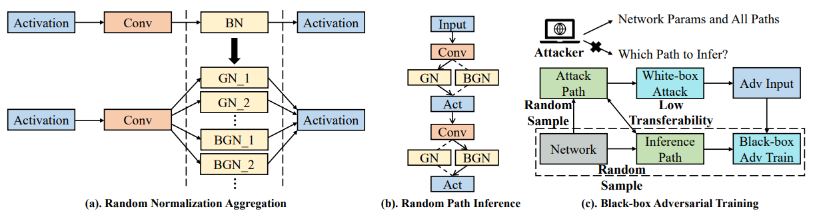

# Contents

- [Contents](#contents)
    - [RNA Description](#RNA-description)
    - [RNA architecture](#RNA-architecture)
    - [Dataset](#dataset)
    - [Environment Requirements](#environment-requirements)
    - [Script description](#script-description)
        - [Script and sample code](#script-and-sample-code)
    - [Eval process](#eval-process)
        - [Usage](#usage)
        - [Launch](#launch)
        - [Result](#result)
    - [Description of Random Situation](#description-of-random-situation)
    - [ModelZoo Homepage](#modelzoo-homepage)

## [RNA Description](#contents)

We propose a simple yet effective module named Random Normalization Aggregation (RNA) which replaces the batch normalization layers in the networks and aggregates different selected normalization types to form a huge random space. Specifically, a random path is sampled during each inference procedure so that the network itself can be treated as an ensemble of a wide range of different models. Since the entire random space is designed with low adversarial transferability, it is difficult to perform effective attacks even when the network parameters are accessible. We conduct extensive experiments on various models and datasets, and demonstrate the strong superiority of proposed algorithm.

Minjing Dong, Xinghao Chen, Yunhe Wang, Chang Xu. Random Normalization Aggregation for Adversarial Defense. NeurIPS 2022.

## [RNA architecture](#contents)

An illustration of Random Normalization Aggregation and Black-box Adversarial Training:



## [Dataset](#contents)

Dataset used: [CIFAR10](<http://www.cs.toronto.edu/~kriz/cifar.html>), [CIFAR100](<http://www.cs.toronto.edu/~kriz/cifar.html>)

- Dataset size 32*32 colorful images in 10/100 classes
    - Train：50,000 images  
    - Test： 10,000 images
- Data format：binary files
    - Note：Data will be processed in datasets.py

## [Environment Requirements](#contents)

- Hardware(Ascend/GPU)
    - Prepare hardware environment with Ascend or GPU.
- Framework
    - [MindSpore](https://www.mindspore.cn/install/en)
- For more information, please check the resources below£º
    - [MindSpore Tutorials](https://www.mindspore.cn/tutorials/en/master/index.html)
    - [MindSpore Python API](https://www.mindspore.cn/docs/api/en/master/index.html)

## [Script description](#contents)

### [Script and sample code](#contents)

```bash
RNA
├── ckpt                             # Path of ckpt
├── data
│   ├── cifar-10-batches-bin         # Dataset cifar10
│   └── cifar-100-binary             # Dataset cifar100
├── fig
│   └── RNA.PNG                      # The illustration of RNA
├── README.md                        # Readme
└── src
    │
    ├── attacks
    │   ├── __init__.py
    │   ├── fgsm.py                  # The mindspore version of torchattacks.FGSM
    │   ├── mifgsm.py                # The mindspore version of torchattacks.MIFGSM
    │   └── pgd.py                   # The mindspore version of torchattacks.PGD
    ├── model
    │   ├── __init__.py
    │   ├── base.py                  # Definition of base module  
    │   ├── norm.py                  # Definition of norm function
    │   ├── resnet.py                # Definition of resnet
    │   └── wide_resnet.py           # Definition of wide_resnet
    ├── datasets.py                  # Dataset processing
    ├── eval.py                      # Inference entry
    └── utils.py                     # basic function


```

## [Eval process](#contents)

### Usage

After installing MindSpore via the official website, you can start evaluation as follows:

### Launch

```bash
# infer example
  # python
  GPU:
  cd ./src/
  python eval.py --dataset [dataset_name] --data_dir [dataset_path] --random_norm_training --mixed --network [net_name] --attack_type [attack_type] --batch_size 128 --num_group_schedule 0 0 --worker 4 --random_type bn --gn_type gnr --pretrain [ckpt_name] --save_dir [save_dir]
```

> checkpoint can be downloaded at https://download.mindspore.cn/model_zoo/research/cv/RNA/.

### Result

|    CIFAR10      |  Natural | FGSM   | PGD20  | MIFGSM |
|-----------------|----------|--------|--------|--------|
|   ResNet-18     |  84.32   | 63.47  | 60.94  | 61.49  |
|  WideResNet32   |  86.65   | 65.56  | 62.10  | 63.03  |

|    CIFAR100     |  Natural | FGSM   | PGD20  | MIFGSM |
|-----------------|----------|--------|--------|--------|
|   ResNet-18     |  57.18   | 37.08  | 34.34  | 34.47  |
|  WideResNet32   |  60.65   | 38.09  | 36.28  | 36.18  |

## [Description of Random Situation](#contents)

We set random norm in models. We also use random seed in attacks.

## [ModelZoo Homepage](#contents)

Please check the official [homepage](https://gitee.com/mindspore/models).