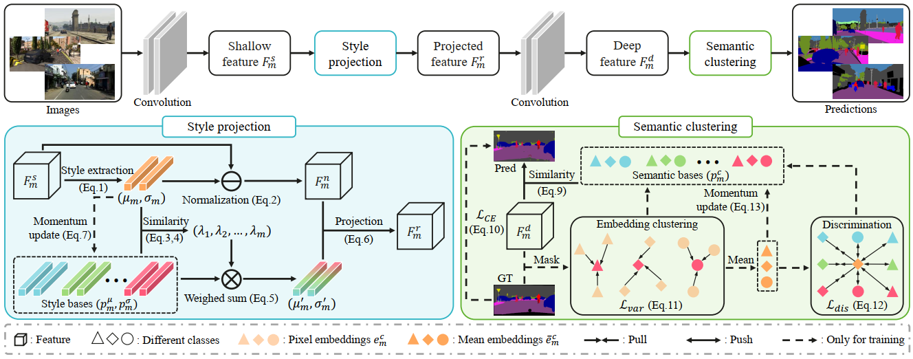

# 目录

[TOC]

## SPC-Net 概述

SPC-Net(Style Projected Clustering Network) 提出了一种基于风格表征的语义分割方法。

现有的语义分割方法通过将各种图像正则化到规范的特征空间来提高网络泛化能力。虽然这个过程有助于提升网络的泛化，但它不可避免地削弱了网络特征的表示能力。与现有方法相比，我们利用图像之间的差异来构建一个更好的表示空间，提取并存储不同的风格特征作为表示的基。然后通过将特征投影到这个已知的空间来实现对未知图像的泛化。大量实验表明，所提出的方法具有最先进的分割性能表现，在多个未知场景下平均提高了3.6个点的mIoU。

[CVPR2023论文 Style Projected Clustering for Domain Generalized Semantic Segmentation](https://openaccess.thecvf.com/content/CVPR2023/papers/Huang_Style_Projected_Clustering_for_Domain_Generalized_Semantic_Segmentation_CVPR_2023_paper.pdf)

## 模型架构

SPC-Net的模型结构如下：



## 数据集

- 合成数据：
    - **GTAV** (Playing for Data: Ground Truth from Computer Games) [[paper](https://link.springer.com/chapter/10.1007/978-3-319-46475-6_7)][[website](https://download.visinf.tu-darmstadt.de/data/from_games/)]
    - **Synthia** (The SYNTHIA Dataset: A Large Collection of Synthetic Images for Semantic Segmentation of Urban Scenes) [[paper](https://www.cv-foundation.org/openaccess/content_cvpr_2016/html/Ros_The_SYNTHIA_Dataset_CVPR_2016_paper.html)][[website](http://synthia-dataset.net/)]

- 真实数据：
    - **IDD** (IDD: A Dataset for Exploring Problems of Autonomous Navigation in Unconstrained Environments) [[paper](https://ieeexplore.ieee.org/abstract/document/8659045/)][[website](http://idd.insaan.iiit.ac.in/)]
    - **Cityscapes** (The Cityscapes Dataset for Semantic Urban Scene Understanding) [[paper](https://openaccess.thecvf.com/content_cvpr_2016/html/Cordts_The_Cityscapes_Dataset_CVPR_2016_paper.html)][[website](https://www.cityscapes-dataset.com/)]
    - **BDD** (BDD100K: A Diverse Driving Dataset for Heterogeneous Multitask Learning) [[paper](https://openaccess.thecvf.com/content_CVPR_2020/html/Yu_BDD100K_A_Diverse_Driving_Dataset_for_Heterogeneous_Multitask_Learning_CVPR_2020_paper.html)][[website](https://www.bdd100k.com/)]
    - **Mapillary** (The Mapillary Vistas Dataset for Semantic Understanding of Street Scenes) [[paper](https://openaccess.thecvf.com/content_iccv_2017/html/Neuhold_The_Mapillary_Vistas_ICCV_2017_paper.html)][[website](https://www.mapillary.com/)]

## 环境要求

- 硬件: 具备GPU 和CPU 的机器
- 深度学习框架: MindSpore 1.9.0
- 如需查看详情，请参见如下资源：
    - [MindSpore教程](https://www.mindspore.cn/tutorials/zh-CN/master/index.html)
    - [MindSpore Python API](https://www.mindspore.cn/docs/zh-CN/master/index.html)

## 快速入门

以下是代码运行的说明及示例：

```bash
python eval.py --root DATA_PATH
               --dataset DATASET_NAME
               --num NUMBER_SOURCE_DATASET
# For example
python eval.py --root /path/to/Datasets
               --dataset cityscapes
               --num 2
```

## 代码说明

```path
.
├─network
    ├─kaiming_normal.py             # 参数初始化方法定义
    ├─network.py                    # SPC-Net模型定义
    ├─Resnet.py                     # ResNet模型定义
    ├─styleRepIN.py                 # 风格表征模块定义
├──src
    ├──cityscapes_labels.py         # 数据集标签定义
    ├──dataset.py                   # 数据集定义
    ├──utils.py                     # 画图、指标计算函数定义
├──models                           # 模型存储路径
├──eval.py                          # 测试脚本
├──requirements.txt                 # python库配置
└──README_CN.md                     # README文件
```

### 性能

在单卡V100 GPU上，测试2048x1024分辨率的图像，平均推理时延在10ms以内。

## ModelZoo 主页

请浏览官网[主页](https://gitee.com/mindspore/models)。