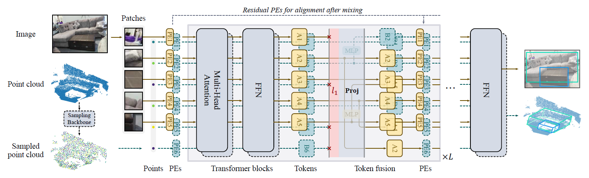

# Contents

- [TokenFusion Description](#tokenfusion-description)
- [Model Architecture](#model-architecture)
- [Dataset](#dataset)
- [Environment Requirements](#environment-requirements)
- [Script Description](#script-description)
    - [Script and Sample Code](#script-and-sample-code)
        - [Training Process](#training-process)
        - [Evaluation Process](#evaluation-process)
- [Model Description](#model-description)
    - [Performance](#performance)
        - [Evaluation Performance](#evaluation-performance)
- [Description of Random Situation](#description-of-random-situation)
- [ModelZoo Homepage](#modelzoo-homepage)

# [TokenFusion Description](#contents)

TokenFusion is a multimodal token fusion method tailored for transformer-based vision tasks. To effectively fuse multiple modalities, TokenFusion dynamically detects uninformative tokens and substitutes these tokens with projected and aggregated inter-modal features. Residual positional alignment is also adopted to enable explicit utilization of the inter-modal alignments after fusion. The design of TokenFusion allows the transformer to learn correlations among multimodal features, while the single-modal transformer architecture remains largely intact. Extensive experiments are conducted on a variety of homogeneous and heterogeneous modalities and demonstrate that TokenFusion surpasses state-of-the-art methods in three typical vision tasks: multimodal image-to-image translation, RGB-depth semantic segmentation, and 3D object detection with point cloud and images.

[Paper](https://openaccess.thecvf.com/content/CVPR2022/papers/Wang_Multimodal_Token_Fusion_for_Vision_Transformers_CVPR_2022_paper.pdf): Yikai Wang, Xinghao Chen, Lele Cao, Wenbing Huang, Fuchun Sun, Yunhe Wang. **Multimodal Token Fusion for Vision Transformers**. In **CVPR 2022**.

# [Model architecture](#contents)

The overall architecture of TokenFusion is show below:



# [Dataset](#contents)

Dataset used: [NYUDv2](https://cs.nyu.edu/~silberman/datasets/nyu_depth_v2.html)

- Dataset size：colorful images and depth images, with labels in 40 segmentation classes
    - Train：795 samples
    - Test：654 samples
- Data format：image files
    - Note：Data will be processed in utils/datasets.py

# [Environment Requirements](#contents)

- Hardware (GPU)
- Framework
    - [MindSpore](https://www.mindspore.cn/install/en)
- For more information, please check the resources below:
    - [MindSpore Tutorials](https://www.mindspore.cn/tutorials/en/master/index.html)
    - [MindSpore Python API](https://www.mindspore.cn/docs/en/master/index.html)

# [Script Description](#contents)

## [Script and Sample Code](#contents)

```markdown
.TokenFusion
├── README.md               # descriptions about TokenFusion
├── models
│   ├── mix_transformer.py  # definition of backbone model
│   ├── segformer.py        # definition of segmentation model
│   └── modules.py          # TokenFusion operations
├── utils
│   ├── datasets.py         # data loader
│   ├── helpers.py          # utility functions
│   ├── transforms.py       # data preprocessing functions
│   └── meter.py            # utility functions
├── eval.py                 # evaluation interface
├── cfg.py                  # configure file
├── config.py               # configure file
```

### [Training process](#contents)

To Be Done

### [Evaluation Process](#contents)

#### Launch

```bash
# infer example

python eval.py --checkpoint_path  [CHECKPOINT_PATH]
```

> Checkpoint can be downloaded at [here](https://download.mindspore.cn/models/r1.8/tokenfusion_ascend_v180_nyudv2_research_cv_acc54.8.ckpt) or [Mindspore Hub](https://www.mindspore.cn/resources/hub).

### Result

```bash
result: IoU=54.8, ckpt= ./tokenfusion_ascend_v180_nyudv2_research_cv_acc54.8.ckpt
```

| Parameters                 | Ascend                                                       |
| -------------------------- | ----------------------------------------------------------- |
|Model|TokenFusion|
| Model Version              | tokenfusion_seg_mitb3_nyudv2                                                |
| Resource                   | Ascend 910               |
| Uploaded Date              | 2022-08-10                                |
| MindSpore Version          | 1.8.0                                                 |
| Dataset                    | NYUDv2                                              |
| Outputs | probability                                                 |
| Accuracy             | 1pc: 54.8%                   |
| Speed                      | 1pc：1s/step                        |

# [Description of Random Situation](#contents)

We set the seed inside datasets.py.

# [ModelZoo Homepage](#contents)

Please check the official [homepage](https://gitee.com/mindspore/models).
