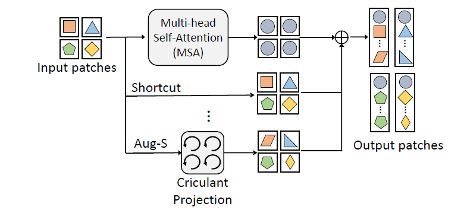

# Contents

- [Contents](#contents)
    - [Aug-ViT Description](#aug-vit-description)
    - [Model architecture](#model-architecture)
    - [Dataset](#dataset)
    - [Environment Requirements](#environment-requirements)
    - [Script description](#script-description)
        - [Script and sample code](#script-and-sample-code)
    - [Eval process](#eval-process)
        - [Usage](#usage)
        - [Launch](#launch)
        - [Result](#result)
    - [Description of Random Situation](#description-of-random-situation)
    - [ModelZoo Homepage](#modelzoo-homepage)

## [Aug-ViT Description](#contents)

Aug-ViT inserts additional paths with learnable parameters in parallel on the original shortcuts for alleviating the feature collapse. The block-circulant projection is used to implement augmented shortcut, which brings negligible increase of computational cost.

[Paper](https://arxiv.org/abs/2106.15941): Yehui Tang, Kai Han, Chang Xu, An Xiao, Yiping Deng, Chao Xu, Yunhe Wang. Augmented Shortcuts for Vision Transformers. NeurIPS 2021.

## [Model architecture](#contents)

A block of Aug-ViT is show below:



## [Dataset](#contents)

Dataset used: [CIFAR-10](https://www.cs.toronto.edu/~kriz/cifar.html)

- Dataset size: 60000 colorful images in 10 classes
    - Train: 50000 images
    - Test: 10000 images
- Data format: RGB images.

## [Environment Requirements](#contents)

- Hardware(Ascend/GPU)
    - Prepare hardware environment with Ascend or GPU.
- Framework
    - [MindSpore](https://www.mindspore.cn/install/en)
- For more information, please check the resources below£º
    - [MindSpore Tutorials](https://www.mindspore.cn/tutorials/en/master/index.html)
    - [MindSpore Python API](https://www.mindspore.cn/docs/en/master/index.html)

## [Script description](#contents)

### [Script and sample code](#contents)

```bash
AugViT
├── eval.py # inference entry
├── fig
│   └── augvit.png # the illustration of augvit network
├── readme.md # Readme
└── src
    ├── config.py # config of model and data
    ├── c10_dataset.py # dataset loader
    └── augvit.py # augvit network
```

## [Eval process](#contents)

### Usage

After installing MindSpore via the official website, you can start evaluation as follows:

### Launch

```bash
# infer example
  GPU: python eval.py --model augvit_s --dataset_path cifar_dataset --platform GPU --checkpoint_path [CHECKPOINT_PATH]
```

> checkpoint can be downloaded at https://download.mindspore.cn/model_zoo/research/cv/augvit/.

### Result

```bash
result: {'acc': 0.98} ckpt= ./augvit_c10.ckpt
```

## [Description of Random Situation](#contents)

In dataset.py, we set the seed inside "create_dataset" function. We also use random seed in train.py.

## [ModelZoo Homepage](#contents)

Please check the official [homepage](https://gitee.com/mindspore/models).