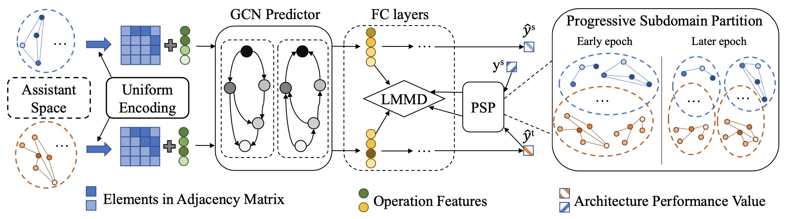

# Contents

- [Contents](#contents)
    - [CDP Description](#cdp-description)
    - [Method](#method)
    - [Dataset](#dataset)
    - [Environment Requirements](#environment-requirements)
    - [Script description](#script-description)
        - [Script and sample code](#script-and-sample-code)
    - [Eval process](#eval-process)
        - [Usage](#usage)
        - [Launch](#launch)
        - [Result](#result)
    - [ModelZoo Homepage](#modelzoo-homepage)

## [CDP Description](#contents)

We propose a Cross-Domain Predictor (CDP), which is trained based on the existing NAS benchmark datasets (e.g., NAS-Bench-101), but can be used to find high-performance architectures in large-scale search spaces. Particularly, we propose a progressive subspace adaptation strategy to address the domain discrepancy between the source architecture space and the target space. Considering the large difference between two architecture spaces, an assistant space is developed to smooth the transfer process.

Bridge the Gap Between Architecture Spaces via A Cross-Domain Predictor, NeurIPS 2022.

## [Method](#contents)

The Pipeline of CDP is show below:



## [Dataset](#contents)

Dataset used: [CIFAR-10](https://www.cs.toronto.edu/~kriz/cifar.html)

- Dataset size: 60000 colorful images in 10 classes
    - Train: 50000 images
    - Test: 10000 images
- Data format: RGB images.

## [Environment Requirements](#contents)

- Hardware(Ascend/GPU)
    - Prepare hardware environment with Ascend or GPU.
- Framework
    - [MindSpore](https://www.mindspore.cn/install/en)
- For more information, please check the resources below£º
    - [MindSpore Tutorials](https://www.mindspore.cn/tutorials/en/master/index.html)
    - [MindSpore Python API](https://www.mindspore.cn/docs/en/master/index.html)

## [Script description](#contents)

### [Script and sample code](#contents)

```bash
AugViT
├── eval.py # inference entry
├── fig
│   └── cdp.png # the illustration of augvit network
├── readme.md # Readme
├── genotypes.py # genotypes
├── model.py # CDP model
├── operations.py # operations
└── utils.py # utils
```

## [Eval process](#contents)

### Usage

After installing MindSpore via the official website, you can start evaluation as follows:

### Launch

```bash
# infer example
  GPU: python eval.py --model_path checkpoint.ckpt --arch CDP_cifar --set cifar10 --data [DATA_PATH]
```

> checkpoint can be downloaded at https://download.mindspore.cn/model_zoo/research/cv/cdp/.

### Result

```bash
result: {'acc': 97.4%} ckpt= ./checkpoint.ckpt
```

## [ModelZoo Homepage](#contents)

Please check the official [homepage](https://gitee.com/mindspore/models).