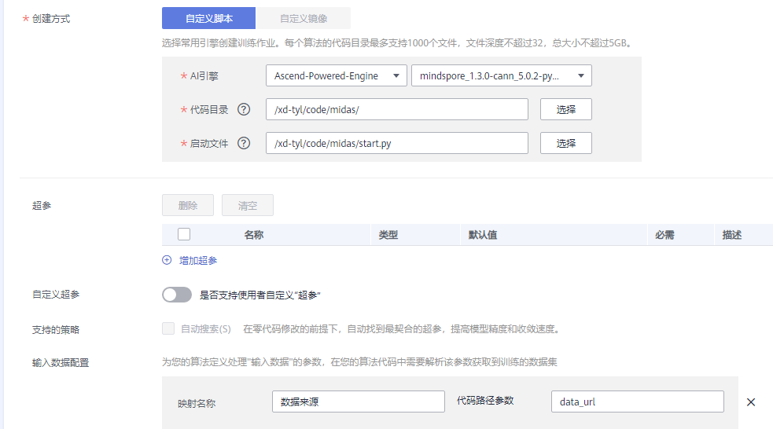
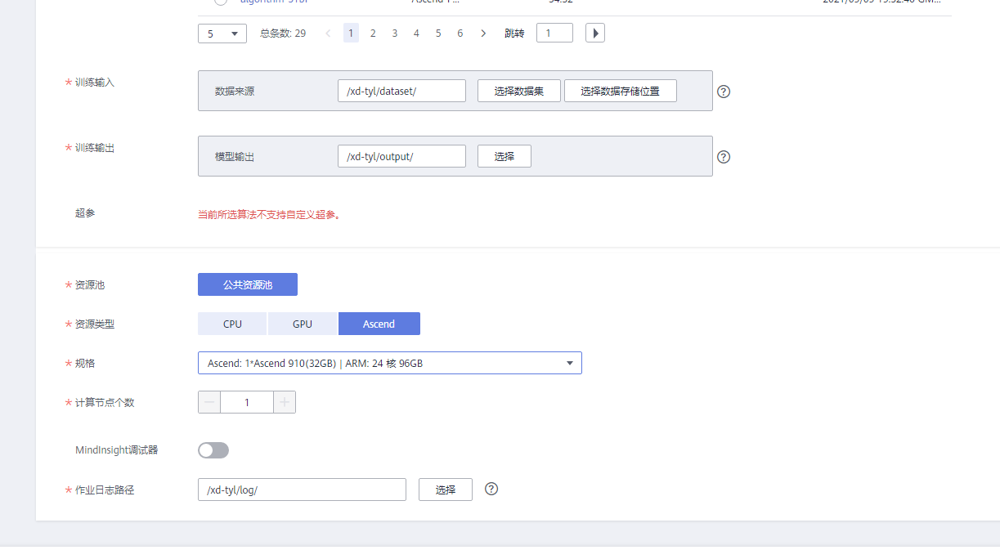

# 在ModelArts上应用

如果需要用到modelarts,请把'fairmot/src/infer_net.py'中28行换为‘self.gather = ops.GatherV2()’，37行换为:

```python
   feat = self.gather(feat, ind, 1)
   feat = self.squeeze(feat)
   feat = feat[:, :, 0, :]
```

## 创建OBS桶

1. 登录[OBS管理控制台](https://storage.huaweicloud.com/obs)，创建OBS桶。具体请参见[创建桶](https://support.huaweicloud.com/usermanual-obs/obs_03_0306.html)章节。例如，创建名称为“mindspore-dataset”的OBS桶。

   

   创建桶的区域需要与ModelArts所在的区域一致。例如：当前ModelArts在华北-北京四区域，在对象存储服务创建桶时，请选择华北-北京四。

2. 创建用于存放数据的文件夹，具体请参见[新建文件夹](https://support.huaweicloud.com/usermanual-obs/obs_03_0316.html)章节。例如，在已创建的OBS桶“mindspore-dataset”中创建如下模型目录。

   

   目录结构说明：

   - code：存放训练脚本目录
   - dataset：存放训练数据集目录
   - log：存放训练日志目录
   - output：训练生成ckpt和pb模型目录

   将fairmot脚本文件夹上传至“code”目录，数据集“ETH, CalTech, MOT17, CUHK-SYSU, PRW, CityPerson”,数据配置文件'data.json'以及预训练模型'dla34-ba72cf86_ms.ckpt'上传至“dataset”目录。其格式应该是下面的样子：

    ```path
        └── dataset
            |─ dla34-ba72cf86_ms.ckpt
            |─ data.json
            |─ caltech.all
            |─ prw.train
            |─ mot17.half
            |─ eth.train
            |─ cuhksysu.train
            |─ citypersons.train
            ├── Caltech
            |   └─ data
            |       ├─ images
            |       │    ├─set00_V000_1271.png
            |       │    ├─ ...
            |       │    └─set07_V011_1391.png
            |       └─ labels_with_ids
            |            ├─set00_V000_1271.txt
            |            ├─ ...
            |            └─set07_V011_1391.txt
            ├── Cityscapes
            |   ├─ images
            |   │   ├─test
            |   │   ├─train
            |   │   └─val
            |   └─ labels_with_ids
            |       ├─train
            |       └─val
            ├── CUHKSYSU
            |   ├─ images
            |   │    ├─s1.jpg
            |   │    ├─ ...
            |   │    └─s9999.jpg
            |   └─ labels_with_ids
            |        ├─s1.txt
            |        ├─ ...
            |        └─s9999.txt
            ├── ETHZ
            |   ├─ eth01
            |   ├─ eth02
            |   ├─ eth03
            |   ├─ eth05
            |   └─ eth07
            ├── PRW
            |   ├─ images
            |   │    ├─c1s1_000151.jpg
            |   │    ├─ ...
            |   │    └─c6s2_125693.jpg
            |   └─ labels_with_ids
            |        ├─c1s1_000151.txt
            |        ├─ ...
            |        └─c6s2_125693.txt
            └── MOT17
                ├─ images
                │    ├─test
                │    └─train
                └─ labels_with_ids
                     └─train

    ```

    data.json中'train'里面各个文件目录应为"eth":"/eth.train","cuhksysu":"/cuhksysu.train"等
3. 代码由于需要用到src目录的代码，所以需将下载后的代码中modelarts目录下的启动文件start.py放入到代码根目录下。

## 创建算法

1. 创建作业列表中需要先创建算法，点击创建训练作业界面后在我的算法界面点击创建。

2. 创建算法目录，填写算法参数。如在以下填写AI引擎和代码启动目录和代码启动文件。

   

   | 参数名称     | 子参数       | 说明                                                         |
   | ------------ | ------------ | ------------------------------------------------------------ |
   | AI引擎         | -     | 选择mindspore版本进行训练 |
   | 代码目录       | -     | 选择启动文件所在的目录 |
   | 启动文件       | -     | 选择启动文件 |

## 创建训练作业

1. 使用华为云帐号登录[ModelArts管理控制台](https://console.huaweicloud.com/modelarts)，在左侧导航栏中选择“训练管理 > 训练作业”，默认进入“训练作业”列表。

2. 在训练作业列表中，单击左上角“创建”，进入“创建训练作业”页面。

3. 在创建训练作业页面，填写训练作业相关参数，然后单击“下一步”。

   本步骤只提供训练任务部分参数配置说明，其他参数配置详情请参见《[ModelArts AI 工程师用户指南](https://support.huaweicloud.com/modelarts/index.html)》中“使用常用框架训练模型”章节。

   1. 填写基本信息。

      设置训练作业名称。

   2. 填写作业参数。

      

      | 参数名称     | 子参数       | 说明                                                         |
      | ------------ | ------------ | ------------------------------------------------------------ |
      | 算法         | 我的算法     | 创建自己的算法 |
      | 数据来源     | 数据存储位置 | 选择OBS上数据集存放的目录。                                  |
      | 训练输出位置 | -            | 设置模型输出目录，请尽量选择空目录来作为训练输出路径。       |
      | 运行参数     | -            | 代码中的命令行参数设置值，请根据您编写的算法代码逻辑进行填写，确保参数名称和代码的参数名称保持一致。单击“增加运行参数”可填写多个参数。示例：传入给start.py的参数：train_url：训练输出位置（默认生成）data_url：数据来源（默认生成）run_distribute:True 数据配置文件data_cfg：‘data.json’ 预训练模型load_pre_model：dla34-ba72cf86_ms.ckpt 可选参数num_epochs：迭代次数 |
      | 作业日志路径 | -            | 设置训练日志存放的目录。                                     |

   3. 选择用于训练作业的资源。

      选择资源类型为“Ascend”。

      

   4. 完成参数填写后，单击“提交”。

4. 在“规格确认”页面，确认填写信息无误后，单击“确认”，完成训练作业的创建。

   训练作业一般需要运行一段时间，根据您选择的数据量和资源不同，训练时间将耗时几分钟到几十分钟不等。

## 查看训练任务日志

1. 在ModelArts管理控制台，选择“训练管理 > 训练作业”，进入训练作业列表页面。

2. 在训练作业列表中，单击作业名称，查看该作业的详情。

3. 选择“日志”页签，可查看该作业日志信息。

   
