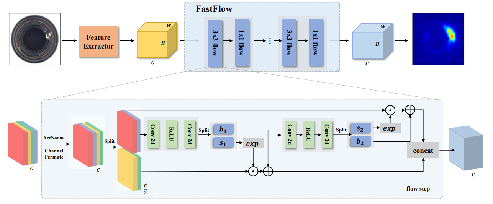

# 目录

<!-- TOC -->

- [目录](#目录)
- [FastFlow描述](#fastflow描述)
- [模型架构](#模型架构)
- [数据集](#数据集)
- [特性](#特性)
    - [混合精度](#混合精度)
- [环境要求](#环境要求)
- [快速入门](#快速入门)
- [脚本说明](#脚本说明)
    - [脚本及样例代码](#脚本及样例代码)
    - [脚本参数](#脚本参数)
    - [训练过程](#训练过程)
        - [加载预训练权重](#加载预训练权重)
        - [训练](#训练)
    - [评估过程](#评估过程)
        - [评估](#评估)
    - [导出过程](#导出过程)
        - [导出](#导出)
    - [推理过程](#推理过程)
        - [推理](#推理)
- [模型描述](#模型描述)
    - [性能](#性能)
        - [训练性能](#训练性能)
            - [MVTec-AD上训练FastFlow](#mvtec-ad上训练fastflow)
        - [评估性能](#评估性能)
            - [MVTec-AD上评估FastFlow](#mvtec-ad上评估fastflow)
        - [推理性能](#评估性能)
            - [MVTec-AD上推理FastFlow](#MVTec-AD上推理fastflow)
- [随机情况说明](#随机情况说明)
- [ModelZoo主页](#modelzoo主页)

<!-- /TOC -->

# FastFlow描述

FastFlow是2021年提出的基于预训练神经网络的工业缺陷检测模型，在MVTec-AD数据集上达到99.4%的AUC，且推理效率高。FastFlow 使用 2D 归一化流实现，可以作为特征提取器的插件模块，用于概率分布估计，如用于无监督缺陷检测和定位的ResNet和Vision Transformer。在训练阶段，FastFlow 将输入的特征转化为易处理的分布，并获得在推理阶段识别缺陷的可能性。在 MVTec AD 数据集上的大量实验结果表明，FastFlow 在各种骨干网络的准确性和推理效率方面超越了以前的最先进方法。

[论文](https://arxiv.org/pdf/2111.07677v2.pdf)：Yu, Jiawei, Ye Zheng, Xiang Wang, Wei Li, Yushuang Wu, Rui Zhao, and Liwei Wu. "Fastflow: Unsupervised anomaly detection and localization via 2d normalizing flows." arXiv preprint arXiv:2111.07677 (2021).

# 模型架构


FastFlow 使用预训练的 WideResNet50 作为 Encoder, 并去除 layer4 之后的层。

# 数据集

使用的数据集：[MVTec AD](<https://www.mvtec.com/company/research/datasets/mvtec-ad/>)

- 数据集大小：4.9G，共15个类、5354张图片(尺寸在700x700~1024x1024之间)
    - 训练集：共3629张
    - 测试集：共1725张
- 数据格式：二进制文件
    - 注：数据将在src/dataset.py中处理。
- 目录结构:

  ```text
  data
  ├── bottle
  │   ├── bottle_test.json
  │   ├── bottle_train.json
  │   ├── ground_truth
  │   │   ├── broken_large
  │   │   │   ├── 000_mask.png
  │   │   │   └── ......
  │   │   ├── broken_small
  │   │   │   ├── 000_mask.png
  │   │       └── ......
  │   ├── test
  │   │   ├── broken_large
  │   │   │   ├── 000.png
  │   │   │   └── ......
  │   │   └── good
  │   │       ├── 000.png
  │   │       └── ......
  │   └── train
  │       └── good
  │           ├── 000.png
  │           └── ......
  ├── cable
  │   ├── cable_test.json
  │   ├── cable_train.json
  │   ├── ground_truth
  │   │   ├── bent_wire
  │   │   │   ├── 000_mask.png
  ......
  ```

# 特性

## 混合精度

采用[混合精度](https://www.mindspore.cn/tutorials/experts/zh-CN/r1.8/others/mixed_precision.html)的训练方法使用支持单精度和半精度数据来提高深度学习神经网络的训练速度，同时保持单精度训练所能达到的网络精度。混合精度训练提高计算速度、减少内存使用的同时，支持在特定硬件上训练更大的模型或实现更大批次的训练。
以FP16算子为例，如果输入数据类型为FP32，MindSpore后台会自动降低精度来处理数据。用户可打开INFO日志，搜索“reduce precision”查看精度降低的算子。

# 环境要求

- 硬件（Ascend）
    - 使用Ascend处理器来搭建硬件环境。
- 框架
    - [MindSpore](https://www.mindspore.cn/install/en)
- 如需查看详情，请参见如下资源：
    - [MindSpore教程](https://www.mindspore.cn/tutorials/zh-CN/master/index.html)
    - [MindSpore Python API](https://www.mindspore.cn/docs/zh-CN/master/index.html)

# 快速入门

通过官方网站安装MindSpore后，您可以按照如下步骤进行训练和评估：

- Ascend处理器环境运行

  ```bash
  # 运行训练示例
  python train.py --dataset_path /data/mvtec --device_id 0 --pre_ckpt_path pretrained/wide_resnet50_racm-8234f177.ckpt --category bottle > train.log 2>&1 &
  或
  cd scripts
  bash run_standalone_train_ascend.sh [dataset_path] [pre_ckpt_path] [category] [device_id]

  # 运行评估示例
  python eval.py --dataset_path /data/mvtec --device_id 0 --ckpt_path ckpt/fastflow_bottle.ckpt --category bottle > eval.log 2>&1 &
  或
  cd scripts
  bash run_eval_ascend.sh [dataset_path] [ckpt_path] [category] [device_id]

  ```

- GPU处理器环境运行

  ```bash
  # 运行训练示例
  cd scripts
  bash run_standalone_train_gpu.sh [dataset_path] [pre_ckpt_path] [category] [device_id]

  # 运行评估示例
  cd scripts
  bash run_eval_gpu.sh [dataset_path] [ckpt_path] [category] [device_id]
  ```

# 脚本说明

## 脚本及样例代码

```text

  ├── fastflow
      ├── README.md                               // FastFlow 相关介绍
      ├── ascend310_infer                         // 310推理 c++源码
      ├── scripts
      │   ├── run_infer_310.sh                    // 310 单类别推理脚本
      │   ├── run_eval_ascend.sh                  // ascend 单类别推理脚本
      │   ├── run_eval_gpu.sh                     // gpu 单类别推理脚本
      │   ├── run_standalone_train_ascend.sh      // ascend 单类别训练脚本
      │   ├── run_standalone_train_gpu.sh         // gpu 单类别训练脚本
      |   ├── run_all_mvtec_ascend.sh             // ascend MVTec-AD 数据集全部类别训练/推理脚本
      |   └── run_all_mvtec_gpu.sh                // gpu MVTec-AD 数据集全部类训练/推理脚本
      ├── src
      │   ├── anomaly_map.py                      // 缺陷图生成器
      │   ├── cell.py                             // 单步模型文件
      │   ├── config.py                           // 配置文件
      │   ├── dataset.py                          // 数据处理文件
      │   ├── fastflow.py                         // 模型文件
      │   ├── loss.py                             // 损失函数文件
      │   ├── operator.py                         // 推理时可视化辅助工具
      │   ├── pthtockpt.py                        // pth文件到ckpt文件转换
      │   ├── resnet.py                           // resnet 特征提取器
      │   └── utils.py                            // 训练记录辅助工具
      ├── eval.py                                 // 推理文件
      ├── export.py                               // 转换导出文件
      ├─ preprocess.py                            // 310前处理
      ├─ postprocess.py                           // 310后处理
      └── train.py                                // 训练文件
```

## 脚本参数

  ```yaml
  --dataset_path:数据集路径
  --pre_ckpt_path:预训练路径
  --category:数据类别
  --device_id:设备序号
  ```

## 训练过程

### 加载预训练权重

pytorch的WideResNet50预训练模型，[点击获取](https://github.com/rwightman/pytorch-image-models/releases/download/v0.1-weights/wide_resnet50_racm-8234f177.pth)

```bash
python src/pthtockpt.py --pth_path /path/wide_resnet50_racm-8234f177.pth
```

### 训练

- Ascend处理器环境运行

  ```bash
  python train.py --dataset_path /data/mvtec --pre_ckpt_path pretrained/wide_resnet50_racm-8234f177.ckpt --category bottle --device_id 0 > train.log 2>&1 &
  或
  cd scripts
  bash run_standalone_train_ascend.sh [dataset_path] [pre_ckpt_path] [category] [device_id]
  ```

  上述python命令将在后台运行，您可以通过train.log文件查看结果。

  对于Mvtec数据集，可以通过执行以下命令，进行Mvtec中全部类别数据的训练与推理。

  ```bash
  cd scripts
  bash run_all_mvtec_gpu.sh [dataset_path] [pre_ckpt_path] [device_id]
  ```

- GPU处理器环境运行

  ```bash
  cd scripts
  bash run_standalone_train_ascend.sh [dataset_path] [pre_ckpt_path] [category] [device_id]
  ```

  上述python命令将在后台运行，您可以通过train.log文件查看结果。

  对于Mvtec数据集，可以通过执行以下命令，进行Mvtec中全部类别数据的训练与推理。

  ```bash
  cd scripts
  bash run_all_mvtec.sh [dataset_path] [pre_ckpt_path] [device_id]
  ```

## 评估过程

### 评估

- 在Ascend环境运行评估

  ```shell
  python eval.py --dataset_path /data/mvtec --device_id 0 --ckpt_path ckpt/fastflow_bottle.ckpt --category bottle > eval.log 2>&1 &
  或
  cd scripts
  bash run_eval_ascend.sh [dataset_path] [ckpt_path] [category] [device_id]
  ```

  上述python命令将在后台运行，您可以通过eval.log文件查看结果。测试数据集的准确性如下：

  ```shell
  # bottle类参考精度
  category is bottle
  pixel_auc: 0.98991
  ```

- 在GPU环境运行评估

  ```shell
  cd scripts
  bash run_eval_ascend.sh [dataset_path] [ckpt_path] [category] [device_id]
  ```

  上述python命令将在后台运行，您可以通过eval.log文件查看结果。测试数据集的准确性如下：

  ```shell
  # bottle类参考精度
  category is bottle
  pixel_auc: 0.98991
  ```

## 导出过程

### 导出

将checkpoint文件导出成mindir格式模型, 以bottle类别为例。

  ```shell
  python export.py --device_id 0 --ckpt_file ckpt/fastflow_bottle.ckpt
  ```

## 推理过程

### 推理

在运行推理之前我们需要先导出模型。Air模型只能在昇腾910环境上导出，mindir可以在任意环境上导出。

- 在昇腾310上使用MVTec AD数据集进行推理

  执行推理的命令如下所示, 其中``MINDIR_PATH``是mindir文件路径；

  ``DATASET_PATH``是推理数据集路径, 为数据类(如toothbrush)的父级目录；

  ``CATEGORY``表示数据类型，可取：bottle, cable, capsule, carpet, grid, hazelnut, leather, metal_nut, pill, screw, tile, toothbrush, transistor, wood, zipper.  

  ``DEVICE_ID``可选，默认值为0；

  ```shell
  bash run_infer_310.sh [MINDIR_PATH] [DATASET_PATH] [CATEGORY] [DEVICE_ID]
  ```

  推理的精度结果保存在acc_[CATEGORY].log日志文件中。

# 模型描述

## 性能

### 训练性能

#### MVTec-AD上训练FastFlow

| 参数          | Ascend                            | GPU                            |
| ------------- | ---------------------------------------------|---------------------------------------------|
| 模型版本      | FastFlow    |FastFlow|
| 资源   | Ascend 910；CPU 2.60GHz，192 cores；RAM 755G；OS Euler2.8       | NVIDIA RTX3090；CPU 2.90GHz，64 cores；RAM 251G；OS Ubuntu 18.04.6       |
| 上传日期  | 2022-10-11         | 2022-10-11                                                   |
| MindSpore版本 | 1.8.1                   |1.8.1                    |
| 数据集        | MVTec AD   |MVTec AD   |
| 训练参数| epoch=500, steps依数据类型而定, batch_size = 32，optimizer=Adam，lr=1e-3，weight decay=1e-5 | epoch=500, steps依数据类型而定, batch_size = 32，optimizer=Adam，lr=1e-3，weight decay=1e-5 |
| 速度          | 554 ms/step                                               | 557 ms/step                                                   |
| 总时长 | 依数据类型而定1-2h | 依数据类型而定1-2h |

### 评估性能

#### MVTec-AD上评估FastFlow

| 参数           | Ascend                           |GPU                           |
| ------------------- | --------------------------- |--------------------------- |
| 模型版本       | FastFlow                |FastFlow                        |
| 资源           | Ascend 910；OS Euler2.8        |NVIDIA RTX3090；OS Ubuntu 18.04        |
| 上传日期       | 2022-10-11           | 2022-10-11         |
| MindSpore 版本 | 1.8.1                 | 1.8.1              |
| 数据集         | MVTec AD              | MVTec AD           |
| batch_size     | 1                     | 1                  |
| bottle_auc     | pixel_auc: 0.9900 | pixel_auc: 0.9878  |
| cable_auc      | pixel_auc: 0.9796 | pixel_auc: 0.9809  |
| capsule_auc    | pixel_auc: 0.9912 | pixel_auc: 0.9900  |
| carpet_auc     | pixel_auc: 0.9918 | pixel_auc: 0.9904  |
| grid_auc       | pixel_auc: 0.9929 | pixel_auc: 0.9924  |
| hazelnut_auc   | pixel_auc: 0.9804 | pixel_auc: 0.9816  |
| leather_auc    | pixel_auc: 0.9971 | pixel_auc: 0.9966  |
| metal_nut_auc  | pixel_auc: 0.9855 | pixel_auc: 0.9844  |
| pill_auc       | pixel_auc: 0.9802 | pixel_auc: 0.9792  |
| screw_auc      | pixel_auc: 0.9874 | pixel_auc: 0.9881  |
| tile_auc       | pixel_auc: 0.9736 | pixel_auc: 0.9739  |
| toothbrush_auc | pixel_auc: 0.9816 | pixel_auc: 0.9834  |
| transistor_auc | pixel_auc: 0.9804 | pixel_auc: 0.9824  |
| wood_auc       | pixel_auc: 0.9624 | pixel_auc: 0.9598  |
| zipper_auc     | pixel_auc: 0.9894 | pixel_auc: 0.9900  |
| **Average**    | **pixel_auc: ** 0.9842 | **pixel_auc: 0.9841** |

### 推理性能

#### MVTec-AD上推理FastFlow

| 参数           | Ascend                           |
| ------------------- | --------------------------- |
| 模型版本       | FastFlow                        |
| 资源           | Ascend 310；系统 Euler2.8        |
| 上传日期       | 2022-10-11                       |
| MindSpore 版本 | 1.8.1                            |
| 数据集         | MVTec AD                         |
| bottle_auc     | pixel_auc: 0.9892         |
| cable_auc      | pixel_auc: 0.9795         |
| capsule_auc    | pixel_auc: 0.9912         |
| carpet_auc     | pixel_auc: 0.9918         |
| grid_auc       | pixel_auc: 0.9929         |
| hazelnut_auc   | pixel_auc: 0.9806         |
| leather_auc    | pixel_auc: 0.9971         |
| metal_nut_auc  | pixel_auc: 0.9855         |
| pill_auc       | pixel_auc: 0.9802         |
| screw_auc      | pixel_auc: 0.9871         |
| tile_auc       | pixel_auc: 0.9738         |
| toothbrush_auc | pixel_auc: 0.9815         |
| transistor_auc | pixel_auc: 0.9803         |
| wood_auc       | pixel_auc: 0.9621         |
| zipper_auc     | pixel_auc: 0.9855         |

# 随机情况说明

在dataset.py中，设置了"shuffle=True"。
在train.py中，使用了随机种子。

# ModelZoo主页  

请浏览官网[主页](https://gitee.com/mindspore/models)。
