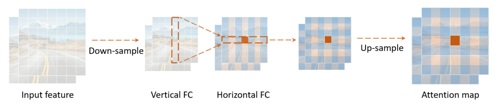
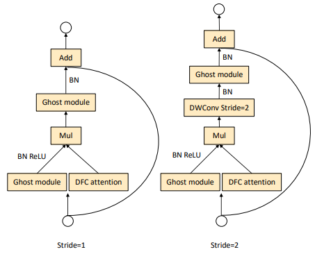

# Contents

- [Contents](#contents)
    - [GhostNetV2 Description](#ghostnetv2-description)
    - [Model architecture](#model-architecture)
    - [Dataset](#dataset)
    - [Environment Requirements](#environment-requirements)
    - [Script description](#script-description)
        - [Script and sample code](#script-and-sample-code)
    - [Eval process](#eval-process)
        - [Usage](#usage)
        - [Launch](#launch)
        - [Result](#result)
    - [Description of Random Situation](#description-of-random-situation)
    - [ModelZoo Homepage](#modelzoo-homepage)

## [GhostNetV2 Description](#contents)

In this paper, we propose a hardware-friendly attention mechanism (dubbed DFC attention) and then present a new GhostNetV2 architecture for mobile applications. The proposed DFC attention is constructed based on fully-connected layers, which can not only execute fast on common hardware but also capture the dependence between long-range pixels. We further revisit the expressiveness bottleneck in previous GhostNet and propose to enhance expanded features produced by cheap operations with DFC attention, so that a GhostNetV2 block can aggregate local and long-range information simultaneously.

Yehui Tang, Kai Han, Jianyuan Guo, Chang Xu, Chao Xu, Yunhe Wang. GhostNetV2: Enhance Cheap Operation with Long-Range Attention. NeurIPS 2022.

## [Model architecture](#contents)

The information flow of DFC attention:



A block in GhostNetV2:



## [Dataset](#contents)

Dataset used: [ImageNet2012]

- Dataset size 224*224 colorful images in 1000 classes
    - Train：1,281,167 images  
    - Test： 50,000 images
- Data format：jpeg
    - Note：Data will be processed in dataset.py

## [Environment Requirements](#contents)

- Hardware(Ascend/GPU)
    - Prepare hardware environment with Ascend or GPU.
- Framework
    - [MindSpore](https://www.mindspore.cn/install/en)
- For more information, please check the resources below£º
    - [MindSpore Tutorials](https://www.mindspore.cn/tutorials/en/master/index.html)
    - [MindSpore Python API](https://www.mindspore.cn/docs/api/en/master/index.html)

## [Script description](#contents)

### [Script and sample code](#contents)

```bash
ghostnetv2
├── eval.py               # inference entry
├── fig
│   ├── DFC.PNG           # The information flow of DFC attention
│   └── ghostnetv2.PNG    # A block in GhostNetV2
├── README.md             # Readme
└── src
    ├── dataset.py        # dataset loader
    └── ghostnetv2.py     # ghostnetv2 network
```

## [Eval process](#contents)

### Usage

After installing MindSpore via the official website, you can start evaluation as follows:

### Launch

```bash
# infer example
  # python
  GPU: python eval.py --data_url dataset --device_target GPU --checkpoint_path [CHECKPOINT_PATH]
  # shell
  cd ./scripts/
  bash run_eval.sh [DATA_PATH] [PLATFORM] [CHECKPOINT_PATH]
```

> checkpoint can be downloaded at https://download.mindspore.cn/model_zoo/research/cv/ghostnetv2/.

### Result

```bash
result: {'acc': 0.740} ckpt= ./ghostnetv2_1x.ckpt
```

## [Description of Random Situation](#contents)

In dataset.py, we set the seed inside "create_dataset" function. We also use random seed in train.py.

## [ModelZoo Homepage](#contents)

Please check the official [homepage](https://gitee.com/mindspore/models).