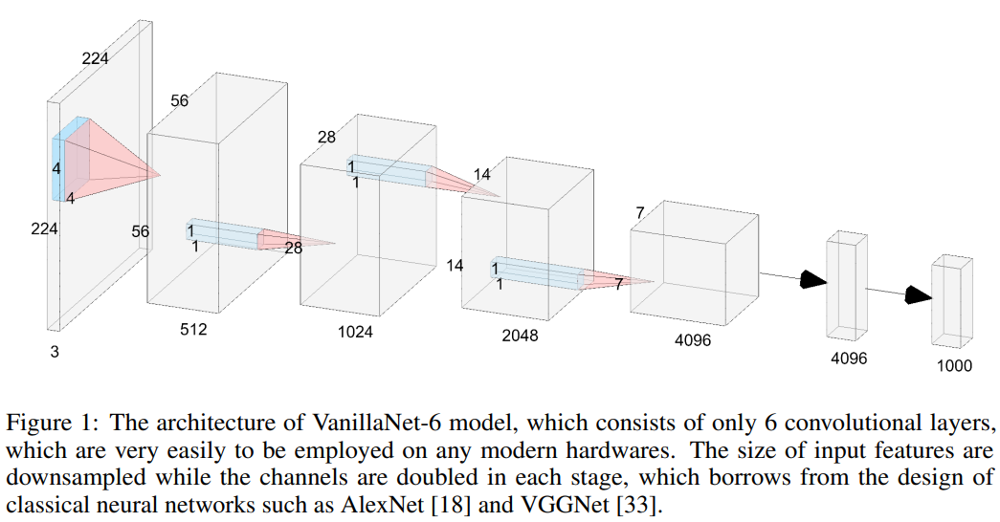

# Contents

- [Contents](#contents)
    - [Vanillanet Description](#Vanillanet-description)
    - [Model architecture](#model-architecture)
    - [Dataset](#dataset)
    - [Environment Requirements](#environment-requirements)
    - [Script description](#script-description)
        - [Script and sample code](#script-and-sample-code)
    - [Eval process](#eval-process)
        - [Usage](#usage)
        - [Launch](#launch)
    - [Description of Random Situation](#description-of-random-situation)
    - [ModelZoo Homepage](#modelzoo-homepage)

## [Vanillanet Description](#contents)

VanillaNet is an innovative neural network architecture that focuses on simplicity and efficiency. Moving away from complex features such as shortcuts and attention mechanisms, VanillaNet uses a reduced number of layers while still maintaining excellent performance. This project showcases that it's possible to achieve effective results with a lean architecture, thereby setting a new path in the field of computer vision and challenging the status quo of foundation models.

[Paper](https://arxiv.org/pdf/2107.06263.pdf): Hanting Chen, Yunhe Wang, Jianyuan Guo,  Dacheng Tao. VanillaNet: the Power of Minimalism in Deep Learning.

## [Model architecture](#contents)

The overall architecture of vanillalet-6 is shown below:



## [Dataset](#contents)

```bash
#!/bin/bash
Dataset used: [ImageNet2012](http://www.image-net.org/)

- Dataset size 224*224 colorful images in 1000 classes
- Train：1,281,167 images  
- Test： 50,000 images
- Data format：jpeg
- Note：Data will be processed in dataset.py
```

## [Environment Requirements](#contents)

- Hardware(Ascend/GPU)
    - Prepare hardware environment with Ascend or GPU.
- Framework
    - [MindSpore](https://www.mindspore.cn/install/en)
- For more information, please check the resources below£º
    - [MindSpore Tutorials](https://www.mindspore.cn/tutorials/en/master/index.html)
    - [MindSpore Python API](https://www.mindspore.cn/docs/api/en/master/index.html)

## [Script description](#contents)

### [Script and sample code](#contents)

```bash
#!/bin/bash
vanillanet
├── eval.py # inference entry
├── fig
│   └── vanillanet.PNG # the illustration of VanillanNet network
├── readme.md # Readme
└── src
    ├── dataset.py # dataset loader
    └── vanillanet.py # VanillanNet network
```

## [Eval process](#contents)

### Usage

After installing MindSpore via the official website, you can start evaluation as follows:

### Launch

```bash
#!/bin/bash
# VanillaNet infer example
  GPU: python eval.py --model vanillanet_5 --dataset_path dataset --platform GPU --checkpoint_path <CHECKPOINT_PATH>
```

checkpoint can be downloaded at https://download.mindspore.cn/model_zoo/.

## [Description of Random Situation](#contents)

In dataset.py, we set the seed inside "create_dataset" function. We also use random seed in train.py.

## [ModelZoo Homepage](#contents)

Please check the official [homepage](https://gitee.com/mindspore/models).