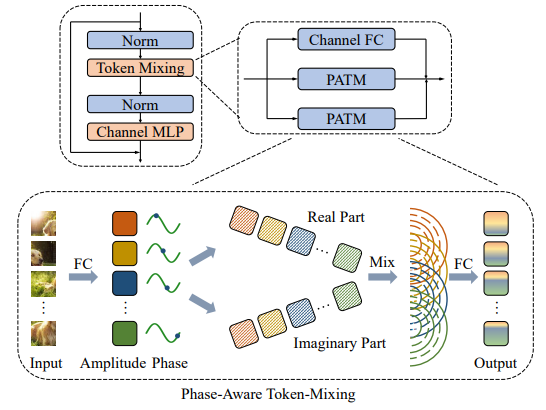

# Contents

- [Contents](#contents)
    - [Wave-MLP Description](#aug-vit-description)
    - [Model architecture](#model-architecture)
    - [Dataset](#dataset)
    - [Environment Requirements](#environment-requirements)
    - [Script description](#script-description)
        - [Script and sample code](#script-and-sample-code)
    - [Eval process](#eval-process)
        - [Usage](#usage)
        - [Launch](#launch)
        - [Result](#result)
    - [Description of Random Situation](#description-of-random-situation)
    - [ModelZoo Homepage](#modelzoo-homepage)

## [Wave-MLP Description](#contents)

To dynamically aggregate tokens, Wave-MLP proposes to represent each token as a wave function with two parts, amplitude and phase. Amplitude is the original feature and the phase term is a complex value changing according to the semantic contents of input images.

[Paper](https://arxiv.org/pdf/2111.12294.pdf): Yehui Tang, Kai Han, Jianyuan Guo, Chang Xu, Yanxi Li, Chao Xu, Yunhe Wang. An Image Patch is a Wave: Phase-Aware Vision MLP. arxiv 2111.12294.

## [Model architecture](#contents)

A block of Wave-MLP is shown below:



## [Dataset](#contents)

Dataset used: [ImageNet2012]

- Dataset size 224*224 colorful images in 1000 classes
    - Train：1,281,167 images  
    - Test： 50,000 images
- Data format：jpeg
    - Note：Data will be processed in dataset.py

## [Environment Requirements](#contents)

- Hardware(Ascend/GPU)
    - Prepare hardware environment with Ascend or GPU.
- Framework
    - [MindSpore](https://www.mindspore.cn/install/en)
- For more information, please check the resources below£º
    - [MindSpore Tutorials](https://www.mindspore.cn/tutorials/en/master/index.html)
    - [MindSpore Python API](https://www.mindspore.cn/docs/en/master/index.html)

## [Script description](#contents)

### [Script and sample code](#contents)

```bash
WalveMlp
├── eval.py # inference entry
├── fig
│   └── wavemlp.png # the illustration of wave_mlp network
├── readme.md # Readme
└── src
    ├── dataset.py # dataset loader
    └── wave_mlp.py # wave_mlp network
```

## [Eval process](#contents)

### Usage

After installing MindSpore via the official website, you can start evaluation as follows:

### Launch

```bash
# infer example
  # python
  GPU: python eval.py --dataset_path dataset --platform GPU --checkpoint_path [CHECKPOINT_PATH]
  # shell
  bash ./scripts/run_eval.sh [DATA_PATH] [PLATFORM] [CHECKPOINT_PATH]
```

> checkpoint can be downloaded at https://download.mindspore.cn/model_zoo/research/cv/wavemlp/.

### Result

```bash
result: {'acc': 0.807} ckpt= ./WaveMLP_T.ckpt
```

### Inference Performance

#### WaveMlp infer on ImageNet2012

| Parameters          | Ascend                      |
| ------------------- | --------------------------- |
| Model Version       | WaveMlp                     |
| Resource            | Ascend 910; OS Euler2.8     |
| Uploaded Date       | 08/03/2022 (month/day/year) |
| MindSpore Version   | 1.6.0                       |
| Dataset             | ImageNet2012                |
| batch_size          | 1024                        |
| outputs             | probability                 |
| Accuracy            | 1pc: 80.7%                  |
| Speed               | 1pc: 11.72 s/step           |
| Total time          | 1pc: 562.96 s/step          |

## [Description of Random Situation](#contents)

In dataset.py, we set the seed inside "create_dataset" function. We also use random seed in train.py.

## [ModelZoo Homepage](#contents)

Please check the official [homepage](https://gitee.com/mindspore/models).