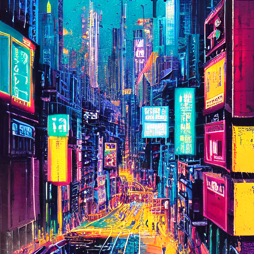
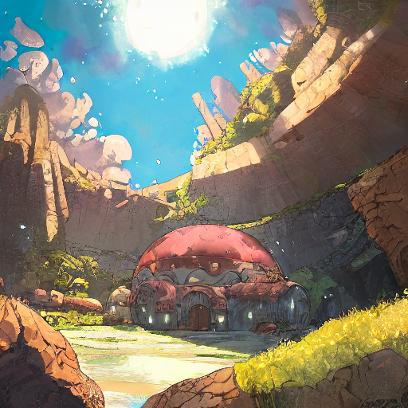
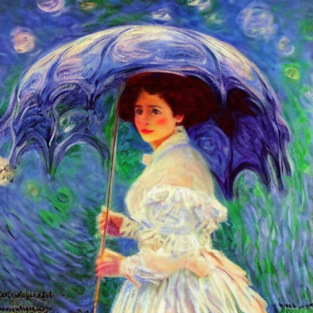
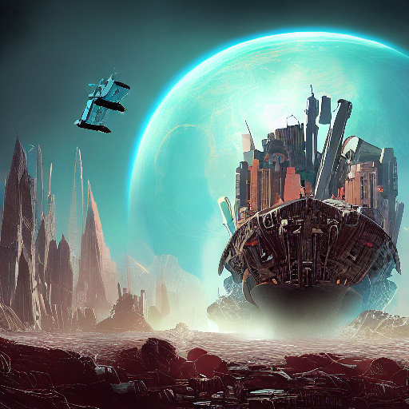
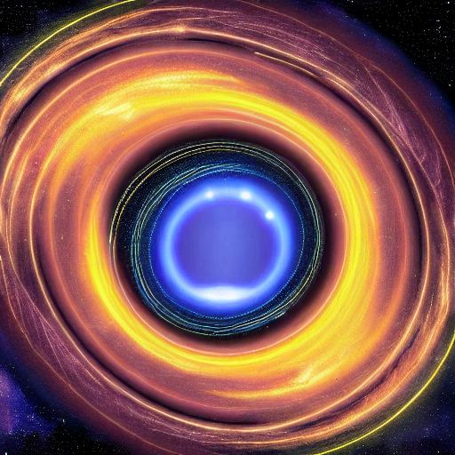
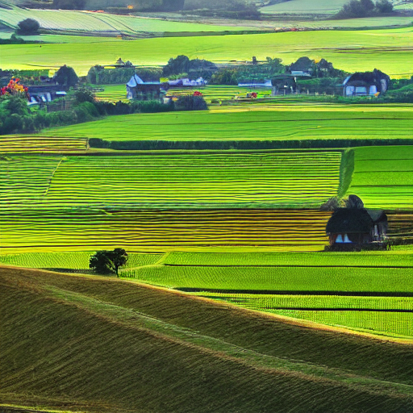

## Contents

[查看中文](./README_CN.md)

- [Contents](#contents)
- [Wukong-Huahua](#wukong-huahua)
- [Environment requirements](#environment-requirements)
- [Quick Start](#quick-start)
    - [Prepare checkpoint](#prepare-checkpoint)
    - [Prepare tokenizer files](#prepare-tokenizer-files)
    - [Text to Image generation](#text-to-image-generation)
    - [Demos](#demos)

## Wukong-Huahua

Wukong-Huahua is a diffusion-based model trained on [Wukong dataset](https://wukong-dataset.github.io/wukong-dataset/).

## Environment requirements

- Hardware
    - Ascend processor
- Framework
    - [Mindspore 1.9+](https://www.mindspore.cn/ "Mindspore")
    - install remaining python packages according to wukong-huahua/requirements.txt
- Tutorial
    - [Mindspore Tutorial](https://www.mindspore.cn/tutorials/zh-CN/master/index.html)
    - [Mindspore Python API](https://www.mindspore.cn/docs/zh-CN/master/index.html)

## Quick Start

### Prepare checkpoint

Download Wukong-Huahua pretrained checkpoint [wukong-huahua-ms.ckpt](https://download.mindspore.cn/toolkits/minddiffusion/wukong-huahua/wukong-huahua-ms.ckpt) and place it under wukong-huahua/models/ folder.

### Prepare tokenizer files

Download file [vocab_zh.txt](https://drive.google.com/file/d/1jmbTqpnef3czYWMK2QXYm_i79FpV1bxl/view?usp=sharing) and place them under wukong-huahua/ldm/models/clip_zh/ folder.

### Text to image generation

To generate images according to input text, run txt2img.py or simply infer.sh with default argumemts.

```shell
python txt2img.py --prompt [input text] --ckpt_path [ckpt_path] --H [image_height] --W [image_width] --outdir [image save folder] --n_samples [number of images to generate] --plms --skip_grid
```

```shell
bash infer.sh
```

higher resolution requires more memory. For Ascend 910 card, we can generate 2 1024x768 images or 16 512 x 512 images at a time.

### Demos

Below is some of the images generated by our wukong-huahua models.







