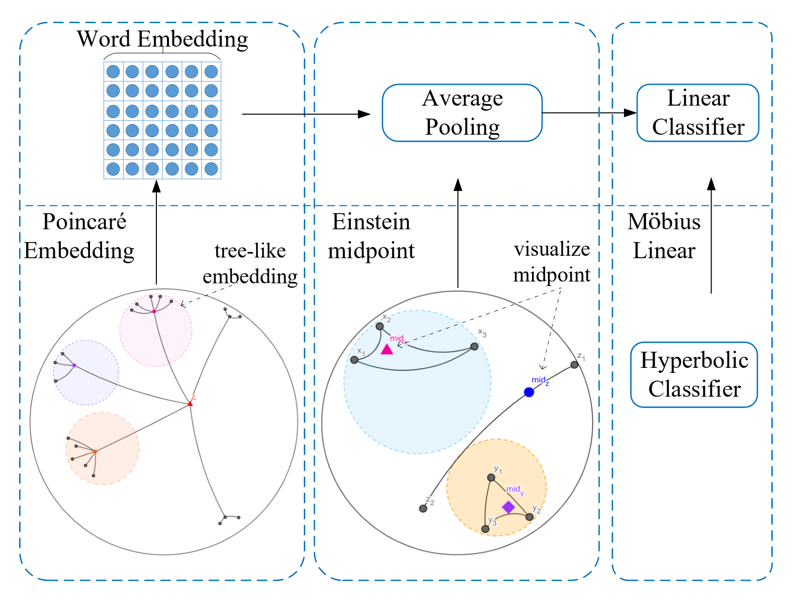

# 目录

- [HyperText概述](#HyperText概述)
- [模型架构](#模型架构)
- [数据集](#数据集)
    - [TNEWS数据集](#TNEWS数据集)
    - [IFLYTEK数据集](#IFLYTEK数据集)
- [环境要求](#环境要求)
- [快速入门](#快速入门)
- [脚本说明](#脚本说明)
    - [脚本及样例代码](#脚本及样例代码)
    - [脚本参数](#脚本参数)
        - [TNEWS](#TNEWS)
        - [IFLYTEK](#IFLYTEK)
- [训练过程](#训练过程)
    - [训练](#训练)
    - [分布式训练](#分布式训练)
- [评估过程](#评估过程)
    - [评估](#评估)
        - [评估性能](#评估性能)
            - [tnews上的HyperText](#tnews上的HyperText)
            - [iflytek上的HyperText](#iflytek上的HyperText)
- [推理过程](#推理过程)
    - [导出MindIR](#导出mindir)
    - [在Ascend310执行推理](#在ascend310执行推理)
    - [结果](#结果)
- [ModelZoo主页](#ModelZoo主页)

# HyperText概述

自然语言数据呈现出树状的层次结构，如WordNet中的hypernymhyponym关系。考虑到双曲空间自然适合于树状分层数据的建模，原作者提出了一个名为HyperText的新模型，通过赋予FastText以双曲几何形状来实现高效的文本分类。经验表明，HyperText在一系列文本分类任务中的表现优于FastText，而且参数大大减少。

论文：[HyperText: Endowing FastText with Hyperbolic Geometry](https://arxiv.org/abs/2010.16143)

# 模型架构

HyperText 基于双曲空间的庞加莱球模型。首先利用单词或 ngram 的庞加莱球嵌入捕捉自然语言句子中的潜在层次结构，然后使用Einstein中点作为池化方法来强调语义特定词（包含更多信息出现频率低于一般词），最后使用Mobius线性变换作为双曲线分类器。


# 数据集

## TNEWS数据集

下载：[TNEWS](https://bj.bcebos.com/paddlehub-dataset/tnews.tar.gz)

解压至 data/tnews

## IFLYTEK数据集

下载：[IFLYTEK](https://bj.bcebos.com/paddlehub-dataset/iflytek.tar.gz)

解压至 data/iflytek

```text
    │── data
       │──iflytek_public   # 处理后数据集
       │──iflytek  # 原始数据集
       │──tnews_public    # 处理后数据集
       │──tnews   # 原始数据集
```

# 环境要求

- 硬件（Ascend处理器）
    - 准备Ascend/GPU/CPU处理器搭建硬件环境。
- 框架
    - [MindSpore](https://gitee.com/mindspore/mindspore)
- 更多关于Mindspore的信息，请查看以下资源：
    - [MindSpore教程](https://www.mindspore.cn/tutorials/zh-CN/master/index.html)
    - [MindSpore Python API](https://www.mindspore.cn/docs/zh-CN/master/index.html)

# 快速入门

通过官方网站安装MindSpore和下载数据集后，您可以按照如下步骤进行训练和评估：

- Ascend/GPU/CPU处理器环境运行

```shell
# 数据处理示例
cd ./scripts
bash data_process.sh [DATA_DIR] [OUT_DATA_DIR] [DATASET_TYPE]

# 运行训练示例
cd ./scripts
bash run_standalone_train.sh [DATASET_DIR] [DATASET_TYPE] [DEVICE]

# 运行评估示例
cd ./scripts
bash run_eval.sh [DATASET_DIR] [DATASET_TYPE] [MODEL_PATH] [DEVICE]
```

- device should be in["Ascend","GPU","CPU"].

# 脚本说明

## 脚本及样例代码

```text
│──HyperText
    │── README.md   # hypertext相关声明
    │── scripts
    │   │──run_standalone_train.sh   # 训练的shell脚本
    │   │──run_eval.sh   # 评估的shell脚本
    │   │──run_infer_310.sh   # Ascend310推理的shell脚本
    │   │──data_process.sh   # 在Ascend上评估的shell脚本
    │   │──run_gpu_distributed_train   # 在GPU上分布式训练的shell脚本
    │── output  # 输出文件，包括保存的模型，训练日志，评估日志
    │── src
    │   │──config.py   # 参数文件
    │   │──dataset.py   # 数据集文件
    │   │──data_preprocessing.py   # 数据集处理文件
    │   │──hypertext.py   # 模型文件
    │   │──hypertext_train.py   # 模型训练文件
    │   │──math_utils.py   # 工具模型
    │   │──mobius_linear.py   # mobius_linear文件
    │   │──poincare.py   # poincare算子文件
    │   │──radam_optimizer.py   # 优化器
    │── train.py   # 训练脚本
    │── eval.py   # 评估脚本
    │── preprocess.py   # 推理预处理脚本
    │── quick_start.py   # quick start脚本
    │── postprocess.py   # 推理精度计算脚本
    │── create_dataset.py   # 数据处理脚本
    │── export.py   # 将checkpoint文件导出到air/mindir
```

## 脚本参数

在Config.py中可以同时配置参数

### TNEWS

```text
num_epochs 2   # epoch数量
batch_size 32    # batch数量
max_length 40   # 最大文本长度
learning_rate 0.011    # 学习率
embed 20    # embed维度
bucket 1500000    # 词和Ngram数量
wordNgrams 2   # wordNgram的数量
eval_step  100   # 验证步数
min_freq 1    # min_freq
lr_decay_rate 0.96    #decay率
```

### IFLYTEK

```text
num_epochs 2   # epoch数量
batch_size 32    # batch数量
max_length 1000   # 最大文本长度
learning_rate 0.013    # 学习率
embed 80    # embed维度
bucket 2000000    # 词和Ngram数量
wordNgrams 2   # wordNgram的数量
eval_step  50   # 验证步数
min_freq 1    # min_freq
lr_decay_rate 0.94    #decay率
```

更多配置细节请参考 src/config.py。

# 训练过程

## 训练

- 处理原始数据集：

```bash
tnews
python create_dataset.py --data_dir ./data/tnews --out_data_dir ./data/tnews_public --datasetType tnews
iflytek
python create_dataset.py --data_dir ./data/iflytek --out_data_dir ./data/iflytek_public --datasetType iflytek
```

- Ascend处理器环境运行

```bash
tnews
python train.py --datasetdir ./data/tnews_public --datasetType tnews --device Ascend
iflytek
python train.py --datasetdir ./data/iflytek_public --datasetType iflytek --device Ascend
```

- GPU处理器环境运行

```bash
tnews
python train.py --datasetdir ./data/tnews_public --datasetType tnews --device GPU
iflytek
python train.py --datasetdir ./data/iflytek_public --datasetType iflytek --device GPU
```

- CPU处理器环境运行

```bash
tnews
python train.py --datasetdir ./data/tnews_public --datasetType tnews --device CPU
iflytek
python train.py --datasetdir ./data/iflytek_public --datasetType iflytek --device CPU
```

## 分布式训练

- GPU处理器环境运行

```bash
tnews
mpirun -n {device_num} python train.py --datasetdir ./data/tnews_public --datasetType tnews --device GPU --run_distribute True
iflytek
mpirun -n {device_num} python train.py --datasetdir ./data/iflytek_public --datasetType iflytek --device GPU --run_distribute True
```

其中：{device_num}代表并行的卡的数量，例如：4或者8

# 评估过程

## 评估

把训练生成的ckpt文件放入./output/文件夹下

- Ascend处理器环境运行

```bash
tnews
python eval.py --datasetdir ./data/tnews_public --modelPath ./output/hypertext_tnews.ckpt --datasetType tnews --device Ascend
iflytek
python eval.py --datasetdir ./data/iflytek_public --datasetType iflytek  --modelPath ./output/hypertext_iflytek.ckpt --device Ascend
```

- GPU处理器环境运行

```bash
tnews
python eval.py --datasetdir ./data/tnews_public --modelPath ./output/hypertext_tnews.ckpt --datasetType tnews --device GPU
iflytek
python eval.py --datasetdir ./data/iflytek_public --datasetType iflytek  --modelPath ./output/hypertext_iflytek.ckpt --device GPU
```

- CPU处理器环境运行

```bash
tnews
python eval.py --datasetdir ./data/tnews_public --modelPath ./output/hypertext_tnews.ckpt --datasetType tnews --device CPU
iflytek
python eval.py --datasetdir ./data/iflytek_public --datasetType iflytek  --modelPath ./output/hypertext_iflytek.ckpt --device CPU
```

# quick start

```bash
tnews
python quick_start.py --modelPath ./output/hypertext_tnews.ckpt --datasetType tnews
iflytek
python quick_start.py --datasetType iflytek  --modelPath ./output/hypertext_iflytek.ckpt
```

# 推理过程

**推理前需参照 [MindSpore C++推理部署指南](https://gitee.com/mindspore/models/blob/master/utils/cpp_infer/README_CN.md) 进行环境变量设置。**

## 导出MindIR

可以使用如下命令导出mindir文件

- Ascend处理器环境运行

```shell
tnews
python export.py --modelPath ./output/hypertext_tnews.ckpt --datasetType tnews --device Ascend --batch_size 1 --file_format MINDIR
iflytek
python export.py --modelPath ./output/hypertext_iflytek.ckpt --datasetType iflytek --device Ascend --batch_size 1 --file_format MINDIR
```

- GPU处理器环境运行

```shell
tnews
python export.py --modelPath ./output/hypertext_tnews.ckpt --datasetType tnews --device GPU --file_format MINDIR
iflytek
python export.py --modelPath ./output/hypertext_iflytek.ckpt --datasetType iflytek --device GPU --file_format MINDIR
```

注意：`file_format`必须在["AIR", "MINDIR"]中进行选择。

## 在Ascend310执行推理

在执行推理前，mindir文件必须通过`export.py`脚本导出。以下展示了使用mindir模型执行推理的示例。
使用配置文件默认的export_batch_size导出MINDIR文件

```shell
# Ascend310 inference
bash run_infer_310.sh [MINDIR_PATH] [DATASET] [DATA_PATH] [DEVICE_ID]
```

- `MINDIR_PATH` mindir文件路径
- `DATASET` 使用的推理数据集名称，默认为`iflytek`，可在`iflytek`或者`tnews`中选择
- `INPUT_PATH` 推理数据集路径
- `DEVICE_ID` 可选，默认值为0。

## 结果

推理结果保存在脚本执行的当前路径，你可以在acc.log中看到以下精度计算结果。

```bash
# iflytek
acc: 0.5687865022712524
```

```bash
# tnews
acc: 0.8180614591317679
```

## 模型描述

### 性能

#### 评估性能

##### tnews上的HyperText

| 参数                 | Ascend 910                                                  | GPU                                         |
| -------------------| --------------------------------------  |---------------------------------------------|
| 模型版本              | HyperText                                               | HyperText                                   |
| 资源                    |  Ascend 910；CPU 2.60GHz，192核；内存 755G；系统 Euler2.8 | GPU(Tesla V100 SXM2)；CPU：2.1GHz，24核；内存：128G |
| 上传日期              | 2021-11-18  ;                                           | 2021-11-18                                  |
| MindSpore版本    | 1.3.0                                                       | 1.5.0                                       |
| 数据集                 | tnews                                                      | tnews                                       |
| 训练参数              |  epoch=2, batch_size = 32                        | epoch=2, batch_size = 32                    |
| 优化器                  | radam                                                    | radam                                       |
| 损失函数              | SoftmaxCrossEntropyWithLogits               | SoftmaxCrossEntropyWithLogits               |
| 输出                    | 精度                                                         | 精度                                          |
| 损失                      | 0.818                                                    | 0.818                                       |
| 速度                      | 1958.810毫秒/步（单卡）                          | 315.949毫秒/步（单卡）                             |

##### iflytek上的HyperText

| 参数                 | Ascend 910                                                   | GPU |
| -------------------------- | -------------------------------------- | -------------------------------------- |
| 模型版本              | HyperText                                               | HyperText |
| 资源                   |  Ascend 910；CPU 2.60GHz，192核；内存 755G；系统 Euler2.8 |   GPU(Tesla V100 SXM2)；CPU：2.1GHz，24核；内存：128G   |
| 上传日期              | 2021-11-18  ;                                           | 2021-11-18 |
| MindSpore版本      | 1.3.0                                                      | 1.5.0 |
| 数据集                    | iflytek                                                    | iflytek          |
| 训练参数               |  epoch=2, batch_size = 32                       |   epoch=2, batch_size = 32  |
| 优化器                  | radam                                                     |  radam|
| 损失函数              | SoftmaxCrossEntropyWithLogits               | SoftmaxCrossEntropyWithLogits |
| 输出                    | 精度                                                          |  精度 |
| 损失                      | 0.57                                                        |  0.5776 |
| 速度                      | 395.895毫秒/步（单卡）                            | 597.672毫秒/步（单卡） |

# ModelZoo主页

请浏览官网[主页](https://gitee.com/mindspore/models)。
