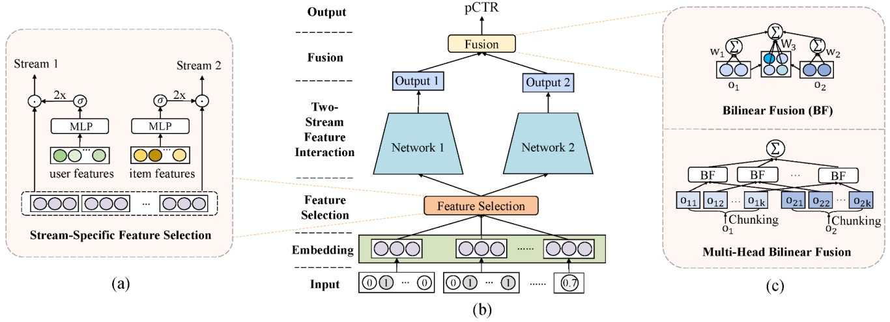

# Contents

- [FinalMLP Description](#FinalMLP-description)
- [Dataset](#dataset)
- [Environment Requirements](#environment-requirements)
- [Quick Start](#quick-start)
- [Detailed Description](#detailed-description)
    - [Script and Sample Code](#script-and-sample-code)
    - [Script Parameters](#script-parameters)
    - [Training &amp; Evaluation Process](#training-&-evaluation-process)
        - [Training](#training)
        - [Evaluation](#evaluation)
    - [Inference Process](#inference-process)
    - [Performance](#performance)

# [FinalMLP Description](#contents)

Click-through rate (CTR) prediction is one of the fundamental tasks for online advertising and recommendation. Although a vanilla MLP is shown inefficient in learning high-order feature interactions, we found that a two-stream MLP model (DualMLP) that simply combines two well-tuned MLP networks can achieve surprisingly good performance. Based on this observation, we further propose feature selection and interaction aggregation layers that can be easily plugged in to build an enhanced two-stream MLP model, namely FinalMLP. We envision that the simple yet effective FinalMLP model could serve as a new strong baseline for future developments of two-stream CTR models. Please refer to our paper for more details.

> Kelong Mao, Jieming Zhu, Liangcai Su, Guohao Cai, Yuru Li, Zhenhua Dong. FinalMLP: An Enhanced Two-Stream MLP Model for CTR Prediction, in AAAI 2023.

Two-stream models (e.g., DeepFM, DCN) have been widely used for CTR prediction, where two streams are combined to capture complementarty feature interactions. FinalMLP is an enhanced two-stream MLP model that integrates stream-specific feature selection and stream-level interaction aggregation layers.


Key components:

- Stream-specific feature selection: We perform feature gating from different views via conditioning on learnable parameters, user features, or item features, which produces global, user-specific, or item-specific feature importance weights, respectively.

$$
\mathbf{g_1} = {Gate}_1(\mathbf{x_1}), ~~~ \mathbf{g_2} = {Gate}_2(\mathbf{x_2})
$$

$$
\mathbf{h_1} = 2\sigma (\mathbf{g_1})\odot \mathbf{e}, ~~~ \mathbf{h_2} = 2\sigma(\mathbf{g_2})\odot\mathbf{e}
$$

- Stream-level interaction aggregation: We propose an interaction aggregation layer to fuse the stream outputs with multi-head bilinear fusion.

$$
BF(\mathbf{o}_1, \mathbf{o}_2) = b + \mathbf{w}_1^{T}\mathbf{o}_1 + \mathbf{w}_2^{T}\mathbf{o}_2 + \mathbf{o}_1^{T}\mathbf{W}_3\mathbf{o}_2
$$

$$
\hat{y} = \sigma(\sum_{j=1}^{k}{BF}(\mathbf{o_{1j}}, \mathbf{o_{2j}}))
$$

# [Dataset](#contents)

## Dataset description

The MovieLens dataset consists of users' tagging records on movies. The task is formulated as personalized tag recommendation with each tagging record (user_id, item_id, tag_id) as an data instance. The target value denotes whether the user has assigned a particular tag to the movie. We obtain the preprocessed data accessible from the [BARS benchmark](https://openbenchmark.github.io/BARS/datasets/README.html).

The dataset statistics are summarized as follows:

| Dataset Split | Total     | #Train    | #Validation | #Test   |
|:-------------:|:---------:|:---------:|:-----------:|:-------:|
|   MovielensLatest_x1     | 2,006,859 | 1,404,801 | 401,373     | 200,686 |

```bash
$ md5sum train.csv valid.csv test.csv
efc8bceeaa0e895d566470fc99f3f271 train.csv
e1930223a5026e910ed5a48687de8af1 valid.csv
54e8c6baff2e059fe067fb9b69e692d0 test.csv
```

# [Environment Requirements](#contents)

- python 3.7
- [MindSpore](https://www.mindspore.cn/install/en)

For more information, please check the resources below：

- [MindSpore tutorials](https://www.mindspore.cn/tutorials/en/master/index.html)
- [MindSpore Python API](https://www.mindspore.cn/docs/api/en/master/index.html)

# [Quick Start](#contents)

- Install MindSpore via the official website.
- Download the codes and datasets.
- Quick run the models
- Training Configuration in `default_config.yaml`

For example: run finalMLP model

```bash
#run finalMLP
python train.py --config_path default_config.yaml
```

# [Detailed Description](#contents)

## [Script and Sample Code](#contents)

```text
├── finalMLP
├── README.md                   // descriptions about finalMLP
├── dataset                     // dataset
|   ├──data_for_tfrecord.py        // original data format to tfrecord
│   ├──Movielenslatest_x1       // MovielensLatest_x1 dataset
|       ├──data                 // the preprocessed data are available
|       ├──tfrecord_mind        // csv format to tfrecord
│           ├──train            // trainging dir
│           ├──valid            // validation dir
│           ├──test             // testing dir
├── src
│   ├── model_utils
│       ├──config.py            // Parsing configuration parameters
│   ├── __init__.py             // python init file
│   ├── callback.py             // Define the callback function.
│   ├── dataset.py              // Creating a Dataset
│   ├── finalMLP.py             // finalMLP NetWork
├── export.py                   // export network
├── infer.py                    // inference network
├── train.py                    // Training network
```

## [Script Parameters](#contents)

An introduction of key parameters for both training and evaluation.

```text
* `--data_emb_dim`                  // Embedding size.
* `--init_args`                     // embedding layer init args
* `--epochs`                        // Total train epochs.
* `--batch_size`                    // Training batch size.
* `--learning_rate`                 // Training learning rate.
* `--mlp1_hidden_units`             // hidden units in MLP1
* `--mlp1_hidden_activations`       // activation function in MLP1. Particularly, layer-wise activations can be specified as a list, e.g., ["relu", "leakyrelu", "sigmoid"]
* `--mlp1_dropout`                  // dropout rate in MLP1
* `--mlp1_batch_norm`               // whether using BN in MLP1
* `--mlp2_hidden_units`             // hidden units in MLP2
* `--mlp2_hidden_activations`       // activation function in MLP2. Particularly, layer-wise activations can be specified as a list, e.g., ["relu", "leakyrelu", "sigmoid"]
* `--mlp2_dropout`                  // dropout rate in MLP2
* `--mlp2_batch_norm`               // whether using BN in MLP2
* `--use_fs`                        // whether using feature selection
* `--fs_hidden_units`               // hidden units of fs gates
* `--fs1_context`                   // conditional features for feature gating in stream 1
* `--fs2_context`                   // conditional features for feature gating in stream 2
* `--num_heads`                     // number of heads used for bilinear fusion
* `--data_format`                   // 1:mindrecord;2:tfrecord;other:h5
* `--data_vocab_size`               // all feature value size
* `--data_field_size`               // sparse feature size
* `--dense_field_size`              // dense feature size
* `--device_target`                 // (CPU, GPU, Ascend)
* `--weight_decay`                  // weight_decay on optimizer
* `--l2_coef`                       // l2_coef on loss
```

## [Training &amp; Evaluation Process](#contents)

We unify the training process and evaluation process into one execution file, and evaluate the performance of the best learned model after the training is completed, which is also the mode usually used by most developers.
Next we will give an illustration by running finalMLP model to demonstrate the flow of training, evaluation and inference.

- Execute running file on command line

```bash
python train.py --config_path default_config.yaml &>running.log
```

### Training

The python command above will run in the background, you can view the results through the file `running.log`. After training, you'll get a checkpoint file containing the parameters of the best model under the script folder by default. The training process will be printed as follows:

```log
# running.log

{'batch_size': 4096,
 'checkpoint_path': './train/finalMLP_12-34_342.ckpt',
 'checkpoint_url': '',
 'ckpt_file': './train/finalMLP_12-34_342.ckpt',
 'ckpt_file_name_prefix': 'finalMLP',
 'ckpt_path': './train',
 'config_path': './finalMLP/default_config.yaml',
 'convert_dtype': True,
 'data_emb_dim': 80,
 'data_field_size': 3,
 'data_format': 2,
 'data_path': './dataset/Movielenslatest_x1/tfrecord_mind/',
 'data_url': '',
 'data_vocab_size': 2006860,
 'dataset_path': './dataset/Movielenslatest_x1/tfrecord_mind',
 'dense_dim': 13,
 'dense_field_size': 0,
 'device_id': 0,
 'device_target': 'GPU',
 'do_eval': True,
 'earlystopping': {'mode': 'min', 'monitor': 'loss', 'patience': 6},
 'enable_modelarts': False,
 'enable_profiling': False,
 'epsilon': 1e-08,
 'eval_callback': True,
 'eval_file_name': './log/auc_finalMLP.log',
 'file_format': 'MINDIR',
 'file_name': 'finalMLP',
 'fs1_context': [],
 'fs2_context': [],
 'fs_hidden_units': [800],
 'init_args': [-0.01, 0.01],
 'keep_checkpoint_max': 50,
 'label_path': '',
 'learning_rate': 0.001,
 'load_path': './checkpoint_path',
 'loss_callback': True,
 'loss_file_name': './log/loss_finalMLP.log',
 'loss_scale': 1.0,
 'mlp1_batch_norm': True,
 'mlp1_dropout': 0.4,
 'mlp1_hidden_activations': 'relu',
 'mlp1_hidden_units': [400],
 'mlp2_batch_norm': True,
 'mlp2_dropout': 0.2,
 'mlp2_hidden_activations': 'relu',
 'mlp2_hidden_units': [800],
 'num_heads': 10,
 'output_path': './train',
 'result_path': './preprocess_Result',
 'save_checkpoint': True,
 'save_checkpoint_steps': 1,
 'skip_id_convert': 0,
 'slot_dim': 26,
 'test': True,
 'test_num_of_parts': 3,
 'threshold': 100,
 'train_epochs': 100,
 'train_line_count': 45840617,
 'train_num_of_parts': 21,
 'train_url': '',
 'use_fs': True,
 'weight_bias_init': ['uniform', 'uniform'],
 'weight_decay': 1e-05}
Please check the above information for the configurations
directory: ./dataset/Movielenslatest_x1/tfrecord_mind/train
dataset_files_len: 1
callback_list=[<mindspore.train.callback._time_monitor.TimeMonitor object at 0x7f623b583250>, <src.callback.LossCallBack object at 0x7f622a570750>, <mindspore.train.callback._checkpoint.ModelCheckpoint object at 0x7f622a570f50>]

epoch: 1 step: 342, loss is 0.8634778261184692
Train epoch time: 119160.997 ms, per step time: 348.424 ms
[WARNING] MD(2637547,7f5fbdffb700,python):2023-06-01-09:14:29.052.845 [mindspore/ccsrc/minddata/dataset/engine/datasetops/data_queue_op.cc:809] DetectPerBatchTime] Bad performance attention, it takes more than 25 seconds to fetch a batch of data from dataset pipeline, which might result `GetNext` timeout problem. You may test dataset processing performance(with creating dataset iterator) and optimize it.

epoch: 2 step: 342, loss is 0.47610682249069214
Train epoch time: 60451.976 ms, per step time: 176.760 ms
[WARNING] MD(2637547,7f5fbdffb700,python):2023-06-01-09:15:22.363.732 [mindspore/ccsrc/minddata/dataset/engine/datasetops/data_queue_op.cc:809] DetectPerBatchTime] Bad performance attention, it takes more than 25 seconds to fetch a batch of data from dataset pipeline, which might result `GetNext` timeout problem. You may test dataset processing performance(with creating dataset iterator) and optimize it.
……
epoch: 99 step: 342, loss is 0.029590755701065063
Train epoch time: 43516.288 ms, per step time: 127.241 ms
[WARNING] MD(2637547,7f5fbdffb700,python):2023-06-01-10:25:27.208.020 [mindspore/ccsrc/minddata/dataset/engine/datasetops/data_queue_op.cc:809] DetectPerBatchTime] Bad performance attention, it takes more than 25 seconds to fetch a batch of data from dataset pipeline, which might result `GetNext` timeout problem. You may test dataset processing performance(with creating dataset iterator) and optimize it.

epoch: 100 step: 342, loss is 0.032171580940485
Train epoch time: 38288.664 ms, per step time: 111.955 ms
```

The model checkpoint will be saved in the `$ckpt_path` path by model name.

### Evaluation

We use loss and AUC to evaluate the performance of rating prediction. If eval needs to be enabled, we need set `do_eval: True` on `default_config.yaml`. We can print the required metric values on epoch end.

```log
...
epoch: 99 step: 342, loss is 0.029590755701065063
Train epoch time: 43516.288 ms, per step time: 127.241 ms
2023-05-30 09:43:06 EvalCallBack metricdict_values([0.9662275650565593]); eval_time13s
...
```

## Inference Process

At the same time, we implement the inferring module, which can directly load the pre-trained model to conduct the corresponding prediction tasks, and only need to execute the `infer.py`. By default, the test dataset is loaded for inference.

```bash
# set checkpoint_path: "./train/finalMLP_12-34_342.ckpt" on default_config.yaml
python infer.py --config_path default_config.yaml &>running.log
```

Information about model loading and inference is displayed in the log file：

```log
directory: ./dataset/Movielenslatest_x1/tfrecord_mind/test
dataset_files_len: 1
infer test_dataset: 2023-06-01 10:25:57 AUC: 0.9669892411201504, use time: 8.624728441238403s.
```

## Performance

| Parameters          | GPU                                  |
| ------------------- | ------------------------------------ |
| Model Version       | finalMLP                             |
| Resource            | NVIDIA-SMI 470.57.02      CUDA11.4   |
| uploaded Date       | 06/03/2023 (month/day/year)          |
| MindSpore Version   | 1.9.0                                |
| Dataset             | Movielenslatest_x1                   |
| Training Parameters | emsize=80, batch_size=4096, lr=0.001 |
| Optimizer           | Adam                                 |
| Loss Function       | BCE loss                             |
| outputs             | pCTR                                 |
| Speed               | 1pc: 40.3s/epoch                     |

## [ModelZoo Homepage](https://gitee.com/mindspore/models/tree/master/research/recommend/user#contents)

Please check the official [homepage](https://gitee.com/mindspore/models).
