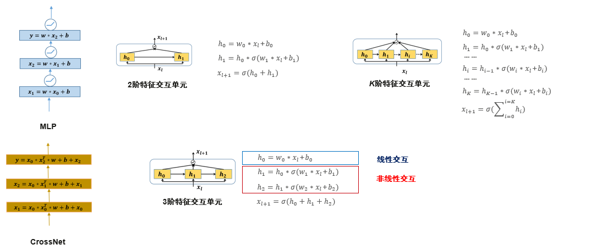
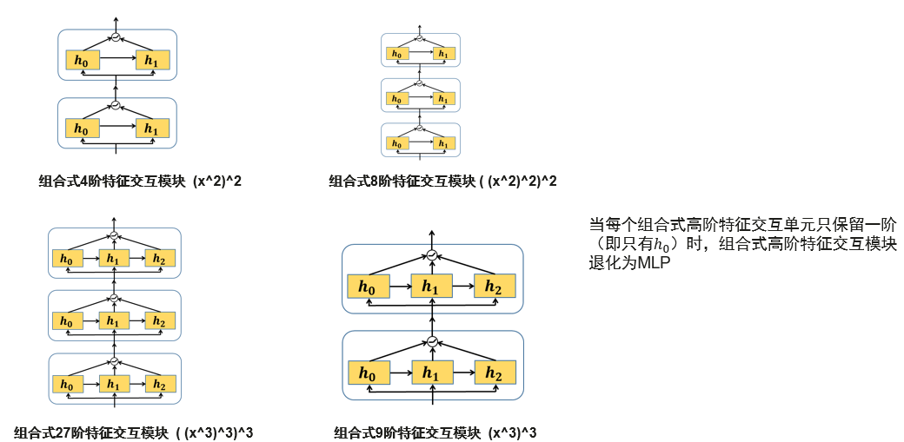
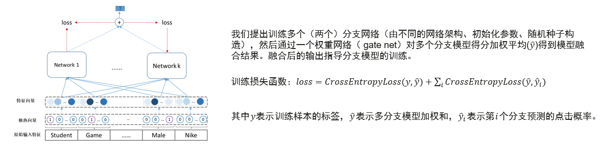

# 目录

<!-- TOC -->

- [目录](#目录)
    - [final概述](#FIANL概述)
    - [模型架构](#模型架构)
    - [数据集](#数据集)
    - [环境要求](#环境要求)
    - [快速入门](#快速入门)
    - [脚本说明](#脚本说明)
    - [脚本和样例代码](#脚本和样例代码)
    - [脚本参数](#脚本参数)
    - [训练过程](#训练过程)
        - [训练](#训练)
        - [分布式训练](#分布式训练)
    - [评估过程](#评估过程)
        - [评估](#评估)
    - [推理过程](#推理过程)
        - [导出MindIR](#导出mindir)
        - [在Ascend310执行推理](#在ascend310执行推理)
        - [结果](#结果)
    - [模型描述](#模型描述)
    - [性能](#性能)
        - [评估性能](#评估性能)
        - [推理性能](#推理性能)
    - [随机情况说明](#随机情况说明)
    - [ModelZoo主页](#modelzoo主页)

<!-- /TOC -->

## final概述

业界有很多方法对以MLP为主的深度学习推荐模型进行了改进，主要通过引入一个浅层模型学习特征向量的显式交互关系，并在最后对双塔模型结果进行融合。然而，现有的技术存在许多缺陷：

1. 现有的融合方式在不同的特征交互方式在信息共享上存在缺陷，在中间层（交互过程中）缺少信息共享，忽略了不同特征交互方式之间的协同作用。

2. 大多浅层模型需要显式输入特征交叉，提升模型捕获信息的能力。

3. 浅层网络获取到的显式交叉阶数有限，受限于计算复杂度，大多不超过3阶。

针对以上问题，本模型提出了一种可以替代MLP的组合式高阶特征交互模块，相比于MLP本发明既可以采用非线性层捕捉特征的隐式交互，又可以引入线性层学习特征的显式交互，并且线性层与非线性层充分交互，能够取得比传统方法更好的预测精度。
本模型还设计了一种双分支融合自蒸馏训练框架，不同的分支网络采用不同的结构参数，从不同的角度学习用户偏好，融合不同分支的结果作为最终输出，随后采用融合结果指导分支网络的参数更新，增强模型的泛化性能，从而取得更好的预测精度。
我们在多个华为真实业务场景引入本模型，均取得了明显的线上效果提升。

## 模型架构

FINAL由两部分组成。组合式高阶交互模块，可以替代多层感知器，达到更好的推荐效果，同时这个模块属于通用模块可以应用于不同的推荐算法模型，提升推荐效果。
基于本模型的组合式高阶特征交互模块，既可以采用非线性层捕捉特征的隐式交互，又可以引入线性层学习特征的显式交互，并且线性层与非线性层充分交互，能够取得比传统方法更好的预测精度。

组合式高阶特征交互模块的阶数随着Units模块的叠加指数增加

本模型设计了一种双分支融合自蒸馏框架，可以替代常用的双分支模型结构，不同的分支采用不同的结构参数，从不同的角度学习用户偏好，融合不同分支的结果作为最终输出，随后采用融合结果指导分支网络的参数更新，增强模型的泛化性能，从而取得更好的预测精度。


## 数据集

- [Criteo Kaggle Display Advertising Challenge Dataset](http://go.criteo.net/criteo-research-kaggle-display-advertising-challenge-dataset.tar.gz)

## 环境要求

- 硬件（Ascend或GPU）
    - 使用Ascend或GPU处理器准备硬件环境。
- 框架
    - [MindSpore](https://www.mindspore.cn/install)
- 如需查看详情，请参见如下资源：
    - [MindSpore教程](https://www.mindspore.cn/tutorials/zh-CN/master/index.html)
    - [MindSpore Python API](https://www.mindspore.cn/docs/api/zh-CN/master/index.html)

## 快速入门

通过官方网站安装MindSpore后，您可以按照如下步骤进行训练和评估：

- 数据集预处理
  '''bash
  #下载数据集
  #请参考[1]获得下载链接
  mkdir -p data/origin_data && cd data/origin_data
  wget DATA_LINK
  tar -zxvf dac.tar.gz

  #数据集预处理脚步执行
  python -m src.preprocess_data  --data_path=./data/ --dense_dim=13 --slot_dim=26 --threshold=100 --train_line_count=45840617 --skip_id_convert=0
  '''

- Ascend处理器环境运行

  ```bash
  # 运行训练示例
  bash python train.py \
    --dataset_path='dataset/train' \
    --ckpt_path='./checkpoint' \
    --eval_file_name='auc.log' \
    --loss_file_name='loss.log' \
    --device_target=Ascend \
    --do_eval=True > ms_log/output.log 2>&1 &

  # 运行分布式训练示例
  bash scripts/run_distribute_train.sh 8 /dataset_path /rank_table_8p.json

  # 运行评估示例
  python eval.py \
    --dataset_path='dataset/test' \
    --checkpoint_path='./checkpoint/final.ckpt' \
    --device_target=Ascend > ms_log/eval_output.log 2>&1 &
  OR
  bash scripts/run_eval.sh 0 Ascend /dataset_path /checkpoint_path/final.ckpt
  ```

  在分布式训练中，JSON格式的HCCL配置文件需要提前创建。

  具体操作，参见：

  <https://gitee.com/mindspore/models/tree/master/utils/hccl_tools>.

- 在GPU上运行

  ```bash
  # 运行训练示例
  bash python train.py \
    --dataset_path='dataset/train' \
    --ckpt_path='./checkpoint' \
    --eval_file_name='auc.log' \
    --loss_file_name='loss.log' \
    --device_target=GPU \
    --do_eval=True > ms_log/output.log 2>&1 &

  # 运行分布式训练示例
  bash scripts/run_distribute_train_gpu.sh 8 /dataset_path

  # 运行评估示例
  bash python eval.py \
    --dataset_path='dataset/test' \
    --checkpoint_path='./checkpoint/final.ckpt' \
    --device_target=GPU > ms_log/eval_output.log 2>&1 &
  OR
  bash scripts/run_eval.sh 0 GPU /dataset_path /checkpoint_path/final.ckpt
  ```

- 在 ModelArts 进行训练 (如果你想在modelarts上运行，可以参考以下文档 [modelarts](https://support.huaweicloud.com/modelarts/))

    ```
     在 ModelArts 上使用8卡训练
     (1) 执行a或者b
           a. 在 default_config.yaml 文件中设置 "enable_modelarts=True"
              在 default_config.yaml 文件中设置 "distribute=True"
              在 default_config.yaml 文件中设置 "dataset_path='/cache/data'"
              在 default_config.yaml 文件中设置 "train_epochs: 5"
              (可选)在 default_config.yaml 文件中设置 "checkpoint_url='s3://dir_to_your_pretrained/'"
              在 default_config.yaml 文件中设置 其他参数
           b. 在网页上设置 "enable_modelarts=True"
              在网页上设置 "distribute=True"
              在网页上设置 "dataset_path=/cache/data"
              在网页上设置 "train_epochs: 5"
              (可选)在网页上设置 "checkpoint_url='s3://dir_to_your_pretrained/'"
              在网页上设置 其他参数
     (2) 准备模型代码
     (3) 如果选择微调您的模型，请上传你的预训练模型到 S3 桶上
     (4) 执行a或者b (推荐选择 a)
           a. 第一, 将该数据集压缩为一个 ".zip" 文件。
              第二, 上传你的压缩数据集到 S3 桶上 (你也可以上传未压缩的数据集，但那可能会很慢。)
           b. 上传原始数据集到 S3 桶上。
               (数据集转换发生在训练过程中，需要花费较多的时间。每次训练的时候都会重新进行转换。)
     (5) 在网页上设置你的代码路径为 "/path/final"
     (6) 在网页上设置启动文件为 "train.py"
     (7) 在网页上设置"训练数据集"、"训练输出文件路径"、"作业日志路径"等
     (8) 创建训练作业
     在 ModelArts 上使用单卡训练
     (1) 执行a或者b
           a. 在 default_config.yaml 文件中设置 "enable_modelarts=True"
              在 default_config.yaml 文件中设置 "dataset_path='/cache/data'"
              在 default_config.yaml 文件中设置 "train_epochs: 5"
              (可选)在 default_config.yaml 文件中设置 "checkpoint_url='s3://dir_to_your_pretrained/'"
              在 default_config.yaml 文件中设置 其他参数
           b. 在网页上设置 "enable_modelarts=True"
              在网页上设置 "dataset_path='/cache/data'"
              在网页上设置 "train_epochs: 5"
              (可选)在网页上设置 "checkpoint_url='s3://dir_to_your_pretrained/'"
              在网页上设置 其他参数
     (2) 准备模型代码
     (3) 如果选择微调您的模型，上传你的预训练模型到 S3 桶上
     (4) 执行a或者b (推荐选择 a)
           a. 第一, 将该数据集压缩为一个 ".zip" 文件。
              第二, 上传你的压缩数据集到 S3 桶上 (你也可以上传未压缩的数据集，但那可能会很慢。)
           b. 上传原始数据集到 S3 桶上。
               (数据集转换发生在训练过程中，需要花费较多的时间。每次训练的时候都会重新进行转换。)
     (5) 在网页上设置你的代码路径为 "/path/final"
     (6) 在网页上设置启动文件为 "train.py"
     (7) 在网页上设置"训练数据集"、"训练输出文件路径"、"作业日志路径"等
     (8) 创建训练作业
    # 在 ModelArts 上使用单卡验证
     (1) 执行a或者b
           a. 在 default_config.yaml 文件中设置 "enable_modelarts=True"
              在 default_config.yaml 文件中设置 "checkpoint_url='s3://dir_to_your_trained_model/'"
              在 default_config.yaml 文件中设置 "checkpoint='./final/final_trained.ckpt'"
              在 default_config.yaml 文件中设置 "dataset_path='/cache/data'"
              在 default_config.yaml 文件中设置 其他参数
           b. 在网页上设置 "enable_modelarts=True"
              在网页上设置 "checkpoint_url='s3://dir_to_your_trained_model/'"
              在网页上设置 "checkpoint='./final/final_trained.ckpt'"
              在网页上设置 "dataset_path='/cache/data'"
              在网页上设置 其他参数
     (2) 准备模型代码
     (3) 上传你训练好的模型到 S3 桶上
     (4) 执行a或者b (推荐选择 a)
           a. 第一, 将该数据集压缩为一个 ".zip" 文件。
              第二, 上传你的压缩数据集到 S3 桶上 (你也可以上传未压缩的数据集，但那可能会很慢。)
           b. 上传原始数据集到 S3 桶上。
               (数据集转换发生在训练过程中，需要花费较多的时间。每次训练的时候都会重新进行转换。)
     (5) 在网页上设置你的代码路径为 "/path/final"
     (6) 在网页上设置启动文件为 "train.py"
     (7) 在网页上设置"训练数据集"、"训练输出文件路径"、"作业日志路径"等
     (8) 创建训练作业
    ```

- 在 ModelArts 进行导出 (如果你想在modelarts上运行，可以参考以下文档 [modelarts](https://support.huaweicloud.com/modelarts/))

    ```
     (1) 执行 a 或者 b.
           a. 在 base_config.yaml 文件中设置 "enable_modelarts=True"
              在 base_config.yaml 文件中设置 "file_name='final'"
              在 base_config.yaml 文件中设置 "file_format='MINDIR'"
              在 base_config.yaml 文件中设置 "checkpoint_url='/The path of checkpoint in S3/'"
              在 base_config.yaml 文件中设置 "ckpt_file='/cache/checkpoint_path/model.ckpt'"
              在 base_config.yaml 文件中设置 其他参数
           b. 在网页上设置 "enable_modelarts=True"
              在网页上设置 "file_name='final'"
              在网页上设置 "file_format='MINDIR'"
              在网页上设置 "checkpoint_url='/The path of checkpoint in S3/'"
              在网页上设置 "ckpt_file='/cache/checkpoint_path/model.ckpt'"
              在网页上设置 其他参数
     (2) 上传你的预训练模型到 S3 桶上
     (3) 在网页上设置你的代码路径为 "/path/final"
     (4) 在网页上设置启动文件为 "export.py"
     (5) 在网页上设置"训练数据集"、"训练输出文件路径"、"作业日志路径"等
     (6) 创建训练作业
    ```

## 脚本说明

## 脚本和样例代码

```shell
.
└─final
  ├─README.md
  ├─mindspore_hub_conf.md             # mindspore hub配置
  ├─scripts
    ├─run_standalone_train.sh         # 在Ascend处理器或GPU上进行单机训练(单卡)
    ├─run_distribute_train.sh         # 在Ascend处理器上进行分布式训练(8卡)
    ├─run_distribute_train_gpu.sh     # 在GPU上进行分布式训练(8卡)
    └─run_eval.sh                     # 在Ascend处理器或GPU上进行评估
  ├─src
    ├─model_utils
      ├─__init__.py
      ├─config.py
      ├─device_target.py
      ├─local_adapter.py
      └─moxing_adapter.py
    ├─__init__.py                     # python init文件
    ├─callback.py                     # 定义回调功能
    ├─final.py                       # final网络
    ├─dataset.py                      # 创建final数据集
    └─preprocess_data.py              # 数据预处理
  ├─eval.py                           # 评估网络
  └─train.py                          # 训练网络
```

## 脚本参数

在config.py中可以同时配置训练参数和评估参数。

- 训练参数。

  ```python
  """
  optional arguments:
  -h, --help            show this help message and exit
  --dataset_path DATASET_PATH
                        Dataset path
  --ckpt_path CKPT_PATH
                        Checkpoint path
  --eval_file_name EVAL_FILE_NAME
                        Auc log file path. Default: "./auc.log"
  --loss_file_name LOSS_FILE_NAME
                        Loss log file path. Default: "./loss.log"
  --do_eval DO_EVAL     Do evaluation or not. Default: True
  --device_target DEVICE_TARGET
                        Ascend or GPU. Default: Ascend
  """
  ```

- 评估参数。

  ```python
  """
  optional arguments:
  -h, --help            show this help message and exit
  --checkpoint_path CHECKPOINT_PATH
                        Checkpoint file path
  --dataset_path DATASET_PATH
                        Dataset path
  --device_target DEVICE_TARGET
                        Ascend or GPU. Default: Ascend
  """
  ```

## 训练过程

### 训练

- Ascend处理器上运行

  ```bash
  python train.py \
    --dataset_path='dataset/train' \
    --ckpt_path='./checkpoint' \
    --eval_file_name='auc.log' \
    --loss_file_name='loss.log' \
    --device_target=Ascend \
    --do_eval=True > ms_log/output.log 2>&1 &
  ```

  上述python命令将在后台运行,您可以通过`ms_log/output.log`文件查看结果。

  训练结束后, 您可在默认文件夹`./checkpoint`中找到检查点文件。损失值保存在loss.log文件中。

  ```log
  2022-06-27 15:26:29 epoch: 1 step: 41257, loss is 0.498953253030777
  2022-06-27 15:32:32 epoch: 2 step: 41257, loss is 0.45545706152915955
  ...
  ```

  模型检查点将会储存在当前路径。

- GPU上运行
  待运行。

### 分布式训练

- Ascend处理器上运行

  ```bash
  bash scripts/run_distribute_train.sh 8 /dataset_path /rank_table_8p.json
  ```

  上述shell脚本将在后台运行分布式训练。请在`log[X]/output.log`文件中查看结果。损失值保存在loss.log文件中。

- GPU上运行
  待运行。

## 评估过程

### 评估

- Ascend处理器上运行时评估数据集

  在运行以下命令之前，请检查用于评估的检查点路径。

  ```bash
  python eval.py \
    --dataset_path='dataset/test' \
    --checkpoint_path='./checkpoint/final.ckpt' \
    --device_target=Ascend > ms_log/eval_output.log 2>&1 &
  OR
  bash scripts/run_eval.sh 0 Ascend /dataset_path /checkpoint_path/final.ckpt
  ```

  上述python命令将在后台运行，请在eval_output.log路径下查看结果。AUC保存在auc.log文件中。

  ```log
  {'result': {'AUC': 0.8067789065281104, 'eval_time': 35.64779996871948}}
  ```

- 在GPU运行时评估数据集
  待运行。

## 推理过程

### [导出MindIR](#contents)

```shell
python export.py --ckpt_file [CKPT_PATH] --file_name [FILE_NAME] --file_format [FILE_FORMAT]
```

参数ckpt_file为必填项，
`FILE_FORMAT` 必须在 ["AIR", "MINDIR"]中选择。

### 在Ascend310执行推理

**推理前需参照 [MindSpore C++推理部署指南](https://gitee.com/mindspore/models/blob/master/utils/cpp_infer/README_CN.md) 进行环境变量设置。**

在执行推理前，mindir文件必须通过`export.py`脚本导出。以下展示了使用minir模型执行推理的示例。

```shell
# Ascend310 推理
bash run_infer_310.sh [MINDIR_PATH] [DATASET_PATH] [NEED_PREPROCESS] [DEVICE_ID]
```

- `NEED_PREPROCESS` 表示数据是否需要预处理，取值范围为 'y' 或者 'n'。
- `DEVICE_ID` 可选，默认值为0。

### 结果

推理结果保存在脚本执行的当前路径，你可以在acc.log中看到以下精度计算结果。

```log
auc : 0.810024
```

## 模型描述

## 性能

### 评估性能

| 参数                    | Ascend                                                      | GPU                    |
| -------------------------- | ----------------------------------------------------------- | ---------------------- |
| 模型版本              | final                                                      | 待运行                  |
| 模型版本              | final                                                      | 待运行                  |
| 资源                   |Ascend 910；CPU 2.60GHz，192核；内存 755G；系统 Euler2.8             | 待运行                  |
| 上传日期              | 2022-06-22                                 | 待运行                 |
| MindSpore版本          | 1.3.0                                                 | 待运行                  |
| 数据集                    | [1]                                                         | 待运行                 |
| 训练参数        | epoch=35, batch_size=16000, lr=5e-4                          | 待运行                  |
| 优化器                  | Adam                                                        | 待运行                 |
| 损失函数              | Sigmoid Cross Entropy With Logits                           | 待运行                  |
| 输出                    | AUC                                                    | 待运行                 |
| 损失                       | 0.44                                                        | 待运行                 |
| 脚本                    | [final脚本](https://gitee.com/mindspore/models/tree/master/research/recommend/final) | 待运行                  |

### 推理性能

| 参数          | Ascend                      | GPU                         |
| ------------------- | --------------------------- | --------------------------- |
| 模型版本       | final                      | 待运行                       |
| 模型版本       | final                      | 待运行                       |
| 资源            | Ascend 910；系统 Euler2.8                  | 待运行                       |
| 上传日期       | 2022-06-22 | 待运行                       |
| MindSpore版本   | 1.3.0                 | 待运行                       |
| 数据集             | [1]                         | 待运行                       |
| batch_size          | 1000                        | 待运行                      |
| 输出             | AUC                    | 待运行                       |
| AUC| 0.810                |待运行                       |

## 随机情况说明

在train.py.中训练之前设置随机种子。

## ModelZoo主页

 请浏览官网[主页](https://gitee.com/mindspore/models)。  
