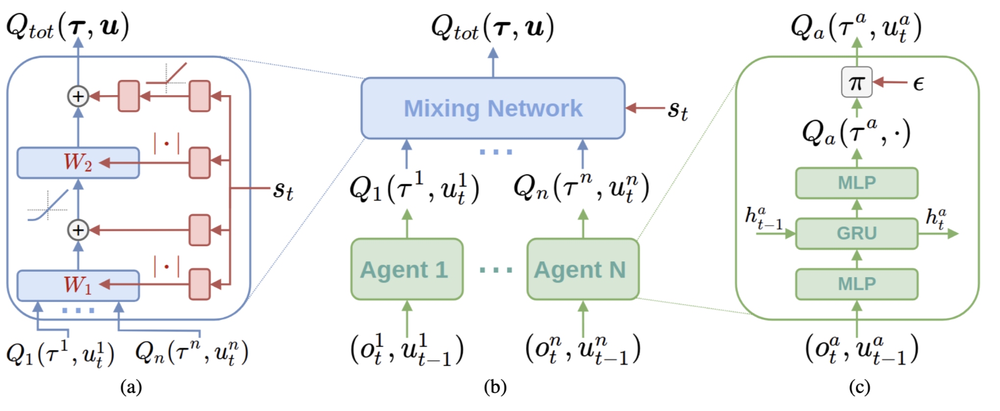
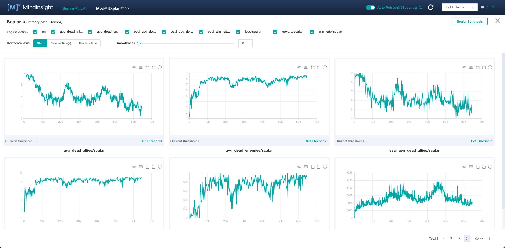
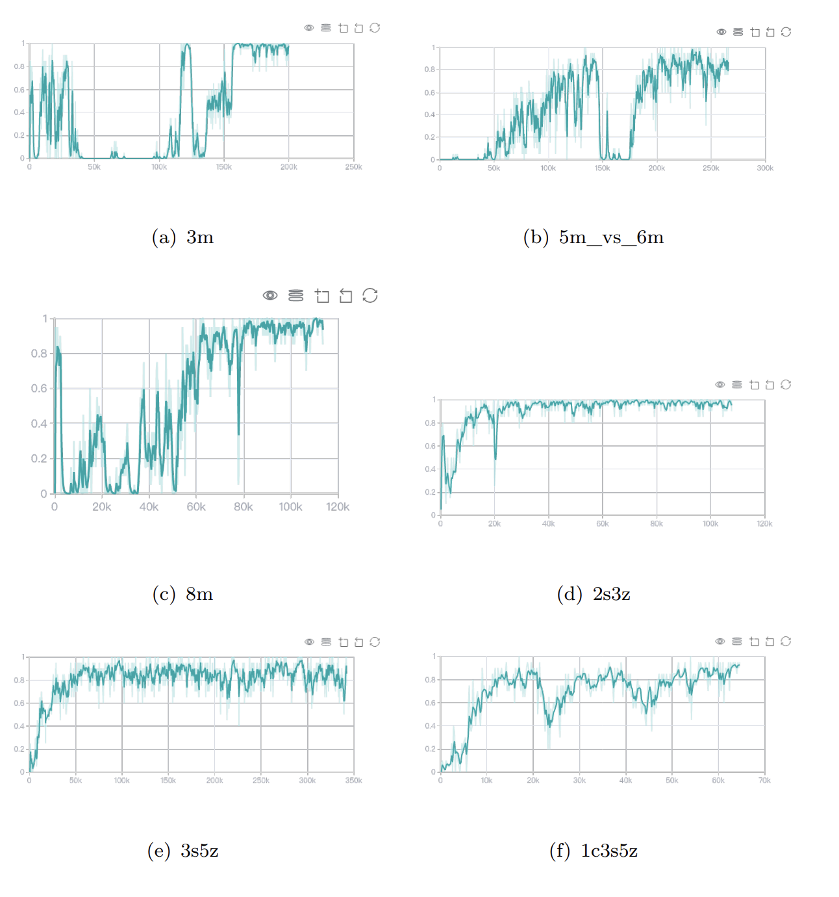

# 目录

## QMIX

QMIX是一种基于值函数的多智能体强化学习算法。
[论文](https://arxiv.org/pdf/1803.11485.pdf)：Tabish Rashid, Mikayel Samvelyan, Christian Schroeder de Witt, Gregory Farquhar, Jakob Foerster, Shimon Whiteson. "Qmix: Monotonic value function factorisation for deep multi-agent reinforcement learning." International Conference on Machine Learning. 2018.

## 模型架构

QMIX的网络分为智能体网络(Agent Network)和混合网络(Mixer Network)两部分。

* 智能体网络。每个智能体拥有一个单独的网络用来表征其值函数$Q_a(\tau^a, u^a)$，网络架构同DRQN类似，用来接收当前时间步的局部观察$o_t^a$和最后一步采取的动作$u_{t-1}^a$。中间层的GRU网络会将每一个时间步的隐向量输出到下一个时间步，利用观察历史。
* 混合网络。混合网络是一种以智能体网络的输出作为输入的前馈神经网络，其输出为全局的Q值估计$Q_{\text{tot}}$。为了保证最终整个网络满足单调性质，QMIX令混合网络的权重为非负。其中混合网络的权重为可训练的参数，为超网络的输出。超网络的输入为当前的全局状态，其输出为混合网络某一层的参数。每一个超网络都由单层神经网络和一个激活函数组成，保证最后输出值非负。将输出的向量的维度修改后作为混合网络的权重。



更多细节可以参考[原论文](https://arxiv.org/pdf/1803.11485.pdf)。

## 数据集

QMIX作为一种强化学习算法，模型通过和环境交互收集样本更新参数权重。我们在[SMAC](https://github.com/oxwhirl/smac)上训练智能体。SMAC是基于暴雪的星际争霸2开发的多智能体强化学习(MARL)领域经典的多智能体合作环境。智能体可以在环境中获得环境观察和执行动作，在游戏中的每一个单元都由独立的智能体控制。

具体地，我们测试的环境有：

|地图名称|友方单位|敌方单位|环境类型
|---|---|---|---|
|3m| 3 Marines| 3 Marines| 同质&对称|
|5m_vs_6m|5 Marines|6 Marines|同质&非对称|
| 8m | 8 Marines | 8 Marines | 同质&对称 |
|2s3z|2 Stalkers & 3 Zealots|2 Stalkers & 3 Zealots|异质&对称|
|3s5z|3 Stalkers & 5 Zealots|3 Stalkers & 5 Zealots|异质&对称|
|1c3s5z|1 Colossi & 3 Stalkers & 5 Zealots|1 Colossi & 3 Stalkers & 5 Zealots|异质&对称|

关于SMAC环境更多实现细节，可以参考[论文](https://arxiv.org/abs/1902.04043)：Mikayel Samvelyan, Tabish Rashid, Christian Schroeder de Witt, Gregory Farquhar, Nantas Nardelli, Tim G. J. Rudner, Chia-Man Hung, Philip H. S. Torr, Jakob Foerster, Shimon Whiteson. "The Starcraft Multi-agent Challenge." arXiv preprint arXiv:1902.04043 (2019).

## 环境要求

* 硬件（GPU）
    * 使用GPU处理器来搭建硬件环境。
* 框架
    * MindSpore(1.8)，参考MindSpore-gpu版本的[安装教程](https://www.mindspore.cn/install)
    * MindSpore Reinforcement(0.5.0)，参考MindSpore Reinforcement的[安装教程](https://gitee.com/mindspore/reinforcement/tree/master#%E5%AE%89%E8%A3%85)
* 环境配置
    * SMAC的安装参考[SMAC仓库文档](https://github.com/oxwhirl/smac)
* 其他第三方库参考`requirements.txt`

## 快速入门

完成框架安装和环境配之后，你可以按照如下步骤进行模型的训练和评估

```bash
# 运行训练实例
bash ./scripts/run_train.sh [EPISODE_NUM] [DEVICE] [ENV_NAME]
# 例如
bash ./scripts/run_train.sh 500000 GPU 2s3z
# 运行评估示例
bash ./scripts/run_eval.sh.sh [EPISODE_NUM] [DEVICE] [CKPT_PATH] [ENV_NAME]
# 例如
bash ./scripts/run_eval.sh 50 GPU ./out/2s3z 2s3z
```

## 脚本说明

### 脚本和样例代码

```bash
.
├── configs # 模型配置
│   ├── default.py # 默认配置文件
├── eval.py # 评估脚本
├── log # 模型日志目录
├── out # 模型保存目录
├── README_CN.md # 模型相关说明
├── requirements.txt # 第三方库列表
├── scripts
│   ├── run_eval.sh # 启动评估
│   └── run_train.sh # 启动训练
├── src
│   ├── qmix_actor.py # Agent智能体和Mixer网络
│   ├── qmix_learner.py # 模型的损失函数和参数更新逻辑
│   ├── qmix_trainer.py # 智能体和环境交互逻辑
│   └── utils.py # 辅助函数
└── train.py # 训练脚本
```

### 脚本参数

环境无关的脚本参数在./configs/default.py当中定义，可以根据为不同环境设置新的参数。环境相关的参数将根据环境信息在`ParamConfig`中自动配置。

```python
class ParamConfig():
    def __init__(self, env_name):
        # 随机数种子
        SEED = 42
        # 批大小
        BATCH_SIZE = 64
        self.policy_params = {
            # RNN种类，默认为GRU
            'rnn_type': 'GRU',
            # RNN层数
            'rnn_layer_num': 1,
            # 网络中间隐向量维度
            'hidden_dim': 64,
            'embed_dim': 32,
            'hypernet_embed': 64,
            # epsilon贪心策略初始概率
            'epsi_start': 1.0,
            # epsilon贪心策略结束概率
            'epsi_end': 0.05,
            # epislon贪心总衰减步数
            'all_steps': 50000
        }

        self.learner_params = {
            # 学习率
            'lr': 0.0005,
            # 折扣因子
            'gamma': 0.99,
        }

        self.trainer_params = {
            # 训练日志文件存放路径
            'summary_path': './log/{}'.format(ENV_NAME),
            # 训练模型输出路径
            'ckpt_path': './out/{}'.format(ENV_NAME)
        }
```

## 训练过程

### 训练

可通过下列命令在GPU上训练模型

```shell
bash ./scripts/run_train.sh 500000 GPU 2s3z
```

或者

```shell
python train.py --episode_num=500000 --device=GPU --env_name=2s3z > train_log.txt 2>&1 &
```

> 用法:
train.py [-h] [--episode EPISODE] [--device {CPU,GPU,Auto}] [--env_name {1c3s5z,2s3z,3m,3s5z,5m_vs_6m,8m}]
可选参数:
--episode EPISODE 训练总回合数
--device {CPU,GPU,Auto} 训练QMIX的目标计算设备(默认为GPU).
--env_name {1c3s5z,2s3z,3m,3s5z,5m_vs_6m,8m} 训练QMIX的SMAC环境名称(默认为2s3z)

训练日志可以通过下列两种方式查看

* 训练日志。训练日志在当前文件夹下train_log.txt查看，输出了训练过程中每回合的奖赏和损失信息以及当前训练过程的提示信息。
    > 训练日志样例
    Episode 98: loss is 0.015, rewards is 1.585
    Episode 99: loss is 0.015, rewards is 1.132
    Episode 100: loss is 0.016, rewards is 2.491
* mindinsight。记录训练过程中的标量指标，可以在mindinsight中查看模型训练过程不同指标的折线图。通过下列命令在本地启动mindinsight服务查看可视化的训练日志

    ```bash
    mindinsight start --summary-base-dir ./log
    ```



## 评估

评估模型在用户指定环境上的性能，运行命令前需要检查模型文件路径是否设置正确

```batch
bash ./scripts/run_eval.sh 50 GPU ./out/2s3z 2s3z
```

或者

```bash
python eval.py --episode_num=50 --device=GPU --ckpt_path=./out/2s3z --env_name=2s3z  > eval_log.txt 2>&1 &
```

上述python命令将在后台运行，评估结果将会保存在./eval_log.txt当中。评估结果的样例如下：
> Evaluation of 50 episodes finish
eval_avg_win_rate:1.0
eval_avg_dead_alies:0.68
eval_avg_dead_enemies:3.0

我们训练好的模型可以访问此[链接](https://pan.baidu.com/s/1JssTj2pZUdHughbKlxIebw?pwd=mc4j)下载，提取码mc4j。

## 性能

### 训练性能

这里以1c3s5z环境上的模型为例进行展示
| 参数                      |GPU               |
| --------------------------| ---------------------- |
| 模型版本                  | QMIX           |
| 资源                      |GPU(NVIDIA-A400)|
| 上传日期                  | 2022-09-27      |
| MindSpore版本             |1.8.0              |
| 训练环境                    |1c3s5z|
| 训练参数                  | epoches=64800, lr=5e-4   |
| 优化器                    | Adam                           |
| 损失函数                  | QMIX loss                    |
| 速度                      | 单卡: 401.94毫秒/步|
| 总时长                    | 单卡：7小时16分14秒;  |
| 微调检查点                | 156KB(agents.ckpt文件),418 KB(mixer.ckpt)|
| 脚本                      | ./scripts/run_train.sh |

训练过程中的测试胜率曲线如下图：


## 随机情况说明

train.py中使用不同的随机种子可能会对训练结果造成影响。

## ModelZoo 主页

请浏览官方[主页](https://gitee.com/mindspore/models)。
