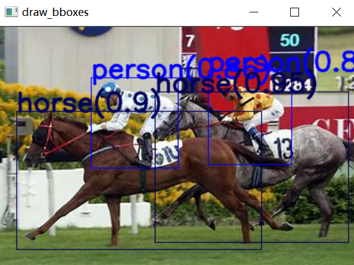
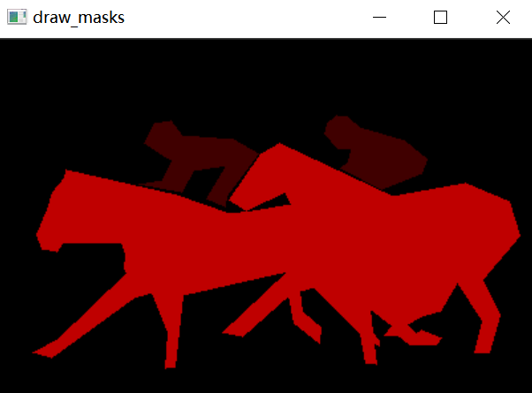

# Script Description

This script contains image visualizing modules for detection and segmentation tasks based on OpenCV.

## APIs

### draw_bbox()

Used for drawing bounding boxes, where the colors of the boxes and fonts are obtained by the function get_n_hsv_color().

### get_n_hsv_color()

Used for getting a specific number of colors, where the colors are determined by the H component of the HSV format.

### draw_mask()

Used for drawing masks, where the colors of the boxes and fonts are determined by the H component of the HSV format.

## Examples

### draw_bbox()

```ruby
img = cv2.imread('data/img/1.jpg')
boxes = [[104, 57, 202, 159, 3, 0.86], [20, 95, 296, 251, 1, 0.9], [176, 73, 394, 243, 1, 0.95]]
class_name = ['cat', 'horse', 'cow', 'person']
draw_bbox(img, boxes, class_name, bbox_mode=1)
```



### draw_mask()

```ruby
class_name = ['cat', 'horse', 'cow', 'person']
draw_mask(mask, len(class_name))
```



## Dependencies

* numpy
* opencv-python